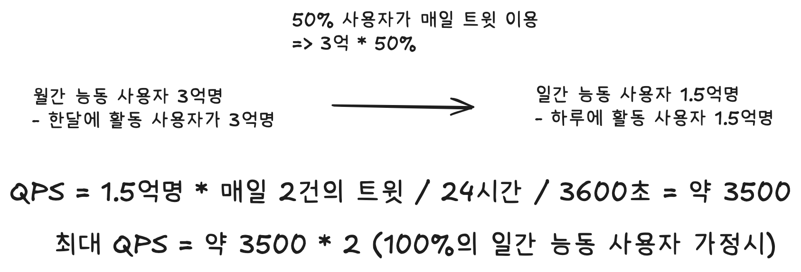

# 제 2장 개략적인 규모 추정

## 개략적인 규모 추정이란?

보편적으로 통용되는 성능 수치상에서 사고 실험을 행하여 추정치를 계산하는 행위 
=> 어떤 설계가 요구사항에 부합하는지 알아보기 위한 것
- 2의 제곱수, 응답지연 값, 가용성에 관계된 수치 중요

## 2의 제곱수

데이터 볼륨의 단위를 2의 제곱수로 표현하면 어떻게 되는지 알아야 한다.(최소 1바이트, 8비트 구성 = ASCII 문자 하나)

## 응답지연 값

컴퓨터 연산들의 처리 속도를 의미한다.(자세한 수치는 책 참고)
  책에 나온 수치들을 참고하면 다음과 같은 결론이 나온다.
- 메모리는 빠르지만 디스크는 아직도 느리다.
- 디스크 탐색은 가능한 피하라.
- 단순한 압축 알고리즘은 빠르다.
- 데이터를 인터넷으로 전송하기 전에 가능하면 압축하라.
- 데이터 센터는 보통 여러 지역에 분산되어 있고, 센터들 간에 데이터를 주고받는 데는 시간이 걸린다.

## 가용성에 관계된 수치들
- 고가용성: 시스템이 지속적으로 중단 없이 운영될 수 있는 능력(%로 표현)
- SLA(Service Level Agreement): 서비스 사업자와 고객 사이에 맺어진 합의, 서비스 사업자가 제공하는 서비스의 가용시간
  - 관습적으로 9를 사용해 이를 표현하며, 많을수록 좋다는 뜻

## 예제) 트위터

- 가정
  - 월간 활동 사용자 3억명
  - 50% 사용자가 매일 사용
  - 각 사용자는 평균적으로 매일 2건의 트윗 올림
  - 미디어를 포함하는 트윗은 10% 정도
  - 데이터는 5년간 보관
  
 - 추정
   - QPS(Query Per Second)
  

### QPS
- 시스템이 1초에 처리할 수 있는 query의 수.
- 성능 측정, 병목 감지등 여러 곳에서 참조.
- 주의사항: QPS가 높다고 무조건 좋은게 아니다. 응답 속도랑 오류율을 함께 봐야 신뢰성이 생긴다.

## 팁
- 정확하게 굳이 계산하려고 하지말고 근사치를 활용하자.
- 가정들을 적어놓기.
- 단위를 붙여서 말하기.
- QPS, 최대 QPS, 저장소 요구량, 캐시 요구량, 서버 수 추정하는 거 많이 나온다.
