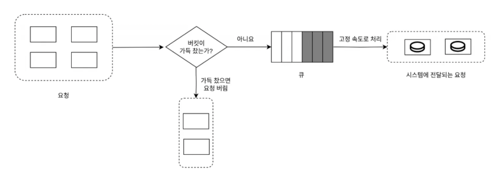
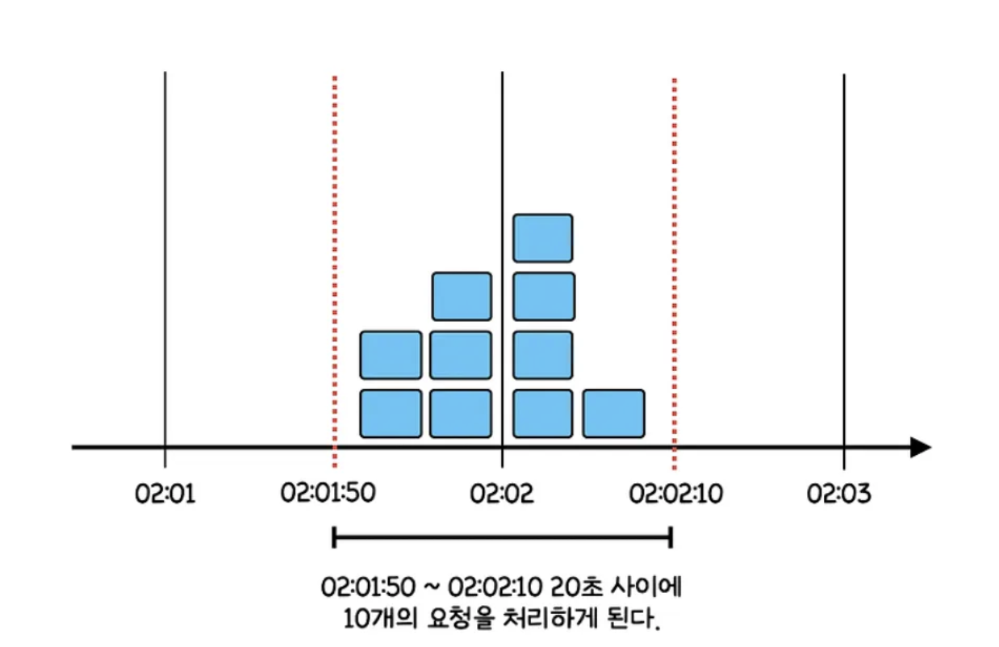
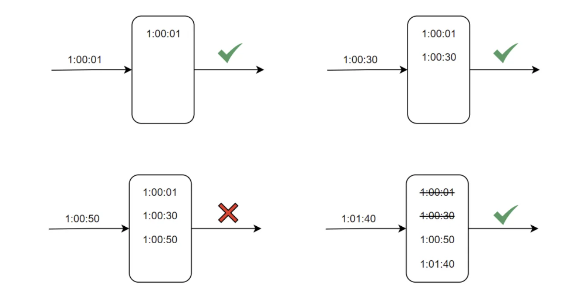
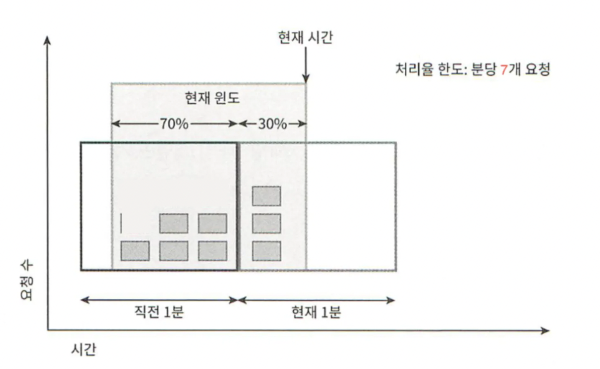

# Rate Limiter

## 처리율 제한 장치란?

클라이언트 또는 서비스가 보내는 트래픽의 처리율을 제어하기 위한 장치를 말한다.

### 예시

- 초당 2회 이상의 새 글을 작성할 수 없음.
- 같은 IP 주소로 하루에 10개 이상의 계정 생성 불가
- 같은 디바이스로 주당 5회 이상 리워드 요청 불가

### 장점

- DoS 공격에 의한 자원 고갈 방지
- third-party API 사용을 하는 경우 처리량을 제한함으로써 비용 절감이 가능
- 서버 과부하 방지

### System Interview 예시

- 시스템 설계 면접에서 가장 중요한 것은 요구사항을 명확하게 파악하는 것.
- 요구사항을 먼저 구체화한다.

**Question**

면접에서 아래와 같이 구체화해나가면 된다.

- 처리율 제한은 서버, 클라이언트 어디에서 해야되나요?
- 어떤 기준으로 제한할까요? → IP, userId, etc
- 시스템 규모는 어느 정도로 산정할까요?
- 분산환경에서 동작하나요? 그렇다면 독립적인 서비스인가요? 아니면 애플리케이션 코드에 포함되나요?
- 사용자가 제한에 걸렸다는 사실을 인지할 수 있어야 하나요?

**Requirements**

위 질문들을 통해 아래와 같은 요구사항을 도출한다.

- 처리율을 초과하는 요청은 제한된다.
- 처리율 제한 장치로 인해 HTTP 응답 시간에 악영향을 주면 안된다.
- 가능한 자원을 적게 사용하면 좋다.
- 하나의 처리율 제한 장치를 여러 WAS에서 공유할 수 있어야 한다.
- 요청이 제한되면 사용자가 인식할 수 있어야 한다.
- 장애가 발생하더라도 전체 시스템에 영향을 주면 안된다.

### 처리율 제한 장치를 어디서 구현하면 좋을까?

- 클라이언트의 경우 요청 위변조가 가능하기 때문에 서버가 적절
- 애플리케이션에서 처리할지, 미들웨어에서 처리할지 선택해야 한다.
  - 애플리케이션 구현
    - 알고리즘을 자유롭게 선택할 수 있다.
    - 모두 직접 구현해야 하기 때문에 공수가 크다.
    - MSA 환경에서 사용자 인증, IP 허용 목록 관리를 하기 위해 API 게이트웨이를 사용하고 있으면 애플리케이션에서 구현이 어려울 수 있다.
  - 미들웨어 사용 (GateWay)
    - third-party 동작을 바꿀 수 없기 때문에 커스터마이징이 어렵다.
    - 구현되어 있는걸 가져다 쓰면 되기 때문에 새로 개발하지 않아도 된다.

→ 현재 상황에 맞게 선택하면 OK

## 처리율 제한 알고리즘

- 처리율 제한을 실현하는 여러 알고리즘이 있는데 유명한 5가지 정도만 책에서 소개하고 있음.

### 토큰 버킷 알고리즘

**동작**

- 버킷에 토큰이 있는데 주기적으로 채워진다.
- 요청이 들어오면 버킷에 있는 토큰을 확인한다.
  - 토큰이 있으면 요청을 처리한다.
  - 토큰이 없으면 요청은 버려진다.

**튜닝값**

- 버킷 크기 : 몇개의 토큰을 담을 수 있는지 결정
- 토큰 공급률 : 초당 몇 개의 토큰이 버킷에 공급되는지 결정

**설정**

- 일반적으로 API 엔드포인트별로 버킷을 둔다.
- 한 사용자의 전체 API 요청 횟수를 제한하고 싶다면 모든 요청이 하나의 버킷을 공유하도록 설정하면 된다.

**장점**

- 구현이 쉽고 메모리 사용 측면에서 효율적이다.
- 짧은 시간에 집중되는 트래픽도 처리 가능하다.

**단점**

- 버킷 크기, 토큰 공급률을 적절하게 튜닝하기 어렵다.

### 누출 버킷 알고리즘

**동작**

- 큐를 사용하고 요청이 도착하면 큐가 가득차있는지 확인한다.
  - 빈 경우 요청을 큐에 추가한다.
  - 비어있지 않은 경우 요청을 버린다.
- 지정된 시간마다 큐에서 요청을 꺼내서 처리한다.

**튜닝값**

- 버킷 크기 : = 큐 사이즈, 처리될 항목을 보관
- 처리율 : 지정된 시간에 몇 개의 요청을 처리할지 지정

**장점**

- 큐 사이즈가 정해져있기 때문에 메모리 사용량 측면에서 효율적
- 고정된 처리율이 있기 때문에 안정적 출력이 필요한 경우 적합

**단점**

- 단시간에 요청이 몰리면 큐에 오래된 요청이 쌓이고 이 요청을 제때 처리 못하면 뒤 요청이 다 버려진다.
- 마찬가지로 적절한 튜닝값 설정이 어렵다.

### 고정 윈도 카운터 알고리즘

**동작**

- 타임라인을 고정 간격 윈도로 나누고 각 윈도마다 카운터를 붙인다.
- 요청이 들어오면 카운터 값 1씩 증가
- 카운터 값이 임계치에 도달하면 새로운 요청은 새로운 윈도가 열릴 때까지 버린다.

**장점**

- 메모리 효율이 좋다.
- 특정한 트래픽 패턴을 처리할때 적합하다.

**단점**

- 윈도 경계 부분에서 일시적으로 요청이 몰리면 예상보다 더 많은 요청을 처리하게 될 수 있다.

  

  - 초당 처리율이 5일때 위와 같이 경계에 요청이 몰리면 10개를 처리하게 될 수 있다.

### 이동 윈도 로깅 알고리즘

**동작**

- 요청이 들어올 때마다 타임스탬프를 로깅한다.
- 새로운 요청이 들어오면 만료된 타임스탬프를 제거한다.
  - 만료된 타임스탬프 : 현재 윈도 시작 시점보다 오래된 타임스탬프
- 로그의 크기가 허용치보다 같거나 작으면 요청을 시스템에 전달, 아니면 처리 거부

**예시**

가정 - 분당 최대 2회의 요청을 처리하도록 설정됨, 1분 윈도 사용

- 1:00:01, 1:00:30은 요청이 들어온 시점에 타임스탬프 로그가 각각 0, 1이기 때문에 자신의 타임스탬프 로그를 남기고 요청을 시스템에 전달한다.
- 1:00:50 요청의 경우 [0:59:50, 1:00:50) 사이에 타임스탬프 로그가 2개이기 때문에 로그만 남기고 시스템에 요청을 넘기지 않는다.
- 1:01:40 요청의 경우 [1:00:40, 1:01:40)가 윈도인데 1:00:40 이전에 들어온 요청의 경우 만료된 타임스탬프이기 때문에 로그에서 제거한다. → 그러면 1:00:50 로그 하나만 남기 때문에 타임스탬프를 기록하고 요청을 시스템에 전달한다.

**장점**

- 어느 순간에도 허용된 요청 개수는 시스템 처리율 한도를 넘지 않는다.
  - 고정 윈도 카운터 알고리즘에서 발생했던 제한보다 많이 처리하게 되는 문제를 해결한다.

**단점**

- 거부되는 타임스탬프도 다 기록해야 하기 때문에 메모리를 많이 사용한다.

### 이동 윈도 카운터 알고리즘

**동작**

- 현재 1분의 30% 시점에 요청이 새로 들어왔을 때 현재 윈도에 몇 개의 요청이 온걸로 처리해야할지가 핵심
  - 현재 1분간 요청 수(3) + 직전 1분간 요청수(5) * 이동 윈도와 직전 1분이 겹치는 비율(5/8 **≈ 70%**)
  - = 6 (내림), 올림으로 사용할 수도 있음.

**장점**

- 이전 시간대의 평균 처리율에 따라 현재 윈도 상태를 계산하기 때문에 짧은 시간에 몰리는 트래픽 처리에도 잘 대응한다.
- 메모리 효율이 좋다.

**단점**

- 직전 시간대 도착 요청이 균등하게 분포되어 있다고 가정한 상태에서 계산하기 때문에 느슨하다
  - cloudflare에서 실험했는데 40억개 요청가운데 잘못 처리된 비율은 0.003%, 거의 무시해도 되는 수준

### 카운터 저장 위치

- 매 요청마다 DB 찔러서 확인하면 속도가 안나옴.
- 메모리에서 동작하는 솔루션을 사용하는게 바람직 → 책에서는 Redis
  - INCR, EXPIRE 명령어를 활용

### 처리율 한도 초과 트래팩 처리

- HTTP 429 응답 (too many requests)을 내려준다.
- 경우에 따라 나중에 처리하기 위해 큐에 보관할 수도 있음.
- 클라이언트가 요청을 얼마나 보낼 수 있는지 알 수 있어야 하는데 이는 HTTP 응답 헤더로 확인 가능
  - X-Ratelimit-Remaining : 윈도 내에 남은 처리 가능 요청 수
  - X-Ratelimit-Limit : 매 윈도마다 클라이언트가 전송할 수 있는 요청 수
  - X-Ratelimit-Retry-After : 한도 제한에 걸리지 않으려면 몇 초 뒤에 요청을 다시 보내야 하는지

### 해결해야 할 문제

- 경쟁 조건
  - 처리율 제한 장치에서 하는 일은 counter 값을 읽어서 조건을 검사하고 counter++를 해주는 것이다.
  - 즉 Read - Modify - Write 구조를 가지기 때문에 갱신분실 문제가 발생할 수 있다.
  - 가장 대중적인 방법은 Lock을 사용하는 방법이지만 성능 이슈가 있기에 Redis에서 제공하는 Lua Script를 활용하여 읽고 쓰는 부분을 원자적 연산으로 묶어서 처리하면 좋다.
- 동기화 이슈
  - SPOF를 방지하기 위해 처리율 제한 장치를 다중화하게 되면 동기화가 중요하다.
    - Sticky session 방식으로 처리할 수도 있겠지만 확장성이 떨어진다.
    - 처리율 제한 장치가 공통으로 바라볼 수 있는 컴포넌트(Global Session Storage)가 있으면 된다.
      - 책에서는 Redis 활용
- 성능 최적화
  - 서버가 물리적으로 멀리 있으면 latency가 떨어지기 때문에 글로벌 서비스의 경우 서버를 지역마다 둠.
  - 제한 장치간에 동기화가 필요한데 eventually consistency로 처리
- 모니터링
  - 채택한 처리율 제한 알고리즘이 효율적인지, 튜닝값은 적절한지 지속적으로 모니터링하고 개선해야 함.
  - 깜짝 이벤트 등으로 트래픽이 급증할 때 비효율적으로 동작할 수 있는데 이러한 패턴들을 분석해서 적절하게 핸들링해야 함.
