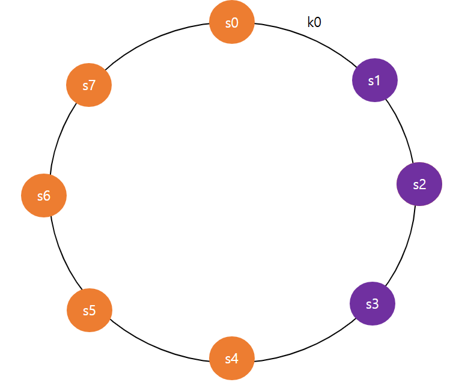
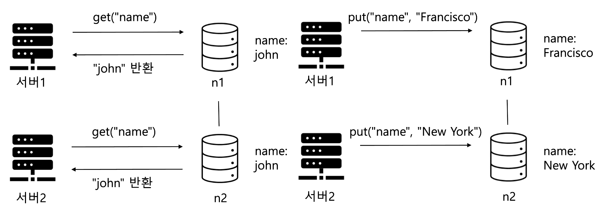
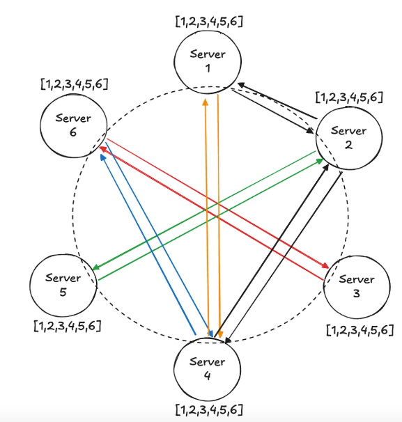
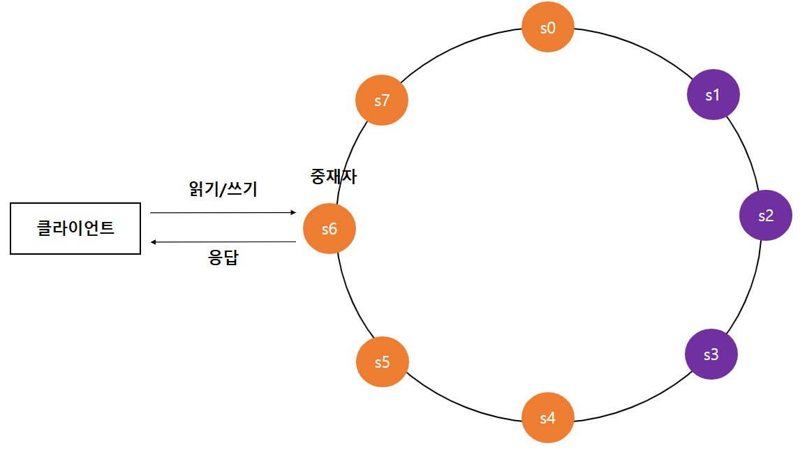

> ## 키 - 값 저장소 설계

키-값 저장소는 키-값 데이터베이스라고 불리는 비 관계형(non-relational) 데이터베이스를 말함. 
이 저장소에 저장되는 값은 고유 식별자를 가지고 접근하며 이 키는 유일해야 하고 해당 키에 달린 값은 키를 통해서만 접근할 수 있다.
이 때, 키는 일반 텍스트일 수도 있고 해시 값일 수도 있다.

이런 키-값 저장소로 알려진 건 아마존의 다이나모, memcached, Redis 등이 있으며 값으로는 데이터베이스마다 다르겠지만
맵이나 리스트 등 여러 값을 지원한다.

앞으로의 설계에서 이야기하는 함수는 put과 get 연산을 이야기할 것이며 다음과 같다.

- put(key, value) : 키-값 쌍을 저장소에 저장한다.
- get(key) : 키에 저장된 값을 가져온다.

---

> ### 분산 키-값 저장소

분산 키-값 저장소는 분산 해시 테이블이라 불리며 분산 시스템을 설계할 떄에는 CAP(Consistency, Availability, Partition Tolerance theorem)에 대한 개념을 알아야 한다.

- 데이터 일관성 : 분산 시스템에 접근하는 모든 클라이언트는 **어떤 노드에 접속했느냐에 관계없이 언제나 같은 데이터를 보아야** 한다.
- 가용성 : 분산 시스템에 접속하는 클라이언트는 **일부 노드에 장애가 발생하더라도 항상 응답을 받을 수 있어야** 한다.
- 파티션 감내 : 파티션은 두 노드 사이에 통신 장애가 발생하였음을 의미한다. 파티션 감내는 **네트워크에 파티션이 생기더라도 시스템은 계속 동작하여야 한다**는 것을 뜻한다.

CAP 정리는 이들 가운데에 2가지를 충족하려면 반드시 나머지 하나는 희생되어야 한다는 것을 의미한다. 

- CP 시스템 : 일관성과 파티션 감내를 지원하는 키-값 저장소, 가용성을 희생한다.
- AP 시스템 : 가용성과 파티션 감내를 지원하는 키-값 저장소, 데이터 일관성을 희생한다.
- CA 시스템 : 네트워크 장애는 피할 수 없으므로 실세계에 존재하지 않는다.

만약에 3개의 노드가 동일한 데이터를 가져야 하는 저장소에서 1개의 서버가 장애가 나면 어떻게 처리를 해야할까?

- CP시스템(일관성을 선택) : 장애가 나지 않은 노드의 쓰기 연산을 중단시킨다. 은행권 시스템에선 데이터의 일관성을 양보하지 않아
상황이 해결될 때까지는 오류를 반환해야 한다.
- AP 시스템(가용성을 선택) : 낡은 데이터를 반환하더라도 읽기 연산을 허용해 정상적인 2개의 노드에 계속해서 쓰기 연산을 허용하고 장애가 난 노드가 복구되면 기존에 반영된 새 데이터를 해당 노드에 전송해 맞추게 된다.

---

> ### 데이터 파티션

책에서는 한 대서버에 모든 데이터를 욱여넣는 게 불가능하다고는 얘기하는데 되는 것 같기도 하다..?
아무튼 불가능한 상황에선 데이터를 작은 파티션들로 분할한 다음 여러 서버에 저장하면 된다. 이 때 고려할 사항은 두 가지이다.

- 데이터를 여러 서버에 고르게 분산할 수 있는가?
- 노드가 추가되거나 삭제될 때 데이터의 이동을 최소화할 수 있는 가?

위의 문제는 안정 해시를 통해 해결을 할 수 있다. 잘 기억이 안날 수 있을 거 같아 가져오면 키가 0-2^64-1까지의 범위로 가질 수 있다면 해당 값을 원형으로 두고
해당 값이 위치한 k0-k3까지의 범위에 있는 키값에 해당하는 데이터를 시계 방향으로 가장 빨리 만나는 서버 s0-s3에 저장한다는 아이디어이다.

#### 안정 해시를 사용하는 장점
- 규모 확장 자동화(automatic scaling) : 시스템 부하에 따라 서버가 자동으로 추가되거나 삭제
- 다양성(heterogeneity) : 각 서버의 용량에 맞게 가상 노드의 수를 조정할 수 있다. 고성능 서버는 더 많은 가상 노드를 갖는다.

가상 노드는 저기서 키가 재배치되는 과정에 있어서 특정 서버가 다운됐을 때 하나의 서버로 지나치게 큰 부하가 가는 현상을 막기 위한 아이디어로 사용이 됐었음.
하단의 이미지를 참고하면 조금 더 잘 기억날 것.

---

### 데이터 다중화

높은 가용성과 안정성을 확보하기 위해선 데이터를 N개 서버에 비동기적으로 다중화(replication)할 필요가 있다. 이 때 N은 시계 방향으로 가면서 몇 개의 서버에 저장할 지를 의미한다.
N이 3이면 k0의 위치에 키가 배치된다고 하면 보라색 위치에 나누어 담기게 된다.

이 때 가상 노드를 사용하면 위에 선택한 N개의 노드가 실제 N개의 물리서버가 아니라 그 미만이 될 수 있다. 그렇기 때문에 충분하게 큰 N을 잡을 필요가 있다.
같은 데이터 센터에 속한 노드는 정전 네트워크 이슈, 자연재해 등의 문제를 동시에 겪으므로 반드시 필요하다.

---

### 데이터 일관성 

여러 노드에 다중화된 데이터는 적절히 동기화가 되어야 한다. 정족수 합의(Quorum Consensus) 프로토콜을 사용하면 읽기/쓰기 일관성을 보장할 수 있다.

- N = 사본 개수
- W = 쓰기 연산에 대한 정족수, W개 이상의 서버로부터 쓰기 연산이 완료되었다는 응답을 받아야 한다.
- R = 읽기 연산에 대한 정족수, R개 이상의 서버로부터 읽기 연산이 완료되었다는 음답을 받아야 한다.

단, 위에서 R이랑 W라고 했지만 실제로는 해당 값 이상의 노드가 완료했을 수 있다. 성공 응답과만 관련이 없기 때문이다. 
전방에 놓인 판단을 내리는 프록시는 해당 응답까지만 기다리고 바로 넘어가버린다.

이 때 R과 W의 값에 따라 이렇게 시스템을 나눌 수 있다.

- R = 1, W = N : 빠른 읽기 연산에 최적화된 시스템
- W = 1, R = N : 빠른 쓰기 연산에 최적화된 시스템
- W + R > N : 강한 일관성이 보장된다.
- W + R <= N : 강한 일관성이 보장되지 않는다.

#### ※ 강한 일관성과 약한 일관성과 최종 일관성

- 강한 일관성 : 모든 읽기 연산은 가장 최근에 갱신된 결과를 반환, 절대로 낡은 데이터를 보지 못한다.
- 약한 일관성 : 읽기 연산은 가장 최근에 갱신된 결과를 반환하지 못할 수도 있다.
- 최종 일관성 : 약한 일관성이지만 결국엔 모든 사본에 갱신 결과가 반영됨.

강한 일관성을 달성하는 방법은 이전에 말한 은행 시스템과 동일하게 모두 반영될 때까지 데이터 읽기/쓰기를 금지시키는 것으로 고가용성을 희생해야 한다.
보통의 솔루션으로 제공되는 다이나모나 카산드라는 최종 일관성을 모델로 잡고 있으며 해당 최종 일관성 문제로 깨진 정합성은 클라이언트 측에서 해결해야 한다.

---

### 데이터 버저닝

아래처럼 기존에 서버 두 곳에서 똑같은 데이터를 보관하고 있다고 해보자. 이 때 각각의 데이터 서버에 다른 요청이 들어와서 일관성을 해칠 수 있다.
이 때 간단한 버저닝으로는 과거의 데이터는 무시할 수 있지만 현재 변경된 "Francisco"와 "New York" 사이의 충돌은 쉽지 않다.

이 문제를 해결할 수 있는 방법으로 제안된 것이 벡터 시계로 [서버, 버전] 순서쌍을 데이터에 매달아 버전 충돌 여부를 판단하는데 사용이 된다.
백터 시계를 D([s1, v1], [s2, v2], ... , [sn, vn])과 같이 표현해보자. 이 때 si 서버에 데이터 D를 기록할 때 규칙은 다음과 같다.

- [si, vi]이 있으면 vi를 증가시킨다.
- 그렇지 않으면 새 항목 [si, 1]을 만든다.

해당 방식을 사용하면 최종 결과에 따라 버전 충돌 여부를 확인할 수 있다.

- 만약에 최종 결과가 D([s0, 1], [s1, 1])이랑 D([s0, 1], [s1, 2])이면 뒷 버전이 최신 버전이다.
- 만약에 최종 결과가 D([s0, 1], [s1, 1])은 D([s0, 1], [s1, 2])이면 어떤 게 최신 버전인지 판별하기가 어렵다.

이를 통해서 어느정도 해결이 가능하지만, 결과적으로 아래의 경우에는 해결할 수가 없음. 이는 타임 스탬프 우선, 특정 서버 우선, 합산 등
도메인 혹은 정책에 따라 다르게 처리한다.

또한, 저 버저닝 관리에서 메모리가 문제가 될 수 있는데, 실제로 DynamoDB에서는 저걸 사용하지만 아마존은 아직까지 문제를 겪어본 적이 없다고 해서 실제로 써도 괜찮은 솔루션으로 판별된다고 한다.

---

### 장애 처리와 감지

분산 시스템에서는 서버 한 대가 아닌 두 대 이상의 서버가 똑같이 특정 서버 A가 장애가 일어났다고 보고 받아야 장애가 일어났다고 간주 받게 된다.
실제로 서로 모든 서버가 서로를 알고 있을 필요는 없다. 시스템 구조가 굉장히 복잡해지기 때문이다. 따라서 가십 프로토콜이라는 방법을 사용한다.
가십 프로토콜은 모든 서버가 서로 알고 있는 게 아니라 각 노드가 멤버 일부에 대한 리스트를 관리하고 그에 대해서만 장애 응답을 서로 주고 받는 것이다.

- 각 노드는 멤버십 목록을 유지한다. 멤버십 목록은 각 멤버 ID와 박동 카운터 쌍의 목록이다.
- 각 노드는 주기적으로 자신의 박동 카운터를 증가시킨다.
- 각 노드는 무작위로 선정된 노드들에게 주기적으로 자기 박동 카운터를 보낸다.
- 박동 카운터 목록을 받은 노드는 멤버십 목록을 최신 값으로 갱신한다.
- 어떤 멤버에 대한 카운터가 지정된 시간을 초과해서 갱신하지 못한다면 해당 멤버는 장애로 판별한다.

---

### 결과 시스템 아키텍처와 특징

#### 아키텍처 주요 기능
- 클라이언트는 키-값 저장소가 제공하는 두 가지 단순한 API, 즉 get(key) 및 put(key, value)와 통신한다.
- 중재자는 클라이언트에게 키-값 저장소에 대한 프락시 역할을 하는 노드이다.
- 노드는 안정 해시와 해시 링 위에 분포한다.
- 노드를 자동으로 추가 또는 삭제할 수 있도록, 시스템은 완전히 분산된다.
- 데이터는 여러 노드에 다중화된다.
- 모든 노드는 같은 책임을 지므로, SPOF는 존재하지 않는다.

