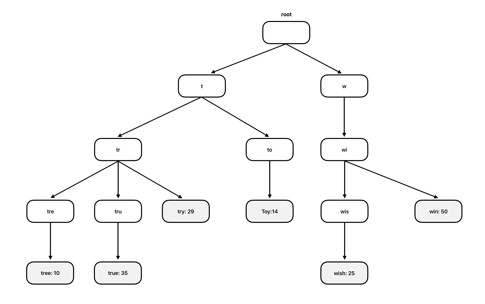
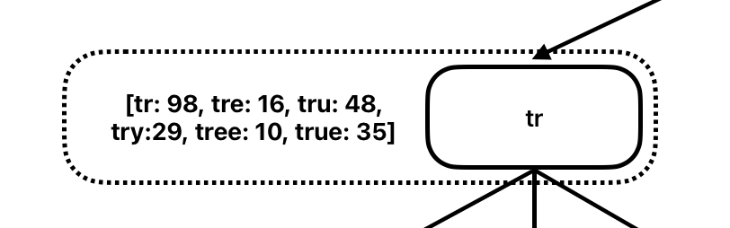
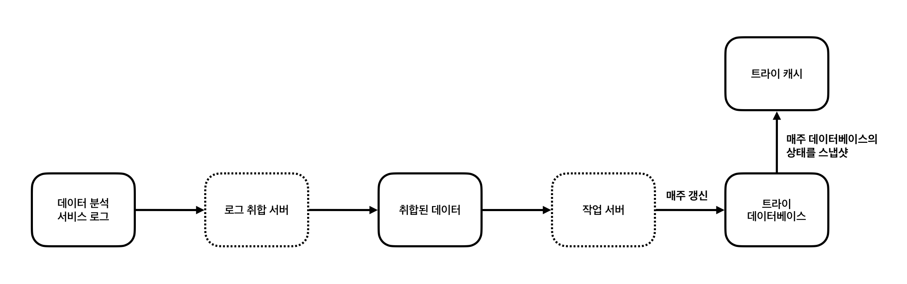
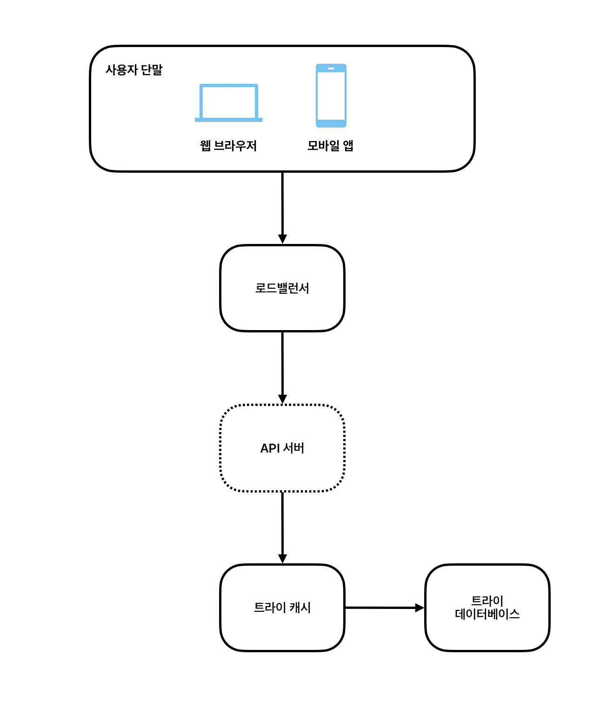

# 13장. 검색어 자동완성 시스템

## 1. 요구사항

- **빠른 응답 속도**: 시스템 응답속도는 100밀리초 이내여야 한다.
- **연관성**: 자동완성되어 출력되는 검색어는 사용자가 입력한 단어와 연관된 것이어야 한다.
- **정렬**: 시스템의 계산 결과는 인기도 등의 순위 모델에 의해 정렬된 상태여야 한다.
- **규모 확장성**: 시스템은 많은 트래픽을 감당할 수 있도록 확장 가능해야 한다.
- **고가용성**: 시스템의 일부에 장애나 예상치 못한 문제가 발생해도 시스템은 계속 사용 가능해야 한다.

## 2. 트라이 자료구조

### 2-1. 필요성

가장 인기 있었던 다섯 개 질의문을 골라내기 위해 먼저 관계형 데이터베이스에 다음과 같은 테이블을 생성한다. 이후 질의문이 들어올 때마다 해당 query의 frequency 값을 1씩 증가시킨다.

| query | frequency |
| --- | --- |
| tree | 10 |
| try | 29 |
| true | 35 |
| toy | 14 |
| wish | 25 |
| win | 50 |

그리고 다음과 같은 SQL 질의문을 사용하면 인기 검색어 5개를 추출할 수 있다.

```sql
SELECT * FROM frequency_table
WHERE query LIKE 'prefix%'
ORDER BY frequency DESC
LIMIT 5
```

하지만 이 방법은 데이터 양이 많아지면 성능이 저하되고 데이터베이스 서버가 병목 지점이 될 수 있다. 이러한 문제를 해결하기 위해 트라이 자료구조를 사용한다.

### 2-2. 특징

트라이는 문자열을 간략하게 저장할 수 있는 자료구조다. 아래와 같은 특징을 가진다.

- 트라이는 트리 형태의 자료구조다.
- 이 트리의 루트 노드는 빈 문자열을 나타낸다.
- 각 노드는 글자 하나를 저장하며, 26개의 자식 노드를 가질 수 있다. (영어 기준)
- 각 트리 노드는 하나의 단어, 또는 접두어 문자열을 나타낸다.

기존의 테이블을 트라이 노드에 저장하면 다음과 같은 상태가 된다.



### 2-3. 구현

트라이를 사용하면 다음과 같은 방식으로 가장 많이 사용된 질의어 $k$개를 찾을 수 있다. 이때 $p$는 접두어의 길이, $c$는 주어진 노드의 전체 하위 노드 개수이다.

1. 해당 접두어를 표현하는 노드를 찾는다. 시간 복잡도는 $O(p)$이다.
2. 해당 노드부터 시작하는 하위 트리를 탐색하여 모든 유효 노드를 찾는다. 시간 복잡도는 $O(c)$이다.
3. 유효 노드들을 정렬하여 가장 인기 있는 검색어 $k$개를 찾는다. 시간 복잡도는 $O(clogc)$이다.

### 2-4. 최적화

시간 복잡도를 줄이기 위해 다음과 같은 최적화 방안을 적용할 수 있다.

- **접두어 최대 길이 제한**
    
    사용자가 검색창에 긴 검색어를 입력하는 경우는 거의 없기 때문에 $p$를 작은 값의 정수로 제한할 수 있다. 그럼 첫 번째 단계의 시간 복잡도는 $O(p)$에서 $O(1)$이 된다.
    
- **노드에 인기 검색어 캐시**
    
    각 노드에 검색 횟수뿐만 아니라 $k$개의 인기 검색어 결과까지 함께 저장해 두면 두 번째와 세 번째 단계의 시간 복잡도는 $O(1)$이 된다. 비록 저장공간이 매우 많이 필요하다는 단점이 있지만 빠른 응답속도가 아주 중요한 상황에서는 저장공간을 희생할 만한 가치가 있다.
    
    
    

## 3. 데이터 수집 서비스

사용자가 검색창에 글자를 타이핑할 때마다 실시간으로 트라이를 갱신하면 속도가 크게 저하될 것이다. 또한 대부분의 경우에 인기 검색어를 자주 갱신할 필요가 없다. 따라서 다음과 같은 구조를 사용해 배치 작업 방식으로 주기적으로 트라이를 계산하고 갱신한다.



### 3-1. 데이터 분석 서비스 로그

검색창에 입력된 질의에 관한 원본 데이터를 기록한다. 데이터 추가만 발생하고 기존 데이터는 수정되지 않으며 별도의 인덱스를 걸지 않는다.

| query | time |
| --- | --- |
| tree | 2019-10-01 22:01:01 |
| try | 2019-10-01 22:01:05 |
| tree | 2019-10-01 22:01:30 |
| toy | 2019-10-01 22:02:22 |

### 3-2. 로그 취합 서버

양이 방대하고 형식도 제각각인 로그 데이터를 취합하는 역할을 한다. 대부분 일주일에 한 번 정도 로그를 취합하지만 실시간성이 강한 서비스라면 데이터 취합 주기를 보다 짧게 설정할 수도 있다.

### 3-3. 취합된 데이터

취합한 데이터는 다음과 같은 형태가 될 수 있다. time 필드는 해당 주의 시작일을, frequency 필드는 해당 질의가 해당 주에 사용된 총 횟수이다.

| query | time | frequency |
| --- | --- | --- |
| tree | 2019-10-01 | 12000 |
| tree | 2019-10-08 | 15000 |
| toy | 2019-10-01 | 9000 |
| toy | 2019-10-08 | 8500 |

### 3-4. 작업 서버

주기적으로 비동기적 작업을 실행하는 서버이다. 취합된 데이터로 트라이 자료구조를 만들고 이를 트라이 데이터베이스에 저장하는 역할을 한다.

트라이를 갱신하는 데는 두 가지 방법이 있다. 첫 번째는 전체 트라이를 갱신하는 방법이다. 새로운 트라이를 만든 다음 기존 트라이를 대체한다. 두 번째는 트라이의 각 노드를 개별적으로 갱신하는 방법이다. 트라이가 작은 경우에 고려해볼 수 있다. 트라이 노드를 갱신할 때 모든 상위 노드도 갱신해야 하는데 트라이의 크기가 클수록 관련 노드 수가 많아져 성능 저하가 발생할 수 있다.

### 3-5. 트라이 캐시

분산 캐시 시스템으로 트라이 데이터를 메모리에 유지하여 읽기 연산 성능을 높인다. 이를 위해 매주 트라이 데이터베이스의 스냅샷을 떠서 갱신한다.

### 3-6. 트라이 데이터베이스

트라이 데이터베이스로 가능한 선택지로는 다음 두 가지가 있다.

1. **문서 저장소**
    
    MongoDB 등과 같은 문서 저장소를 활용해 주기적으로 트라이를 직렬화하여 데이터베이스에 저장한다.
    
2. **키-값 저장소**
    
    트라이에 보관된 모든 접두어를 해시 테이블 키로 변환하고, 각 트라이 노드에 보관된 모든 데이터를 해시 테이블 값으로 변환해 트라이를 해시 테이블 형태로 저장한다.
    

## 4. 질의 서비스

### 4-1. 구조



1. 검색 질의가 로드밸런서로 전송된다.
2. 로드밸런서는 해당 질의를 API 서버로 보낸다.
3. API 서버는 트라이 캐시에서 데이터를 가져와 해당 요청에 대한 자동완성 검색어 제안 응답을 구성한다.
4. 데이터가 트라이 캐시에 없으면 트라이 데이터베이스에서 가져와 캐시에 저장한다.

또한 API 서버와 트라이 캐시 사이에 필터 계층을 두어 부적절한 질의어를 자동완성 결과에서 제거할 수도 있다.

### 4-2. 최적화

속도를 높이기 위해 다음과 같은 최적화 방안을 적용할 수 있다.

- **AJAX 요청**
    
    AJAX 요청을 통해 페이지를 새로고침하지 않고도 요청을 주고 받을 수 있다.
    
- **브라우저 캐싱**
    
    제안된 검색어 결과를 브라우저 캐시에 넣어두면 후속 질의는 서버를 거치지 않고 바로 반환할 수 있다. 구글 검색 엔진이 이런 캐시 메커니즘을 사용하며 한 시간 동안 검색어 결과를 캐시해 둔다.
    
- **데이터 샘플링**
    
    모든 질의 결과를 로깅하지 않고 N개의 요청 중 가장 대표성이 강한 1개만 로깅한다. 이를 통해 CPU나 저장공간 같은 자원도 절약할 수 있다.
    

## 5. 저장소 규모 확장

트라이의 크기가 한 서버에 넣을 수 없을 정도로 커졌다면 규모를 확장해야 한다. 영어의 경우 첫 번째 글자를 기준으로 샤딩하는 방법을 생각해볼 수 있다. 예를 들어 ‘a’부터 ‘i’까지는 첫 번째 서버에, ‘j’부터 ‘r’까지는 두 번째 서버에, 나머지는 세 번째 서버에 저장하는 방식이다. 샤딩을 계층적으로 적용하면 두 번째, 세 번째, 그 이후 글자까지 고려해 샤딩할 수 있다.

하지만 각 알파벳으로 시작하는 검색어들의 개수가 균일하지 않기 때문에 데이터를 각 서버에 균등하게 배분할 수 없다는 한계가 있다. 이를 해결하기 위해 과거 질의 데이터의 패턴을 분석해 샤딩할 수 있다. 예를 들어 특정 알파벳으로 시작하는 검색어의 양이 다른 여러 알파벳으로 시작하는 검색어를 전부 합친 것과 비슷하다면 특정 알파벳에는 하나의 샤드를, 다른 여러 알파벳들은 통합해서 하나의 샤드를 두는 방식이다.