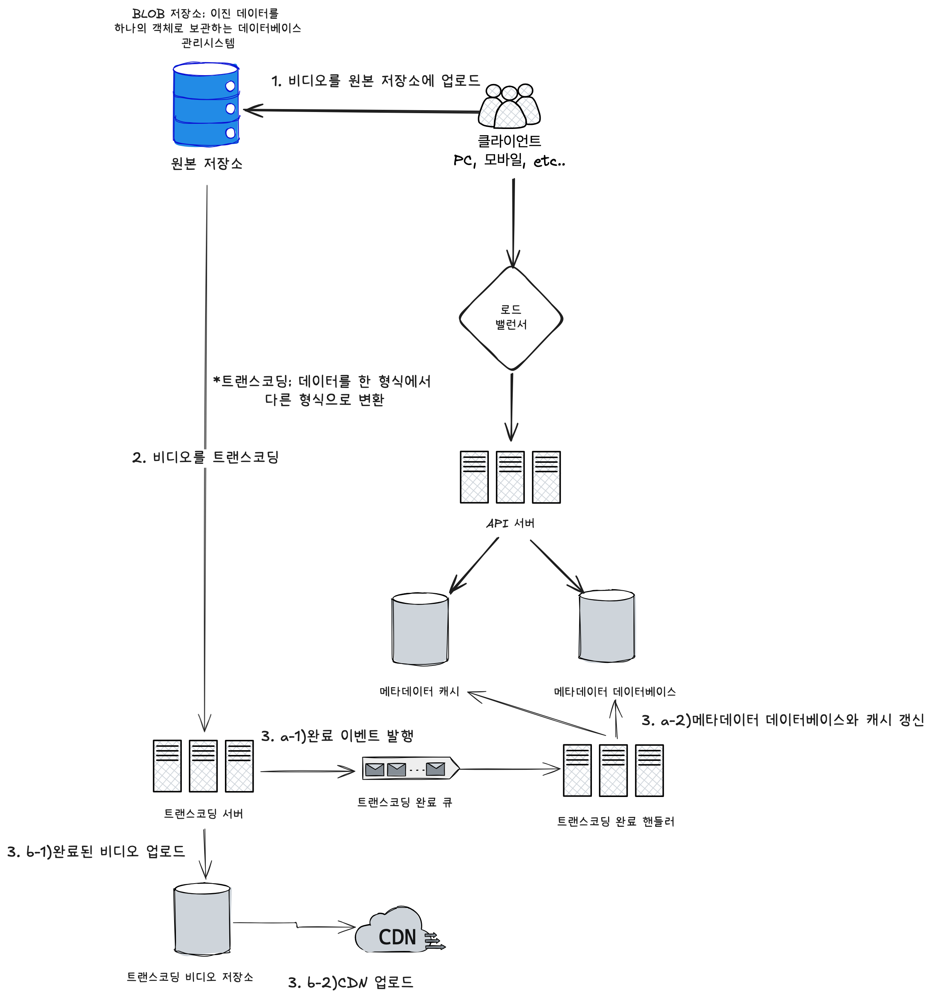
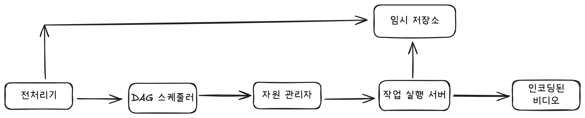

# 유투브 시스템 설계

## 고려사항
- 빠른 비디오 업로드
- 원활한 비디오 재생
- 재생 품질 선택
- 낮은 인프라 비용
- HA, 확장성, 안정성
- 지원 클라이언트: 모바일, PC, 스마트 TV 등등

***

## 개략적 설계안

### 비디오 스트리밍 절차
비디오 스트리밍은 스트리밍 프로토콜을 통해 지역적으로 가까운 CDN에서 실행된다.
- 스트리밍 프로토콜: 비디오 스트리밍을 위해 데이터를 전송할 때 쓰이는 표준화된 통신방법
  - MPEG, HLS, HDS등등
  - 프로토콜마다 지원되는 비디오 인코딩과 플레이어가 다르다.

***
## 상세 설계

### 비디오 트랜스코딩
비디오 트랜스코딩을 통해 다른 단말에 호환되는 비트레이트와 포맷으로 저장한다.
- 저장 공간 문제
- 호환성 문제
- 대역폭에 따른 화질 설정
- 유동적인 화질
- 인코딩 포맷
  - 컨테이너: 비디오 파일, 오디오, 메타데이터를 담는 확장자
  - 코덱: 비디오 화질은 보존하면서 파일 크기를 줄일 목적으로 고안된 압축 및 압축 해제 알고리즘

### 유향 비순환 그래프 모델
이제 원본 비디오를 가지고 사용자가 하고 싶은 작업들이 있을 것이다. 예를 들어 워터마크를 넣는다거나, 메타데이터를 가져온다거나 여러 포맷으로 변환한다거나
다양한 작업을 수행할 수 있다. 각각의 프로세스들을 추상화해서 어떤 과정을 거칠 것인지 커스텀할 수 있게 설계한다.

### 비디오 트랜스코딩 아키텍처

- 전처리기
  - 비디오 분할: 비디오 스트림을 GOP라는 단위로 분할
  - DAG생성: 설정 파일을 읽어 DAG 생성
  - 데이터 캐시: 메타데이터를 저장했다가 인코딩 실패 시 해당 정보로 재시도
- DAG 스케줄러
- 자원 관리자
  - 작업 큐: 실행할 작업이 보관되어 있는 우선순위 큐
  - 작업 서버 큐: 작업 서버의 가용 상태 정보가 보관되어 있는 큐
  - 작업 실행 큐: 현재 실행중인 작업, 서버 정보 저장되어 있는 큐
  - 작업 스케줄러: 최적의 작업 서버를 골라, 해당 작업 서버가 작업을 수행하도록 지시하는 역할
  1. 큐에서 가장 중요한 작업 꺼내기
  2. 적합한 작업 서버 선택
  3. 실행 큐에 작업 정보 저장
  4. 완료 시 실행 큐에서 제거

***
## 최적화

### 속도 최적화
- 비디오 병렬 업로드: 비디오를 GOP로 분할하고 각각을 병렬로 업로드.
- 업로드 센터를 사용자 근거리에 지정
- 모든 절차 병렬화: 메시지 큐로

### 안정성 최적화
- 미리 사인된 업로드 URL: 클라이언트 측에서 백엔드를 거치지 않고 바로 클라우드 스토리지에 저장할 수 있도록 하는 방식
  1. 클라이언트가 서버에 URL 요청
  2. 유효 시간 있는 URL 반환
  3. 클라이언트가 해당 URL로 직접 업로드
- 비디오 보호: 저작권, 워터마크 등등

### 비용 최적화
CDN을 사용하면 과금이 많이 나올 수도 있다.
- 인기 비디오만 CDN으로 재생, 나머지는 비디오 서버로.
- 짧거나 비인기 비디오는 인코딩 안하기
- 지역적으로 인기 비디오는 해당 지역 저장소에 저장.
- CDN 직접 만들기