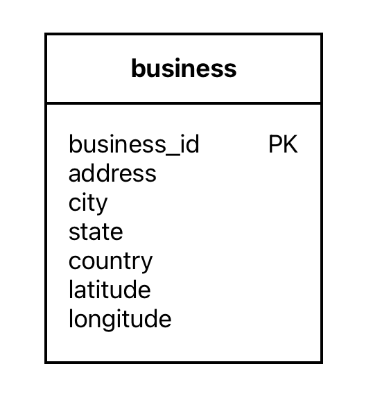
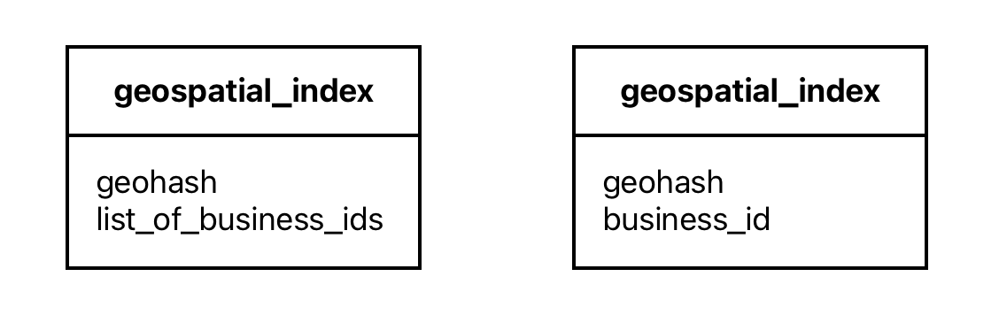
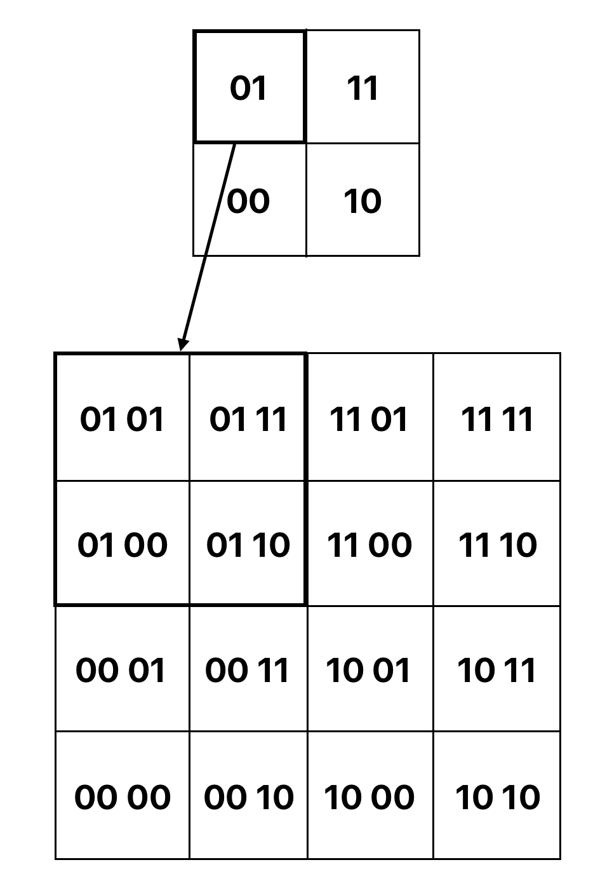
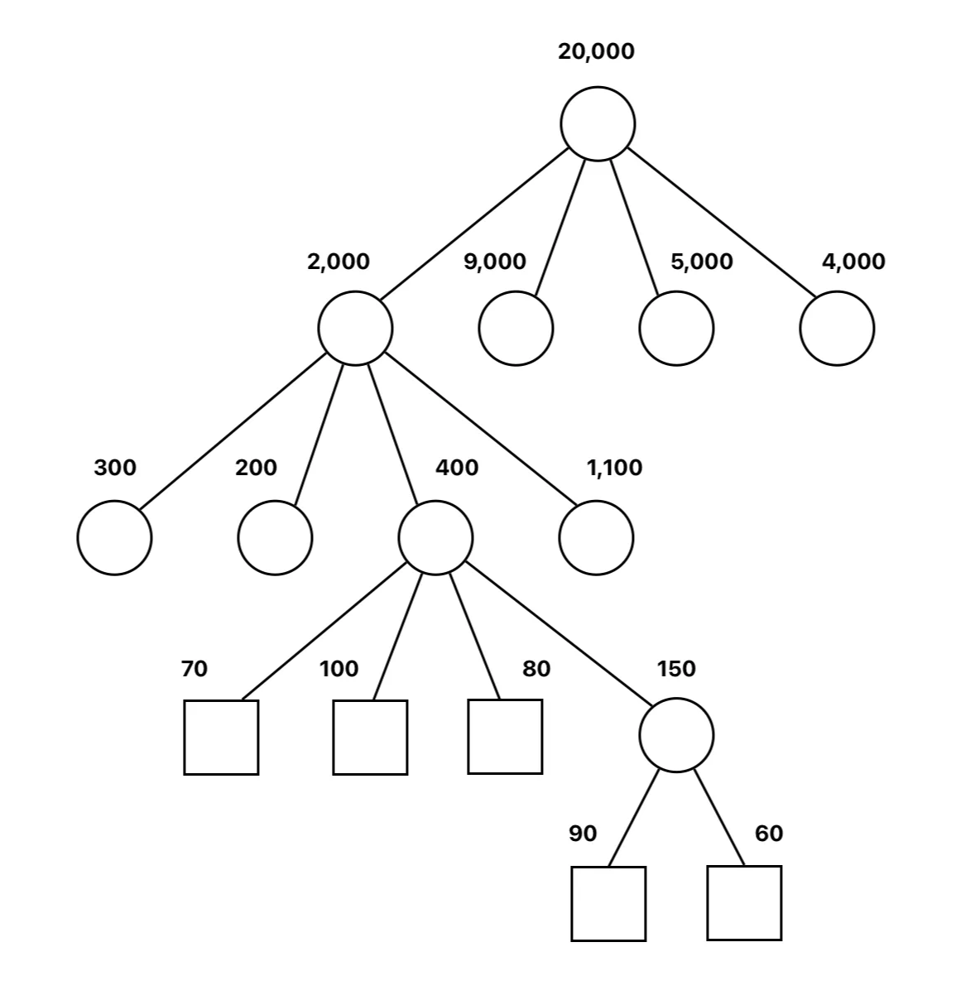
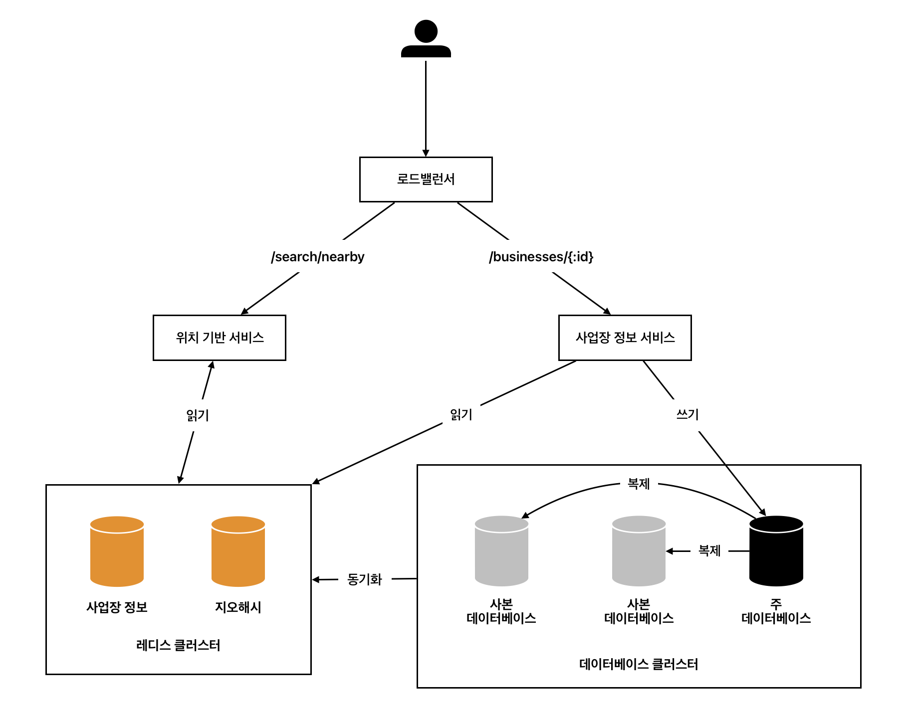

# 1장. 근접성 서비스

## 1. 요구사항

### 1-1. 기능 요구사항

- 사용자의 위치 및 검색 반경 조건과 매치되는 사업장 목록을 반환함
- 사업장 정보는 추가, 삭제, 갱신 가능하며 실시간으로 반영될 필요는 없음
- 고객은 사업장의 상세 정보를 살필 수 있음

### 1-2. 비기능 요구사항

- **낮은 응답 지연**: 사용자는 주변 사업장을 신속히 검색할 수 있어야 함
- **데이터 보호**: 사용자 위치는 민감한 정보이며 데이터 사생활 보호 법안을 준수해야 함
- **고가용성 및 규모 확장성**: 인구 밀집 지역에서 이용자가 집중되는 시간에도 트래픽을 감당할 수 있어야 함

## 2. API 설계

### 2-1. 검색 기준에 맞는 사업장 목록 반환

1. **엔드포인트**
    
    GET `/v1/search/nearby`
    
2. **요청**
    
    
    | 필드 | 설명 | 자료형 |
    | --- | --- | --- |
    | latitude | 위도 | decimal |
    | longitude | 경도 | decimal |
    | radius | 반경 | int |
3. **응답**
    
    편의상 페이지 분할은 생략한다. `business object`는 검색 결과 페이지에 표시되는 정보만 포함한다. 그외 상세 정보는 사업장 상세 정보 API에서 조회한다.
    
    ```json
    {
    		"total": 10,
    		"businesses": [{business object}]
    }
    ```
    

### 2-2. 사업장 관련 API

| 엔드포인트 | 설명 |
| --- | --- |
| GET `/v1/businesses/:id` | 특정 사업장의 상세 정보 반환 |
| POST `/v1/businesses` | 새로운 사업장 추가 |
| PUT `/v1/businesses/:id` | 사업장 상세 정보 갱신 |
| DELETE `/v1/businesses/:id` | 특정 사업장 정보 삭제 |

## 3. 데이터 모델

### 3-1. 사업장 테이블

이 시스템에서 읽기 연산은 굉장히 자주 수행되는 반면 쓰기 연산의 실행 빈도는 낮다. 이런 경우엔 MySQL 같은 관계형 데이터베이스가 적합할 수 있다. 다음은 사업장과 관련된 `business` 테이블의 스키마이다.



규모가 커지면 사업장 테이블을 한 서버에 담을 수 없을 수도 있다. 이런 경우 사업장 ID를 기준으로 샤딩을 적용하면 부하를 고르게 분산할 수 있으며 관리도 용이하다.

### 3-2. 지리 정보 색인 테이블

위치 정보 관련 연산의 효율을 높이기 위해 지리적 위치 색인 테이블을 사용한다. 다음 두 가지 스키마 중 하나를 사용할 수 있다.



첫 번째는 각 지오해시의 격자 내의 사업장 ID들을 리스트 형태로 저장하는 것이다. 두 번째는 첫 번째를 1차 정규화하여 각각 하나의 행으로 저장하는 것이다. 사업장 정보 갱신에는 두 번째 스키마가 더 유리하다.

지오해시 테이블의 경우 샤딩 로직을 애플리케이션 계층에 구현해야 한다는 번거로움이 있다. 따라서 샤딩보다는 주-부 데이터베이스를 나누는 것이 좋다. 주 데이터베이스는 쓰기 요청을 처리하고 부 데이터베이스는 읽기 요청을 처리한다. 데이터의 변경 사항은 우선 주 데이터베이스에 기록된 다음 부 데이터베이스로 복사된다.

### 3-3. 캐시

우선 사용자의 위도, 경도는 캐시 키로 적절하지 않다. 조금만 이동해도 정보 값이 미세하게 변경되기 때문이다. 지오해시나 쿼드트리는 이러한 문제점을 효과적으로 해결할 수 있다. 또한 사업장 정보는 상대적으로 자주 변경되지 않기 때문에 레디스 같은 저장소에 캐시할 수 있다. 따라서 캐시에 다음과 같은 키-값 쌍을 보관한다.

| 키 | 값 |
| --- | --- |
| 지오해시 | 해당 격자 내의 사업장 ID 목록 |
| 사업장 ID | 사업장 정보 객체 |

## 4. 주변 사업장 검색 알고리즘

### 4-1. 2차원 검색

주어진 반경으로 원을 그리고 원 안에 존재하는 사업장을 검색하는 방식이다. 다음과 같은 SQL문을 사용한다.

```sql
SELECT business_id, latitude, longitude
FROM business
WHERE (latitude BETWEEN {:my_lat} - radius AND {:my_lat} + radius)
AND (longitude BETWEEN {:my_long} - radius AND {:my_long} + radius)
```

하지만 이 질의는 테이블을 전부 읽어야 하므로 비효율적이다. 위도와 경도에 인덱스를 생성하더라도 결국 위도로 찾은 데이터 집합과 경도로 찾은 데이터 집합의 교집합을 찾아야 하므로 유의미하게 개선되지 않는다.

이 문제를 해결하려면 지도를 작은 영역으로 분할하고 빠른 검색이 가능하도록 지리적 정보에 색인을 만들어야 한다. 이는 크게 두 가지 방식으로 나눌 수 있다.

- **해시 기반 방안**: 균등 격자, 지오해시, 카르테시안 계층 등
- **트리 기반 방안**: 쿼드트리, 구글 S2, R 트리 등

### 4-2. 균등 격자

지도를 작은 격자 또는 구역으로 나누는 방식이다. 각 격자 간 데이터 분포가 균등하지 않다는 단점이 있다. 또한 격자 식별자 할당에 명확한 체계가 없기 때문에 주어진 격자와 인접한 격자를 찾기가 까다로울 수 있다.

### 4-3. 지오해시



2차원의 위도 경도 데이터를 1차원의 문자열로 변환하는 방식이다. 재귀적으로 비트를 늘려가면서 지도를 더 작은 격자로 분할한다. 예를 들어 전 세계를 사분면으로 나눈 후 각각을 `00`, `01`, `10`, `11`로 표현한다. 그리고 각 사분면을 다시 사분면으로 나눠 비트를 추가한다. 이 과정을 원하는 정밀도를 얻을 때까지 반복한다.

지오해시는 통상적으로 base32 표현법을 사용하며 정밀도는 12단계로 나눌 수 있다. 지오해시의 길이가 길어질수록 정밀도가 높아지며 격자 크기가 작아진다. 최적 정밀도를 구하기 위해서는 사용자가 지정한 반경의 원을 덮을 수 있는 최소 크기의 격자를 찾아 이를 만드는 지오해시 길이를 구해야 한다.

| 반경 | 지오해시 길이 |
| --- | --- |
| 0.5km | 6 |
| 1km | 5 |
| 2km | 5 |
| 5km | 4 |
| 20km | 4 |

### 4-4. 쿼드트리



격자의 내용이 특정 기준을 만족할 때까지 2차원 공간을 재귀적으로 사분면 분할한다. 트리 기반의 자료 구조이다. 예를 들어 다음과 같은 의사 코드 과정을 통해 한 격자에 담긴 사업장 수가 100개 이하가 될 때까지 분할할 수 있다.

```java
public void buildQuadtree(TreeNode node) {
		if (countNumberOfBusinessInCurrentGrid(node) > 100) {
				node.subdivide();
				for (TreeNode child : node.getChildren()) {
						buildQuadtree(child);
				}
		}
}
```

쿼드트리는 데이터베이스가 아니라 메모리에 올라가는 자료 구조이다. 따라서 서버가 시작될 때마다 쿼드트리를 구축해야 한다. 쿼드트리 인덱스는 메모리를 많이 잡아먹지 않아서 서버 한 대에 충분히 올릴 수 있지만 읽기 연산 양이 많아지면 여러 서버로 분산하는 것도 가능하다.

또한 전체 사업장 수가 $n$일 때, 쿼드트리를 구축하는 시간 복잡도는 $n / 100 * log(n / 100)$이다. 이는 사업장이 2억 개일 때 몇 분 정도 소요되는 수준으로 쿼드트리 구축 때문에 서버 시작 시간이 길어질 수 있음에 유의해야 한다.

### 4-5. 구글 S2

구글이 제공하는 라이브러리로 지구를 힐베르트 곡선을 사용해 1차원으로 인덱스화하는 방식이다. 힐베르트 곡선은 곡선 상에서 인접한 두 지점이 인덱스화 이후 1차원 공간 내에서도 인접한 위치에 있다는 특징을 가진다.

S2는 임의의 지역에 다양한 수준의 영역 지정이 가능하기 때문에 지오펜스 구현에 아주 적합하다. 지오펜스란 지리 영역에 설정한 가상의 경계이다. 지오펜스를 활용하면 특정 경계를 벗어난 사용자에게 알림을 보내는 등 단순히 주변 사업장을 검색하는 것보다 훨씬 풍부한 기능을 제공할 수 있다.

## 5. 전체 설계도



### 5-1. 로드밸런서

URL 경로를 분석하여 어느 서비스에 트래픽을 전달할지 결정한다.

### 5-2. 위치 기반 서비스

주어진 위치와 반경 정보를 이용해 주변 사업장을 검색한다. 쓰기 요청이 없고 읽기 요청만 빈번하게 발생하며 QPS가 높다. 무상태 서비스로 수평적 규모 확장이 용이하다. 트래픽이 몰리는 시간대에는 서버를 추가하고 그렇지 않은 시간대에는 서버를 삭제하도록 구성할 수 있다.

### 5-3. 사업장 서비스

고객이 사업장 상세 정보를 조회하는 요청은 읽기 요청으로 QPS가 높다. 반면 사업장 소유주가 사업장 정보를 생성, 갱신, 삭제하는 요청은 기본적으로 쓰기 요청으로 QPS가 높지 않다. 위치 기반 서비스와 마찬가지로 오토스케일링을 적용할 수 있다.