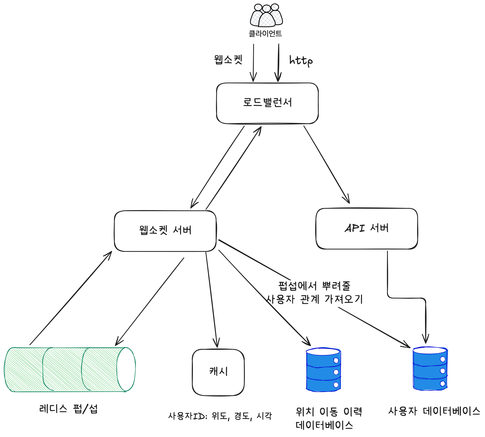
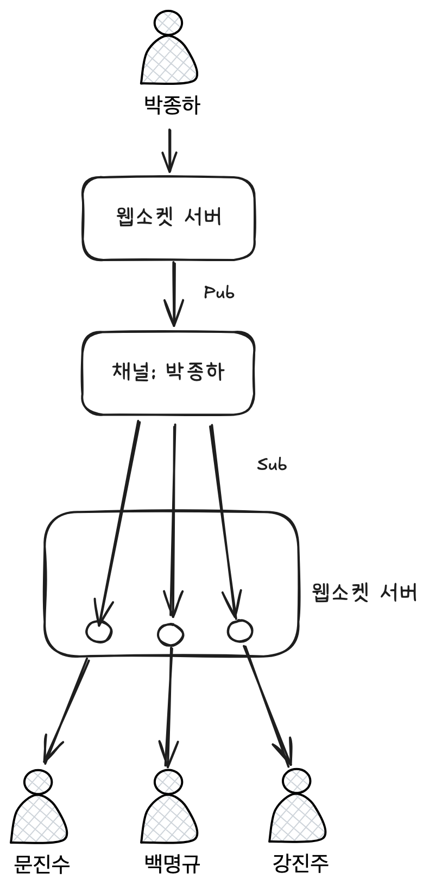
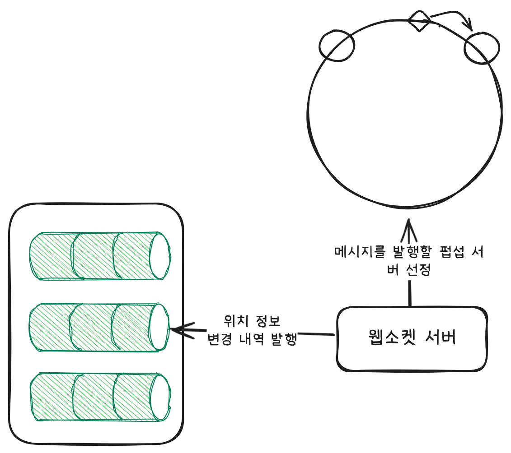

# 주변 친구
- 지리적으로 근접한 친구들 보여주는 기능 
=> 1장과의 차이점은 친구들 위치는 "동적"이라는 점

## 설계 범위 설정
- 얼마나 가까워야 하는가? -> 5마일(직선거리)
- 사용자 1억명
- 이동 이력 저장 필요
- 가만히 있을 시 비활성화 기능 존재

## 요구사항
- 주변에 있는 친구, 거리, 갱신된 시각 정보
- 주기적으로 갱신
- 낮은 지연 시간, 안정성, 결과적 일관성, 

***

## 개략적 설계

### 필요 기능
- 모든 활성 상태 사용자의 위치 변화 내역을 수신
- 내역을 활성 친구들에게 발신
- 거리가 먼 경우 발신 x

### 웹소켓 서버
- 친구 위치 정보를 실시간으로 처리하는 유상태 서버
- 위치 변경 내역을 최신화하고 친구들에게 해당 내용을 뿌리는 역할

### Redis 캐시 서버
- TTL로 활성 상태 관리하면서 최신 위치 정보 캐싱
- 키-값 저장소를 사용하는 이유: 보여주는 것은 사용자의 현재 위치 하나다.(영속성이 중요하지 않음) 빠른 키-값 연산으로 가져오기 위함이다.

### 사용자 DB
- 친구 관계

### Redis Pub/Sub
- 채널 만드는 것은 값싼 연산이기 때문에 수백만 개의 채널 생성 가능 -> 내 친구들 목록이 토픽이 댐 해당 주제에서는
- 사용자의 위치가 바뀌면 pub해서 subscriber들인 친구들이 이를 sub함.

### 위치 이동 이력 데이터베이스
- 위치 변경 내역 기록
- 사용자ID:위도:경도:시각
- 같은 시각에 모든 사용자의 위치 변경을 기록함 -> 사용자 수만큼 쓰기 연산이 같은 시각에 발생하는데 규모에 따라 적정 데이터베이스 선정
- append-only 테이블로 데이터가 엄청 많아짐 -> 사용자ID로 샤딩(시간별 기록이니 데이터는 균등)

***

## 상세 설계

### 웹소켓 서버
- "유상태" 서버다. -> 서버를 유동적으로 열고 닫으려면 물고 있는 웹소켓들이 전부 종료된 후에 해야함. -> 이걸 관리해주는 시스템 필요.

### Redis 캐시 서버
- 마찬가지로 사용자들의 위치 변경 내역을 같은 시각에 일괄적으로 갱신하는데 이를 감당할 수 있게 설계해야 한다.
- 사용자ID 샤딩
- HA 등등

### Redis Pub/Sub
- 채널 메모리 자체는 사용자가 아무리 많아도 크게 문제되지 않음.
- 구독자에게 위치 정보는 보내는 연산이 많아 CPU 사용량의 문제.
- 분산 Redis Pub/Sub 클러스터로 해결

### 분산 Redis Pub/Sub 클러스터
- 안정해시로 해결(1권 자료 참고)

- 주의점
  - 만약 클러스터의 크기를 바꾼다? -> 해시 링 위 다른 서비스에서 이제 데이터 재분배 및 재구독 비용이 엄청남.
  - 이로 인해 위치 정보 변경 처리 유실 가능.

***

## 기타 사항들

### 친구 추가 시
- 친구를 추가할 시 현재 아키텍처에서는 api 서버에서 이를 처리한다.
- 하지만 펍섭에는 구독정보가 없으므로 이를 받지 못함. -> 이를 갱신하는 처리 필요.

### 많은 친구
- 사실상 친구들 위치가 바뀌는 것은 웹소켓 서버가 나누어 처리하므로 핫스팟 문제는 발생하지 않음.

### 주변의 임의 사용자
- 요구사항을 조금 바꿔 만약 위치 공개에 동의한 주변 사용자들을 보여주는 기능을 추가하면?
- 펍섭 채널을 지오해시로 발행해서 해결.
