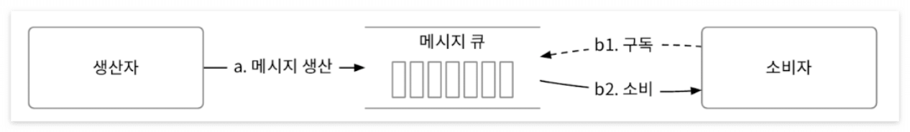
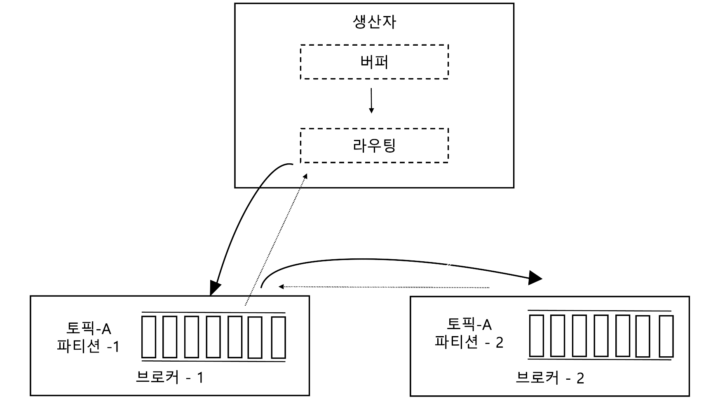
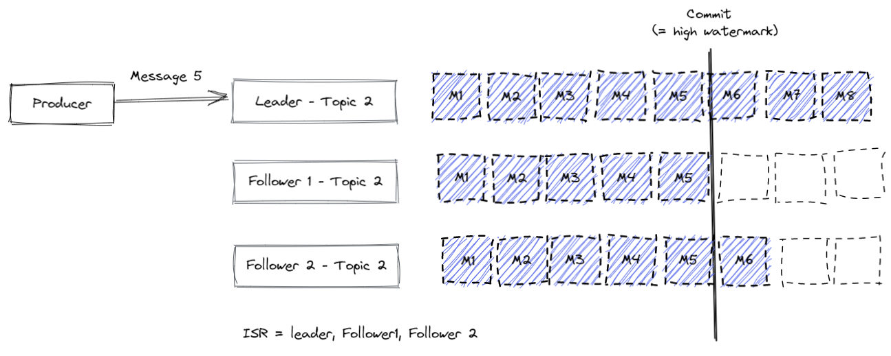

> ## 분산 메세지 큐

메세지 큐의 역할은 아래와 같이 정리할 수 있다.
- 결합도 완화 : 컴포넌트 사이의 강한 결합을 없애 각각을 독립적 갱신이 가능
- 규모 확장성 개선 : 생산자와 소비자를 트래픽 부하에 맞게 독립적으로 늘릴 수 있다.
- 가용성 개선 : 특정 컴포넌트의 장애가 다른 컴포넌트에 영향을 주지 않는다.
- 성능 개선 : 메시지 큐를 사용하면 비동기 통신이 쉽다.

### 전통적인 메시지 모델의 기본 개념

기본적으로 위의 메시지 모델에서 각자의 역할과 그 사이에서 어떤 관계가 있는지는 위의 그림을 보면 알 수 있다.
각각의 역할에 관해서 정의를 해보면 아래와 같이 정리할 수 있다.

- 생산자 : 메시지를 메시지 큐에 발행
- 소비자 : 큐를 구독하고 구독한 메시지를 소비
- 메시지 큐 : 생산자 소비자 사이를 느슨하게 하는 담당

클라이언트 서버 모델에 대응해보자.

- 클라이언트(생산자, 소비자) - 서버(메시지 큐)

각각의 모델은 다음과 같이 정리할 수 있다.

- 일대일 모델 : 큐에 전송된 메시지는 딱 한 소비자만 가지고 갈 수 있다. 이 때 소비자가 메시지를 가져갔다는 사실을 큐에 알리면 메시지는 큐에서 삭제된다.
- 발행-구독 모델 : 토픽이란 개념을 도입해 토픽에 메시지를 보내고 받으며 이 때는 한 소비자가 메시지를 가져가지 않아도 된다. 여러 소비자가 동일한 메시지를 소비해도 된다.

토픽, 파티션, 브로커에 대한 개념

- 토픽 : 특정한 공통점으로 묶인 메시지 집합, 특정 토픽을 구독하는 소비자들이 여럿이면 소비자 그룹이라 칭한다.
- 파티션 : 토픽으로 묶인 메시지가 커지면 나누는 역할을 한다. 각각의 토픽 파티션은 FIFO로 동작하며 같은 파티션 내에선 메시지 순서가 유지된다.
또한, 파티션 내의 메시지 위치는 오프셋으로 관리된다. 메시지에 사용자 ID를 붙여 같은 키를 가진 메시지를 같은 파티션으로 보낼 수도 있다.
- 브로커 : 파티션을 유지하는 서버(중간 계층을 두어 생산자와 소비자 사이에 보조적인 역할을 하는 서버)

---

## 메시지를 소비하는 방법

메시지 시스템에 있어서 중요한 건 무엇일까? 바로 처리량, 응답속도, 안정성이라고 생각을 한다. 
이 개념에서 (처리량, 응답속도)와 안정성은 트레이드 오프의 관계이다. 왜냐하면 안정성을 살리기 위해서는 처리량과 응답속도를 희생해야 하고 처리량과 응답속도는 안정성을 희생해야한다.
메시지 시스템에서는 작업의 손실이 일어나지 않도록 지원을 해야하고, 어느정도의 처리량과 응답속도를 높일 수 있도록 지원을 해야한다.
따라서 아래의 부분을 고민해볼 수 있을 것이다.

- 안정성과 처리량과의 관계 : 데이터 저장 방식에 대한 선택과 얼마나 데이터를 복제하고 동기화 시킬 것인가?, 어떻게 하면 처리량을 유동적으로 처리할 수 있을까?
- 안정성과 응답속도와의 관계 : 데이터를 얼마나 복제하고 동기화 시킬 것이고 소비자의 처리완료 응답을 기다릴 거냐? 그러지 않을 것이냐?, 물리적 네트워크를 어떻게 하면 신경써서 배치할 것인가?

### 안정성과 처리량의 관점에서의 메시지 시스템

메시지 시스템은 많은 데이터양을 빠르게 처리해야 하고, 읽고 쓰기가 자주 일어나고 갱신 및 삭제가 자주 일어나지 않고 메시지를 오래 보관하지 않는다는
특징을 가지고 있다. 또한, 데이터가 큐 형태이므로 순차적으로 쌓인다는 특성이 있다.

데이터베이스를 고려해볼 수 있지만 읽기와 쓰기 연산이 동시에 대규모로 발생하는 걸 처리하긴 쉽지 않기에 메시지 시스템 내에 데이터베이스를 둔다면
이는 병목 구간이 될 것이다.

따라서, 책에서는 WAL(Write-Ahead Log, WAL)을 사용하기를 권한다. 왜냐하면 WAL은 연속적으로 새로운 항목을 추가만 하는 일반 파일이다. 
영속성을 만족하기도 하고 읽고 쓰는 게 순차적인 메시지 시스템 상 저렴한 디스크를 최대한 활용할 수 있다. 
왜냐하면 디스크는 랜덤 엑세스에 약하나 순차적인 접근엔 아주 빠르기 때문이다.

이 때, 메시지를 저장할 때에는 순차적으로 증가하는 오프셋을 두고, 특정 팡리이 지나치게 커지지 않도록 세그먼트 단위로 나누어 크지 않게 한다.
활성 세그먼트는 쓰기 요청을 수용하고 비활성 세그먼트는 읽기만 수용한 뒤 더이상 쓰이지 않는 세그먼트, 기간이 오래된 세그먼트는 버리면 된다.
또한, 소비자는 오프셋을 통해 자신이 어디까지 읽었는 지를 기록하고 다음에 브로커에게서 데이터를 가지고 온다.

특히 이 시스템이 좋은 건 일괄 처리(Batching)을 활용하기 좋기 때문이다. 일괄 처리를 하면 안정성을 유지하면서 처리량을 높일 수 있다. 그 이윤 아래와 같다.
- 네트워크 요청 횟수를 줄여 네트워크 왕복 비용을 줄일 수 있다.
- 더 큰 규모의 순차적인 쓰기 연산을 통해 연속성으로 디스크 접근 효율을 늘릴 수 있다. (다만, 이 부분은 얼마나 한꺼번에 많은 양을 처리하냐에 따라서
응답속도와 처리량에 대한 트레이드오프가 있다. 한번에 큰 연산일수록 응답속도는 떨어진다.)

### 안정성과 응답속도의 관점에서의 메시지 시스템

메시지 시스템에서 안정성을 챙기는 것 중 안정성과 관련된 건, WAL처럼 디스크에 저장하는 방법도 있다. 하지만 카카오처럼 데이터센터가 불이 나버린다면?
이런 경우엔 복제본을 놔둘 필요가 있다. 복제본을 놔둠에 있어서 고려할 점은 그 복제본을 얼마나 충분하게 동기화 시킬 것인가이다. 충분히 동기화가 되고 최대한 리더와 유사할 수록
사용하기에 적합하고 그런 데이터만 확실히 디스크에 저장하는 것이 좋다. 하지만 동기화가 잘되고 잘된 만큼 사용할수록 응답속도는 떨어지게 된다

또한, 이런 복제 시스템에서 중요한 건 복제본을 놓는 노드가 많아질 수록 어떻게 관리하느냐가 문제이다.
그렇기 때문에 라우팅이라는 데이터를 어디에 둘 지 관리하는 역할의 노드를 둘 수 있다. 그런데, 이 노드는 생산자와 분리되면 네트워크 비용이 추가적으로 발생한다.
따라서, 생산자 내부에서 두고 생산자에서 외부로 내보낼 때 라우팅 프로세스에서 처리를 하는 형태로 하라고 한다. 이러면, 최대한 버퍼에 쌓아놓고
한번에 라우팅 처리도 가능해서 성능이 증가한다고 한다.(그런데 이러면 저게 단일 장애지점아닌가..?)

위의 두 내용의 결과로 나오게 되는 시스템은 다음과 같다.

여기에 이제 추가적으로 사본 동기화 부분도 고려를 해볼 수 있다. 어떤 한 노드의 장애로 메시지가 소실되는 걸 막기 위해 메시지는 여러 파티션에 두고 여러 사본으로 복제가 된다.
그런데 이 노드의 동기화 문제도 고려를 해야 한다. 그래서 메시지 시스템에서는 ISR이라는 개념을 통해 사본이 충분히 리더와 유사하게 동기화된 경우 동기화된 부분만큼의 읽기를 허용한다.
사본 동기화 과정에서 동기화 완료 응답을 받는 건 시간이 오래 걸리기 때문이다. 

이 때 선택지는 여러가지가 있다. 리더의 내용이 사본에 동기화가 되건 안되건 모르겠다. 
그냥 처리한 거로 치자라고 할 수록 응답속도는 빨라질 거고 반대로 최소 이만큼의 노드는 기다리자고 하는 수가 많아질수록 안정성은 올라가겠지만 응답속도는 늦어질 것이다.

- ACK=all : 모든 ISR이 메시지를 수신한 뒤에 처리하므로 영속성 측면에서는 좋으나 현실적이지 못하다.
- ACK=1 : 생산자는 리더가 메시지를 저장하고 나면 바로 ACk를 받지만, 이후에 리더에 장애가 났을 때 복구할 방법이 없다. 데이터가 사라져도 되나 낮은 응답 지연을 보장해야 할 때 필요하다.
- ACK=0 : 생산자가 메시지를 메시지 시스템에 던지고 넘어간다. 메트릭이나 로그 같은 상황에 적합하다.

데이터를 리더에서 읽냐 사본에서 읽냐도 이 과정에서 고려를 해야 하는데, 사실 리더와 사본에서 읽는 것은 데이터 센터와 소비자의 물리적 거리에 관계되어있다.
물리적으로 가까운 쪽을 고르면 좋지만, 그게 사본쪽이고 자주 있다면 그만큼 구축하는 난이도는 올라간다.

### 유동적 처리량을 만드는 방법

유동적인 처리량은 서버가 얼마나 늘어나냐 줄어드냐와 관련이 있다. 위의 시스템에서는 브로커와 소비자를 어떻게 늘리고 줄일 수 있냐와도 관련이 된다.

우선 브로커의 입장에서 한번 바라봐보자. 브로커 입장에서는 사본의 확장성과 장애 감내를 고려해야 한다.

- 브로커의 확장성 : 브로커의 확장은 고려할 부분이 적다. 임시적으로 브로커가 늘어날 때 사본이 원래 유지해야 하는 개수보다 많더라도 충분히 새로 들어온
브로커가 동기화될 때까지 기다렸다가 신규 노드가 동기화가 완료되면 불필요한 사본을 없애면 된다.
- 브로커의 삭제 : 삭제해야 되는 브로커를 즉시 삭제하지 않는다. 그 이유는 소비자 중 해당 브로커에 연결된 소비자도 있기 때문이다. 그러므로,
해당 브로커의 데이터가 남아있는 브로커들에게 동기화가 되면 그 때 소비자를 이제 적절한 브로커로 보내준 뒤, 삭제될 브로커의 내용을 지운다.
- 브로커의 장애 : 갑자기 사라진 파티션의 데이터와 동일하게 사본을 가지고 있는 다른 브로커들을 찾아서 해당 브로커들 사이에서 데이터를 어떻게 나눠가질지 고려해야한다.
이러한 시스템이 가능하려면 최소한 파티션의 개수보다 파티션의 사본을 가진 브로커의 개수가 1개 더 많아야 한다.(파티션 -1,2가 있다면 파티션 -1은 최소 원본 1개와 사본 2개를 3개의 브로커에 나눠 가져야 한다.)

이젠 소비자의 입장에서 한번 바라봐보자. 여기선 푸쉬 모델과 풀 모델이라는 개념을 알 필요가 있다.

푸쉬 모델 : 
- 장점 : 브로커가 메시지를 받는 즉시 소비자에게 보내므로 응답 속도가 빠르다.
- 단점 : 만약에 생산속도보다 소비 속도가 느리다면?, 일괄 처리가 불가능하다.

풀 모델 :
- 장점 : 메시지를 소비하는 속도를 소비자가 가져가는 속도를 조절하여 결정한다. 따라서, 소비 속도가 느릴 때 소비자를 늘리면 된다. 
또한, 직접 브로커에서 가져가므로 일괄처리 기능을 제공할 수 있다.
- 단점 : 소비자가 계속 브로커에게 데이터가 있는지 물어보는 자원이 낭비된다.

결과적으로 대부분의 메시지 시스템은 풀 모델을 사용을 한다.

소비자가 늘어나거나 줄어들면 소비자 재조정 과정이 필요한데 이 대 소비자 재조정을 담당해주는 역할을 하는 것을 코디네이터라고 한다.
소비자 재조정 담당을 하는 브로커를 의미하며 해당 브로커는 소비자의 하트비트를 받고 각 소비자의 파티션 내 오프셋 정보를 관리한다.

만약 하트비트가 타임아웃 이상으로 끊긴 소비자가 있다면 재조정 과정을 거쳐야 하는데 이 중 담당하는 파티션이 적고, 새로운 파티션이 할당되어도
감내할 수 있는 소비자에게 끊긴 소비자의 파티션이 할당된다.

반대로 장애가 있다가 복구된 경우에도 기존에 소비자들이 관리하면 파티션 중 균일하게 나눠줄 수 있을 지도 이 코디네이터가 결정한다.
 
---

### 메시지 전달 방식

- at-most-once : 생산자는 토픽에 비동적으로 메시지를 보내고 수신 응답을 기다리지 않는다.(ACK-0)으로 이 경우엔 소비자가 장애로 죽으면
소비 처리됐지만 소비자가 수신하지 못한 메시지를 복구할 방법이 없다. 따라서 지표 모니터링 등에 적합하다.
- at-least-once : 메시지가 한 번 이상 전달되나 메시지 소실은 발생하지 않는다. 생산자는 동기적/비동기적으로 보내되 ACK=1 또는 ACK=all 구성으로
전달된 걸 확인한다. 메시지가 두 번 이상 전달되는 경우는 전달 실패 혹은 타임아웃 발생 시 재시도를 하기 때문이다.
대신 어플리케이션이나 소비자가 중복을 제거해줘야 하거나 중복을 신경쓰지 않는 환경에서 적합하다.
- exactly-once : 위의 과정에서 메시지가 한 번 이상 전송되지 않는 시스템인데 제대로 된 설명이 없다.

### 순차적으로 데이터를 처리하는 방법

데이터가 파티션이 되어있는 경우, 해당 시스템에서 순차적으로 데이터를 처리할 수 있게 하는 방법은 특정 파티션에 연결된 소비자를 1개로 제한하는 것이다.
처리량을 늘리려면 작업 순서가 보장된 작업들을 같은 브로커에게 전달하는 걸 보장해주기만 하면 된다. 단, 이건 키 분배의 문제이므로 생략하도록 하겠다.