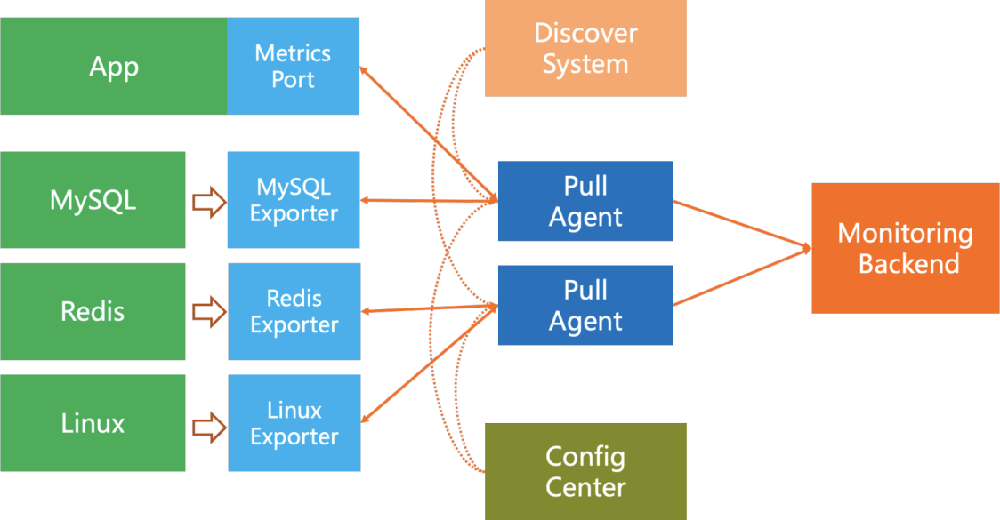

# Pull vs Push

|  | 풀 모델 | 푸시 모델 |
| --- | --- | --- |
| 디버깅 | 데이터를 알아서 가져올 수 있다는 측면에서 이점이 있다. |  |
| 상태 진단  | 데이터를 요청했는데 오류? → 해당 서비스 오류 발생 파악 | 오류 원인 파악 모호 |
| 생존 기간이 짧은 프로세스 | TTL이 짧아 이게 죽고 나서 가져갈 수 있는 상황이 발생 | 어차피 다 처리하고 보내주기 때문에 문제 없음 |
| 방화벽 등의 복잡한 네트워크 구성 | 지표 출처측 서버 모두 접근가능하도록 설계해야함. | 로드밸런서를 통하기 때문에 보안상 이점 |
| 성능 | TCP | UDP
(이에 대한 반론으로 전송 지연 측면에서 TCP 연결을 맺는 데 드는 오버헤드가 지표 데이터를 전송하는 것에 비해 낮다는 뜻 ⇒ 근데 그거와 상관없이 어차피 전송해야 하는거 아닌가?) |

***

## 원리 및 아키텍처 비교

### Pull
1. Discover System(추후 DS)을 통해 Pull 모듈이 어디서 가져올지 탐색한다.
2. Pull 모델은 공통 프로토콜을 써서 데이터를 가져온다고 한다. 
   - Pull 주기 설정, 타임아웃 설정, 메트릭 필터링, 이름 변경, 간단한 처리 기능
3. 애플리케이션 측 SDK는 고정 포트를 리스닝하여 Pull 방식으로 데이터를 제공하는 기능을 지원한다.
4. 다양한 미들웨어 및 기타 시스템은 Pull 프로토콜과 호환되지 않기 때문에, 이러한 시스템의 메트릭을 가져오기 위해 Exporter에 대응하는 에이전트를 개발하여 표준 Pull 인터페이스를 제공할 필요가 있다.

### Push
1. Push 에이전트는 다양한 모니터링 대상의 메트릭 데이터를 수집하여 서버로 푸시하는 기능을 지원한다. 이는 모니터링 시스템과 결합된 방식으로 배포할 수도 있고, 별도로 배포할 수도 있다.
2. ConfigCenter(선택 사항)는 모니터링 대상, 수집 주기, 메트릭 필터링, 메트릭 처리, 원격 대상 등과 같은 중앙 집중식 동적 구성 기능을 제공할 수 있다.
3. 애플리케이션 측 SDK는 모니터링 백엔드 또는 로컬 에이전트로 데이터를 전송하는 기능을 지원한다(일반적으로 로컬 에이전트는 백엔드 인터페이스 세트를 함께 구현한다).

보면 Push 방식은 이미 분산되어 있는 구조로 볼 수 있다. 하지만 Pull 방식은 scale-out이 복잡한데 다음과 같은 요구사항들이 있다.
- Pull 모듈은 Agent로서 백엔드와 분리되어 배포되어야 한다.
- Pull Agent들은 분산 협업을 위해서는 샤딩같은 추가적인 처리가 필요하다.
  - ex: 모듈러 연산을 통해 DS에서 목록을 가져온 다음 어떻게 할당할지 결정
- 각 Pull Agent를 관리하는 Config Center

하지만 이렇게 해도 다음과 같은 문제점들이 존재한다.
- DS에 모든 에이전트가 요청을 보내기 때문에 병목이 발생할 수 있다.
- Agent 확장 시 모니터링 대상이 변경되어 데이터 누락 가능성이 존재한다.

***

## 모니터링 대상 생존성
시스템이 감시하고 있는 서비스의 생존은 매우 중요한 부분이다. Pull에서는 해당 서비스가 요청을 받는지만 봐도 생존성을 확인할 수 있다.
반면 Push에서는 애플리케이션이 따로 보고하지 않는한, 애플리케이션 자체의 문제인지 네트워크 문제인지 알수가 없다. DS를 통해 추가적인 확인이
더 필요한 부분이다.

## 데이터 완전성
데이터 완전성이란 예를 들어 여러 개의 레플리케이션에서 QPS를 모니터링할 때 복제본에서 데이터 전송 지연이 발생하여 QPS 계산에 변화가 생긴 경우
잘못된 정보를 줄 수 있다.

Pull에서는 데이터를 한 라운드 단위로 가져오므로 라운드가 끝나면 완전하다고 판단이 가능하고 누락된 데이터의 비율을 알 수 있다.

Push에서는 각 클라이언트마다 네트워크 지연이 다르기 때문에 과거 이력을 기반으로 완전성을 계산해야 한다.

## 서버리스, 짧은 생명주기 애플리케이션 모니터링
동적으로 요청을 처리하기 위해 증설된 탄력 인스턴스같은 경우 짧은 생명주기를 가지기 때문에 Pull에서 주기를 맞출 수가 없다. 이러한 경우에는
Push 방식을 사용하여 인스턴스에서 스스로 보내야 한다. Pull 시스템은 애플리케이션의 자발적 Push를 수신할 수 있도록 중간 계층(예: Prometheus Push Gateway)을 제공하고,
이후 모니터링 시스템에 Pull 포트를 제공하는 방식으로 구현된다. 그러나 이는 중간 계층에 대한 관리 및 운영 비용을 초래하게 된다.

## 유연성과 결합도
유연성 측면에서는 Pull이 이점을 가진다. 모듈에서 원하는 지표를 설정하고, 간단한 처리를 할 수 있다.(Push SDK도 가능한거임)
Pull은 백엔드와 결합도가 낮다. 공용 인터페이스만 설정하면 되고, 백엔드는 지표를 필요로 하는지는 몰라도 된다.(책임 분리)
Push는 반면 애플리케이션 백엔드 주소와 인증 정보를 설정해야 하기 때문에 결합도가 높다. 그래서 로컬 Push Agent를 두어 결합도를 낮추기도 한다.

**

## 리소스 비용
Pull은 모니터링 시스템의 리소스 비용이 크고 애플리케이션 측은 낮다. Push는 그 반대로 보면 된다.

## 운영 및 유지보수 비용
당연히 관리해야할 컴포넌트가 더 많은 Pull이 더 크다. 또한 Pull에서는 클러스터간 통신, 애플리케이션에서 Access Control List 설정, 네트워크 보호 정책등을
고려해야 한다.

***

## 선택지
Pull 방식에는 Prometheus 계열 솔루션이 대표적이고, Push는 Influx DB가 대표적이다. 둘 중에 어느 것을 선택해야 고민할 때는 다음을
생각해보라.
- 클러스터 구조가 이미 복잡한 경우 -> Push
- 수명이 짧은 애플리케이션 -> Push
- 모바일 -> Push
- Kubernetes 등 Pull 포트를 직접 노출할 수 있는 대상 → Pull
- 시스템 자체가 Consul을 서비스 디스커버리로 사용한다면, Pull 포트를 노출한 뒤 Pull 방식 구현이 쉽다.

