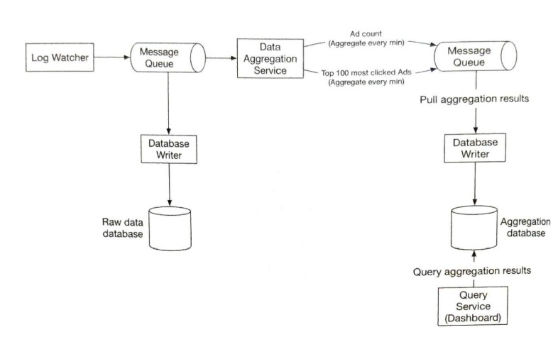
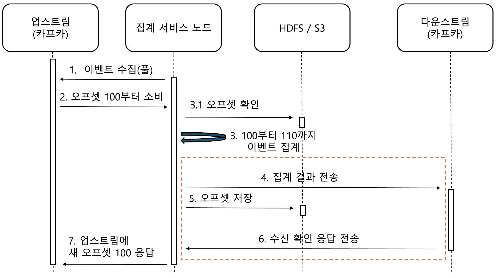

> # 광고 클릭성 이벤트 집계

#### 광고 시스템의 특징 :
- 실시간성 데이터를 다루기에 속도가 중요함.
- 단순 클릭수 뿐만 아니라 광고를 위해서는 정확성과 통계적 정보를 활용해야 함.
- 데이터 양이 엄청나게 많음.
- 특정한 핫스팟이 있는 시스템임.

#### 기능적, 비기능적 요구사항

- 지난 M분 동안의 ad_id 클릭 수 집계(이 집계 값은 정확해야 함.)
- 매분 가장 많이 클릭된 상위 100개 광고 아이디를 반환
- 다양한 속성에 따른 집계 필터링을 지원
- 데이터 지연이 최대한 짧아야 하고, 시스템의 장애에 대해서 감내가 가능해야 한다.

### 설계 때 만들어야 할 API

- 지난 M분 동안 각 ad_id에 발생한 클릭 수 집계
- 지난 M분 동안 가장 많은 클릭이 발생한 상위 N개 ad_id 목록 반환
- 다양한 속성을 기준으로 집계 결과를 필터링하는 기능 지원

## 시스템 고려사항

### 어떻게 데이터를 저장, 분산 관리할까?

우선, 데이터를 보관할 장소를 선정해야 한다. 데이터 집계 상황에서는 데이터를 읽는 일보단 데이터를 쓰는 일이 더 많게 된다.
이 때, 데이터 집계가 완료되더라도 문제가 생길 경우를 대비해 어느정도 기간은 원시 데이터를 보관해야 한다. 
또한, 원시 데이터를 집계한 결과도 보관을 해야 한다.
이때, 원시데이터는 실시간적으로, 집계 데이터는 분단위로 자주 쓰이고 읽기도 해야 하므로 원시 데이터와 집계 데이터 모두 카산드라가 일반 데이터베이스보단 적절하다.

데이터를 분산하는 건 ad_id를 기준으로 나누어서 분산을 하면 된다. 
각각의 광고주 별로 ad_id마다 별도의 집계 시스템에 분산해서 넣고 나중에 통계를 합치는 노드를 하나 만들면 된다. 
이 때 데이터 구조는 아래와 같이 설정할 수 있다.

#### 원시 데이터

#### 집계 결과 데이터

위에서 언급한 데이터 구조에서는 click_timestamp로 클릭한 시간과 국가 정보를 둔다. 
이를 통해 "최근 5분 간 가장 미국에서 클릭이 많이 된 광고 ad_id를 가져오기"와 같은 질의를 통해 뎅터를 가져온다.

#### 시스템에서 메시지 처리가 필요한 이유

요구 사항 중 정확도가 높고, 장애에 대한 감내를 요구하며 처리율을 높여야 했다. 정확도를 살리기 위해선 집계 데이터에 대해 exactly once를 구현해주어야 한다.
또한, 생산자와 소비자 사이의 강한 결합을 끊고, 개별 요소에 대한 확장을 쉽게 하기 위함이다.

메시지 큐는 총 두 곳에 필요하다. 첫 번째는 원시 데이터를 저장하는 데이터 베이스와 클릭 이벤트 전송 프로그램 사이이다.
두 번째는 집계 서비스 노드가 최종적으로 저장하는 재집계를 하는 장소에서 필요하다. 구조는 아래처럼 되어있다.

데이터가 늘어났을 때 데이터 손실을 막고, 순간적으로 특정 노드에 부하가 과도하게 부하되는 것에 대해 막는 용도로도 사용이 되는 부분은 데이터와 클릭 이벤트 전송 프로그램 사이이다.
그로 순간적 부하를 막는다. 그런데 이것보다 큰 문제는 첫 번째 메시지 큐 노드와 두 번째 메시지 큐 노드의 중앙 집계 서비스 노드가 장애가 났을 때이다.

장애를 일으키는 원인엔 두 가지가 있다.

- 클라이언트 측 : 같은 이벤트를 여러 번 보내는 경우 -> 허위 정보 집계 가능성
- 서버 장애 : 집계 서비스 노드에서 장애가 난 경우 -> 데이터 손실 가능성

클라이언트 측 문제는 별도의 광고 사기/위험 제어를 위한 중간 컴포넌트를 만들어야 한다.
서버 장애 문제는 두 번재 메시지 큐에서 어떻게 오프셋을 업그레이드 하느냐를 관리함으로써 어느정도 문제를 해결할 수 있다.

이 때 시도하길 책에서 권장하는 것은 중간 외부 파일 저장소에 오프셋을 기록하고, 분산 트랙잭션을 활용하는 것이다.

이렇게 하는 이유는 오프셋에 대한 저장을 5번 과정처럼 별도로 하지 않으면 7번 과정에서 장애가 나는 경우, 중복 집계를 할 수 있기 때문이다.
또한, 주황 박스 영역을 분산 트랜잭션으로 잡는 이유는 오프셋 확인과 저장을 하고 집계 결과 전송 응답 전송을 하게 되면,
집계 결과 전송 과정에서 문제가 생길 경우 데이터 손실이 발생하게 되기 때문이다.

#### 분산 처리 시 주의 사항

1. 집계 서비스와 확장

집계 서비스는 맵 리듀스 형태로 처리하는 걸 권장한다. 각각의 역할을 나누어 처리만 완료하고 데이터를 넘겨주면 데이터를 넘겨받은 노드는 해당 업무만 하여 또 데이터를 넘긴다.

- 맵 노드 : 요청 ad_id에 따른 집계 노드로 데이터를 넘겨줌
- 집계 노드 :  맵 노드에서 받은 ad_id 별 광고 클릭 이벤트 수를 메모리에서 연산해 리듀스 노드로 넘겨줌.
- 리듀스 노드 : 집계 노드가 산출한 결과를 최종 결과로 축약함.

#### 핫스팟 문제 
광고 ad_id에 따라 분산하게 되면 인기 있는 광고가 많이 있는 노드는 다른 노드보다 많은 데이터를 처리할 수 있게 된다. 
이런 노드를 핫스팟이라고 하며 이 때, 핫스팟 문제를 해결하기 위해 집계 노드 부분만 늘려주면 이 문제를 해결할 수 있다.
이 때, 어떤 시간에 해당 시스템이 여유로운지 확인하여 그 시간에 작업을 한다는 이야기를 해주면 더 좋을 것 같다.

또한, 초기 카산드라를 선택한 이유도 카산드라의 경우엔 집계 서비스 노드가 늘어남에 따라 처리가 곤란해지는 걸 유사 안정 해시를 기반으로 해결해주기 때문이다.

#### 토픽의 물리적 샤딩

국가 별 집계 상황 등의 추가가 필요하면 국가 별로 토픽을 나누고 그 아래에서 또 다시 기존 집계 프로세스를 놓는 방식으로 할 수 있다.
하지만 이렇게 동작을 하는 건 범위를 일정 수준으로 정해놓고 해야 한다. 토픽에 따라 나누면 더 좋은 서비스를 제공, 처리 대역폭도 늘린다는 장점이 있다.
그러나, 시스템의 복잡성과 유지 관리 비용이 엄청나게 크게 증가할 수 있음에 유의해야 한다.

#### 데이터 시간 처리

시간 집계에 있어 타임스탬프가 필요하다. 타임스탬프는 두 가지 위치에서 만들어질 수 있다.

- 이벤트 시각 : 광고 클릭이 발생한 시각 기록
- 처리 시각 : 집계 서버가 클릭 이벤트를 처리한 시스템 시각

 메시지 큐를 거쳐야 하고 네트워크 지연이 있는 경우엔 이벤트 발생 시각과 처리 시각 사이 오차가 커질 수 있다.
이런 경우엔 집계 결과가 부정확할 수 있다.

- 이벤트 시각 : 값은 정확할 수 있겠으나 외부적으로 값을 변조해 보내는 것에 대하 추가 처리와 즉시 처리하지 않으면 값에 대한 집계를 못할 수도 있음.
- 처리 시각 : 값은 부정확하나 변조에 대한 걱정을 하지 않아도 되고 처리량을 어느정도 조절할 수 있다는 특징이 있음.

이 때 1분 집계라고 하면 이것에 대한 집계 윈도우를 살짝 늘리는 방식으로 추가적인 처리를 하여 오차를 줄이는 방식을 많이 사용한다.
이를 워터마크라고 하는데, 실제로는 약간의 시간을 더 주어서 이벤트 시각으로 처리를 하되 해당 이벤트 처리 시각이 이벤트 시각 안에 들어올 수 있게 처리하는 방식이다.

워터마크의 크기는 비즈니스 요구사항에 따라 다르게 잡는다. 

- 워터마크 구간이 길면 늦게 도착하는 이벤트도 포착이 가능하지만 이벤트 처리 시간이 늘어난다.
- 워터마크 구간이 짧으면 데이터 정확도는 떨어지지만 시스템의 응답 지연이 낮아진다.

#### 결함 내성

집계 과정에서는 메모리에서 이루어지므로 집게 노드에서 장애가 생기면 집계 결과가 손실된다. 하지만 카프카 브로커에서 이벤트를 다시 받아오면 그 숫자를 다시 만들어낼 수 있다.
카프카를 원점부터 재생하는 방식 대신 업스트림 오프셋 같은 '시스템 상태'를 스냅숏으로 저장하고 마지막으로 저장된 상태부터 복구하는 방식이 절차도 단순하고 시간이 짧게 든다.

#### 지속적으로 모니터링 해야 할 것들

- 지연 시간 : 데이터를 처리하는 각 단계마다 지연시간이 추가될 수 있으므로 시스템 중요부분마다 기록 시간과 처리 시간 차이를 모니터링해야 한다.
- 메시지 큐 크기 : 큐의 크기에 따라 집계 서비스 노드가 추가돼야 할 수도 있다. 이 때, 레코드 처리 지연 지표를 별도로 추적하면 카프카 시스템에선 큐의 크기를 확인할 수 있다.
- 집계 노드의 시스템 자원 : CPU, 디스크, JVM 모니터링