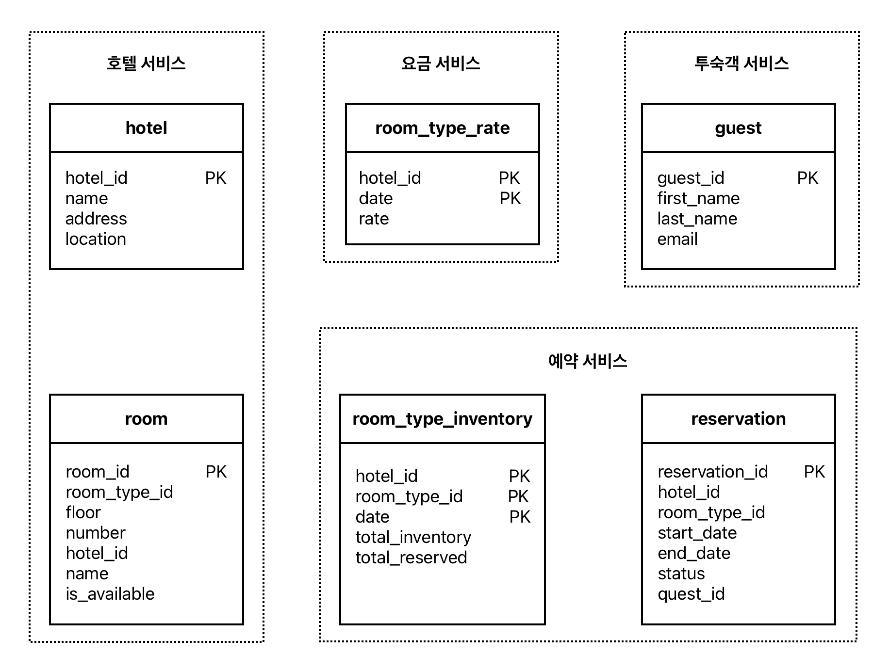
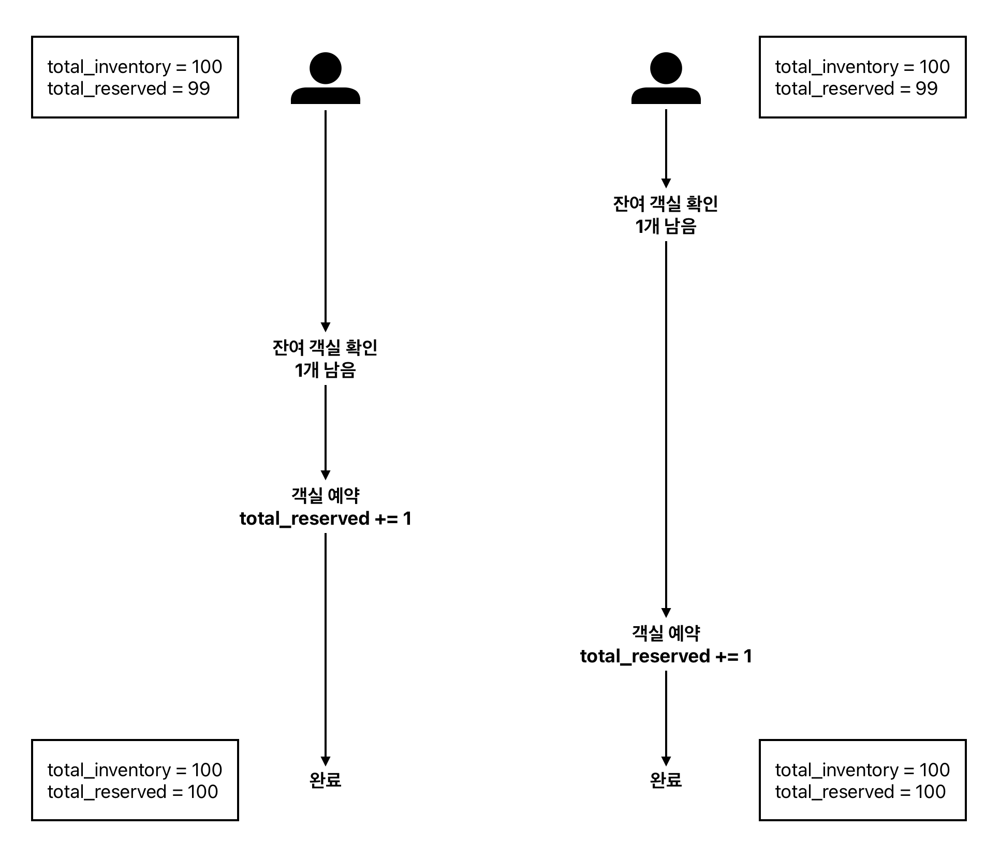
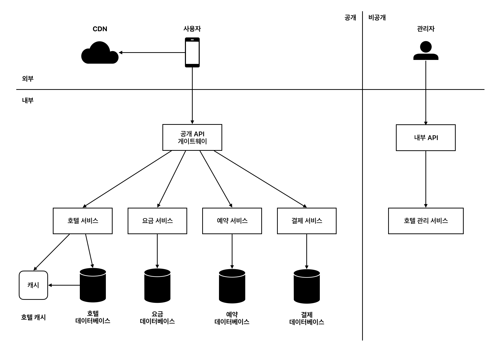

## 7장. 호텔 예약 시스템

## 1. 요구사항

### 1-1. 기능 요구사항

- 5000개 호텔의 100만 개 객실 지원
- 대금은 예약할 때 전부 지불하며 객실 가격은 유동적임
- 예약 취소가 가능하고 예약 취소를 대비해 10% 초과 예약 가능
- 호텔 정보 페이지, 객실 정보 페이지, 관리자 페이지 표시

### 1-2. 비기능 요구사항

- **높은 수준의 동시성**: 성수기나 대규모 이벤트 기간에는 고객이 많이 몰릴 수 있음
- **적절한 지연 시간**: 예약 요청 처리에 몇 초 정도 소요되는 것은 허용함

## 2. API 설계

### 2-1. 호텔 관련 API

| 엔드포인트 | 설명 |
| --- | --- |
| GET `/v1/hotels/id` | 호텔의 상세 정보 반환 |
| POST `/v1/hotels` | 신규 호텔 추가 (호텔 직원만 사용 가능) |
| PUT `/v1/hotels/id` | 호텔 정보 갱신 (호텔 직원만 사용 가능) |
| DELETE `/v1/hotels/id` | 호텔 정보 삭제 (호텔 직원만 사용 가능) |

### 2-2. 객실 관련 API

| 엔드포인트 | 설명 |
| --- | --- |
| GET `/v1/hotels/:id/rooms/id` | 객실 상세 정보 반환 |
| POST `/v1/hotels/:id/rooms` | 신규 객실 추가 (호텔 직원만 사용 가능) |
| PUT `/v1/hotels/:id/rooms/id` | 객실 정보 갱신 (호텔 직원만 사용 가능) |
| DELETE `/v1/hotels/:id/rooms/id` | 객실 정보 삭제 (호텔 직원만 사용 가능) |

### 2-3. 예약 관련 API

| 엔드포인트 | 설명 |
| --- | --- |
| GET `/v1/reservations` | 로그인 사용자의 예약 이력 반환 |
| GET `/v1/reservations/id` | 특정 예약의 상세 정보 반환 |
| POST `/v1/reservations` | 신규 예약 |
| DELETE `/v1/reservations/id` | 예약 취소 |

신규 예약을 생성할 때 전달해야 하는 정보는 다음과 같다.

```json
{
	"startDate": "2021-04-28",
	"endDate": "2021-04-30",
	"hotelID": "245",
	"roomTypeID": "U12354673389",
	"reservationID": "13422445"
}
```

## 3. 데이터 모델

### 3-1. 데이터베이스 유형

관계형 데이터베이스는 쓰기 연산보다 읽기 연산에 강하고, ACID 속성을 보장하며, 엔티티 간의 관계를 안정적으로 지원한다. 이 서비스에서 방문자 수는 실제 예약자 수에 비해 훨씬 많고, 데이터의 정합성이 중요하기 때문에 NoSQL 데이터베이스보다 관계형 데이터베이스가 적합하다.

### 3-2. 스키마



`reservation` 테이블의 `status` 필드는 `결제 대기`, `결제 완료`, `환불 완료`, `취소`, `승인 실패`를 상태 값으로 갖는다.

`room_type_inventory`는 객실 유형과 개수에 대한 정보를 담는 테이블이다. (`hotel_id`, `room_type_id`, `date`)를 복합 키로 갖는다. `total_inventory`는 제공 가능한 객실 수이고 `total_resreved`는 그중 현재 예약된 객실 수이다. 실제 데이터는 다음과 같이 나타날 수 있다.

| hotel_id | room_type_id | date | total_inventory | total_reserved |
| --- | --- | --- | --- | --- |
| 211 | 1001 | 2021-06-01 | 100 | 80 |
| 211 | 1001 | 2021-06-02 | 100 | 82 |
| 211 | 1002 | 2021-06-01 | 200 | 164 |
| 2210 | 101 | 2021-06-02 | 30 | 25 |

이 시스템의 대부분 질의는 `hotel_id`를 사용한다. 따라서 샤딩이 필요하다면 `hotel_id`를 샤딩 조건으로 쓰면 좋다.

### 3-3. 캐시

규모가 커지면 데이터 로딩 속도를 줄이기 위해 데이터베이스 앞에 캐시 계층을 둘 수 있다. 이때 호텔의 잔여 객실 데이터는 현재와 미래의 데이터만이 중요하다. 따라서 TTL과 LRU 캐시 교체 정책을 지원하는 레디스가 적합하다. 이 경우 잔여 객실 정보를 다음과 같은 구조로 캐시에 저장할 수 있다.

- **키**: hotelID_roomTypeID_{날짜}
- **값**: 해당 호텔과 객실 유형, 날짜에 맞는 잔여 객실 수

캐시 계층을 추가하면 데이터베이스와 캐시 간의 데이터 일관성 문제가 발생할 수 있다. 이 서비스에서 문제가 될 만한 상황은 캐시에서는 잔여 객실이 있는데 데이터베이스에서는 그렇지 않은 경우이다. 하지만 만약 사용자가 실제로 예약을 시도할 경우 데이터베이스에 접근하게 되므로 남은 객실이 없다는 것을 알 수 있을 것이다.

## 4. 동시성 문제

### 4-1. 같은 사용자의 중복 예약

같은 사용자가 예약 버튼을 여러 번 누를 때 동일한 예약이 데이터베이스에 중복으로 저장될 가능성이 있다. 다음과 같은 방법으로 이 문제를 해결할 수 있다.

1. **클라이언트 측**
    
    클라이언트에서 요청을 전송하고 난 다음에 예약 버튼을 비활성화하는 방법이다. 사용자가 자바스크립트를 비활성화하거나 조작해 우회할 수 있기 때문에 안정성이 떨어진다.
    
2. **멱등 API**
    
    멱등 API는 몇 번을 호출해도 같은 결과를 내는 API이다. 이를 위해 예약 API 요청에 `reservation_id`를 멱등 키로 사용한다. 예약 API 요청이 들어오면 `reservation_id`를 `reservation` 테이블의 PK로 사용해 새로운 레코드를 생성한다. 이렇게 하면 기본 키의 유일성 조건을 통해 동일한 예약이 추가로 생성되는 것을 막을 수 있다.
    

### 4-2. 같은 객실에 대한 중복 예약

우선 객실 예약에 쓰이는 SQL 질의문의 수도 코드는 다음과 같다.

```sql
# 1단계: 예약 가능 객실 현황 확인
SELECT date, total_inventory, total_reserved
FROM room_type_inventory
WHERE room_type_id = ${roomTypeId} AND hotel_id = ${hotelId}
AND date between ${startDate} and ${endDate}

# 2단계: 1단계에서 반환되는 모든 객실에 대해 다음 사항 확인
if ((total_reserved + ${numberOfRoomsToReserve}) > 1.1 * total_inventory) {
	Rollback
}

# 3단계: 객실 예약
UPDATE room_type_inventory
SET total_reserved = total_reserved + ${numberOfRoomsToReserve}
WHERE room_type_id = ${roomTypeId}
AND date between ${startDate} and ${endDate}

Commit
```

여러 사용자가 같은 객실을 동시에 예약하려고 할 때 한 객실에 대해 이중 예약이 발생할 가능성이 있다. 이는 데이터베이스의 트랜잭션 격리 수준이 직렬화보다 낮은 수준일 경우에 발생할 수 있다. 



이 문제를 해결하려면 다음과 같은 락 메커니즘을 사용해야 한다. 호텔 예약 시스템의 경우 QPS가 높지 않기 때문에 낙관적 락이나 데이터베이스 제약 조건을 사용하는 것이 적합하다.

1. **비관적 락**
    
    사용자가 레코드를 갱신하려고 하는 순간 즉시 락을 걸어 동시 업데이트를 방지한다. 동일한 레코드를 갱신하려는 다른 사용자는 먼저 락을 건 사용자가 변경을 마치고 락을 해제할 때까지 기다려야 한다. 구현이 쉽지만 교착 상태가 발생할 수 있고 동시 처리 성능이 떨어져 확장성이 낮다는 단점이 있다. 이때문에 규모가 큰 예약 시스템에는 부적절하다.
    
2. **낙관적 락**
    
    버전 번호를 통해 낙관적 락을 구현할 수 있다. 먼저 테이블에 `version`이라는 열을 추가한다. 그리고 레코드를 갱신할 때 읽어온 `version` 값에 1을 더한다. 이때 입력되는 `version` 값이 테이블에 저장되어 있는 `version` 값보다 1만큼 높지 않으면 다른 사용자가 이미 레코드를 갱신했다는 뜻이므로 트랜잭션은 중단된다.
    
    여러 사용자가 동시에 같은 레코드를 갱신하려는 것을 허용하기 때문에 일반적으로 비관적 락보다 빠르다. 하지만 데이터에 대한 결쟁이 치열한 상황에서 성능이 급격히 떨어진다. 많은 클라이언트가 동일한 버전의 레코드를 읽고 동시에 갱신을 시도한다면 그중 하나의 클라이언트만 갱신에 성공하고 다른 클라이언트들은 재시도를 반복해야 하기 때문이다.
    
3. **데이터베이스 제약 조건**
    
    `room_type_inventory` 테이블에 다음과 같은 제약 조건을 추가한다.
    
    ```sql
    CONSTRAINT ‵check_room_count‵ CHECK((‵total_inventory - total_reserves‵ >= 0))
    ```
    
    만약 중복 예약이 발생해 제공 가능한 객실보다 많은 객실이 예약됐다면 해당 트랜잭션은 중단되고 실행 전 상태로 돌아간다. 구현이 쉽지만 데이터에 대한 경쟁이 심하면 성능이 떨어지고 데이터베이스에 따라 제약 조건을 허용하지 않을 수도 있다.
    

## 5. 개략적 설계안



### 5-1. 마이크로서비스 아키텍처

마이크로서비스 아키텍처는 전체 시스템을 독립적인 서비스 단위로 나누어 개발하고 운영하는 방식이다. 각 서비스 간 통신에는 gRPC와 같은 고성능 원격 프로세저 호출 프레임워크를 사용한다.

이 설계안에서는 각 서비스에서 사용하는 테이블을 동일한 데이터베이스에 저장했다. 만약 서비스 별로 독립적인 데이터베이스를 가지고 있다면 하나의 트랜잭션으로 데이터의 일관성을 보증할 수 없어 데이터 불일치 문제가 발생할 수 있다. 이러한 문제를 해결할 수 있는 방법은 다음과 같다.

1. **2단계 커밋**
    
    여러 노드에 걸친 원자적 트랜잭션 실행을 보증하는 데이터베이스 프로토콜이다. 한 노드에 장애가 발생하면 해당 장애가 복구될 때까지 진행을 중단하기 때문에 성능이 뛰어난 프로토콜은 아니다.
    
2. **사가**
    
    각 노드에 국지적으로 발생하는 트랜잭션을 하나로 엮은 것이다. 각각의 트랜잭션은 완료되면 다음 트랜잭션을 시작하는 트리거로 쓰일 메시지를 만들어 보낸다. 한 트랜잭션이라도 실패하면 이전 트랜잭션의 결과를 모두 되돌린다.
    

### 5-2. 구성 요소

1. **CDN**
    
    자바스크립트, 이미지, 동영상, HTML 등 정적 콘텐츠를 캐시하여 웹사이트 로드 성능을 개선한다.
    
2. **공개 API 게이트웨이**
    
    처리율 제한, 인증 등의 기능을 지원하며 엔드포인트 기반으로 특정 서비스에 요청을 전달한다. 예를 들어 호텔 홈페이지 요청은 호텔 서비스로, 호텔 객실 예약 요청은 예약 서비스로 전달하는 역할을 한다.
    
3. **내부 API**
    
    권한이 있는 호텔 직원만 사용 가능한 API로 VPN 등의 기술을 사용해 외부 접근을 막는다.
    
4. **호텔 서비스**
    
    호텔과 객실에 대한 상세 정보를 제공한다. 호텔과 객실 데이터는 일반적으로 정적이기 때문에 캐시하기 쉽다.
    
5. **요금 서비스**
    
    어떤 날에 어떤 요금을 받아야 하는지에 대한 데이터를 제공한다. 객실의 요금은 해당 날짜와 호텔에 얼마나 많은 손님이 몰리느냐에 따라 달라진다.
    
6. **예약 서비스**
    
    예약 요청을 받고 객실을 예약하는 과정을 처리한다. 또한 객실이 예약되거나 취소될 때 잔여 객실 정보를 갱신한다.
    
7. **결제 서비스**
    
    고객의 결제를 맡아 처리한다. 결제에 성공하면 예약 상태를 `결제 완료`로 갱신하고 실패하면 `승인 실패`로 갱신한다.
    
8. **호텔 관리 서비스**
    
    권한이 있는 호텔 직원만 사용 가능하다. 임박한 예약 기록 확인, 고객 객실 예약, 예약 취소 등의 기능을 제공한다.