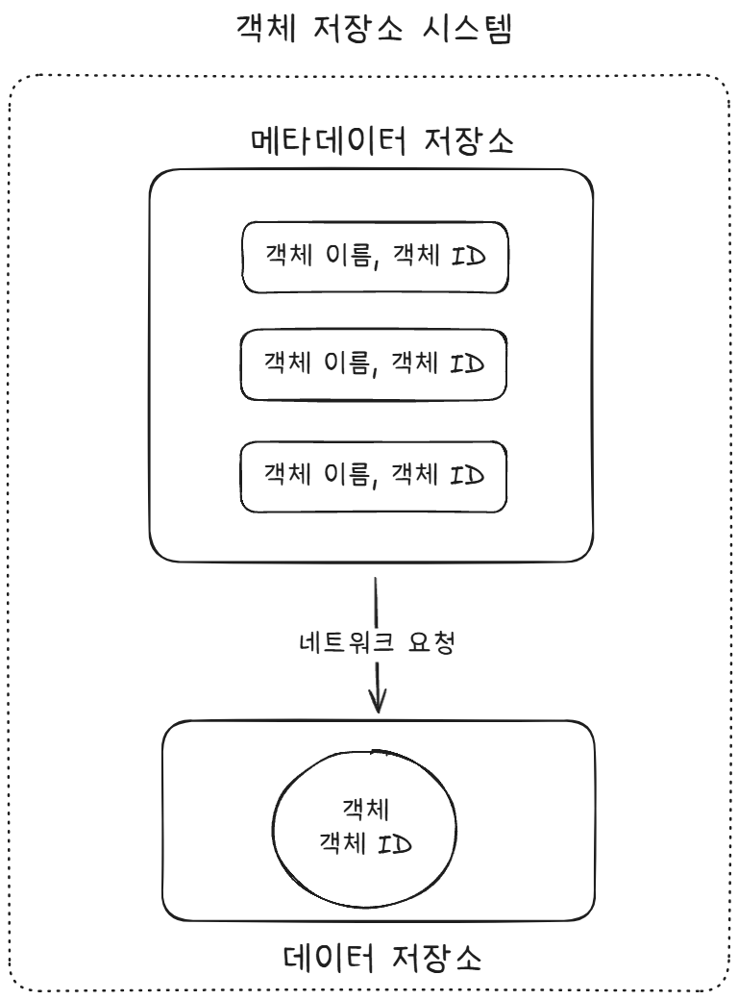
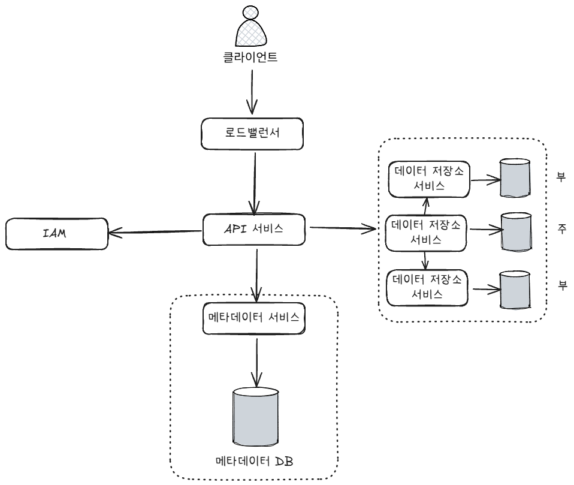
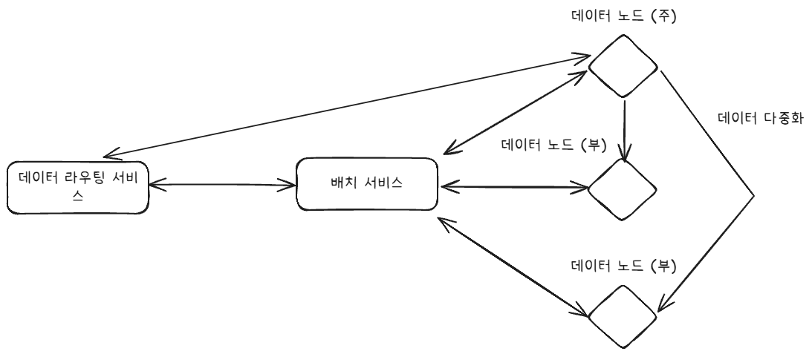
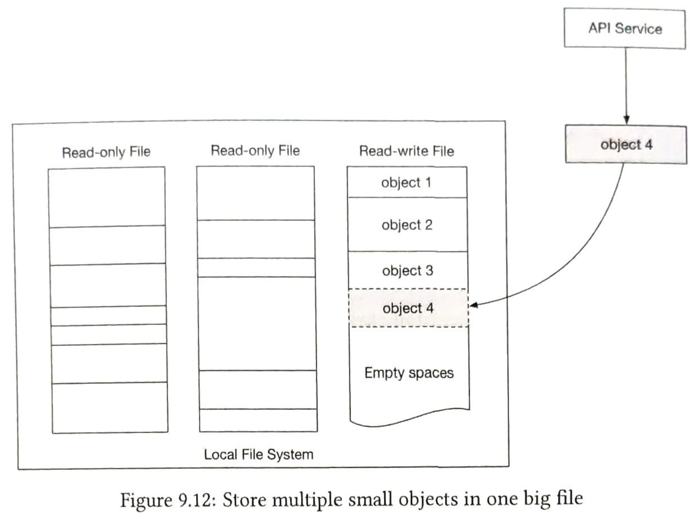
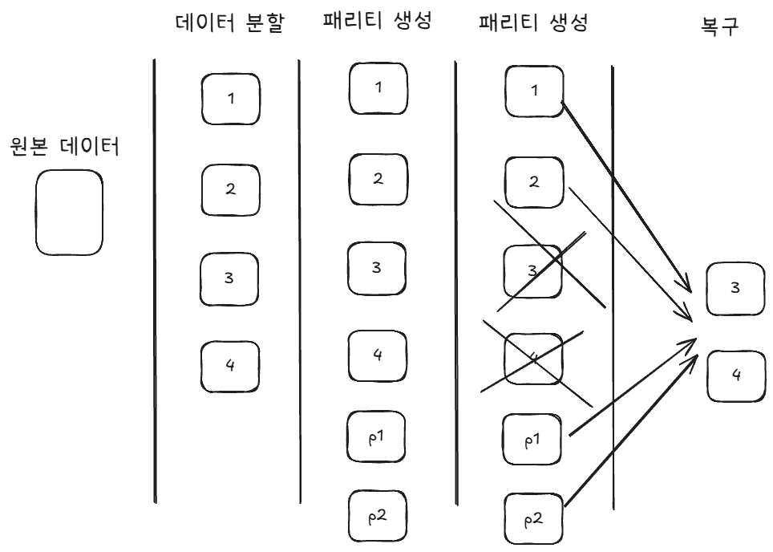
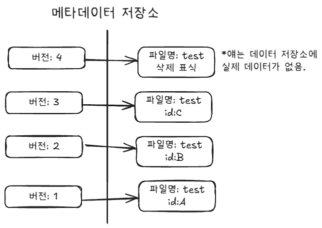

__# S3와 유사한 객체 저장소

# 저장소 시스템
***

### 블록 저장소

블록 저장소는 데이터를 고정된 크기의 블록으로 분할한 다음 고유 식별자로 별도로 저장하는 저장소이다. 우리가 사용하는 데이터베이스 시스템의
저장매체로 사용되고 있다. 각 블록은 계층 구조가 없이 독립적으로 존재하기 때문에 디렉토리 시스템은 존재하지 않는다. 반대로 이러한 특성 덕분에 
저장 시 에 저장할 곳을 찾을 필요 없이 편리한 곳에 저장하기만 하면 된다는 효율성을 가진다.
- 장점
  - 블록들이 로컬로 저장되기 때문에 짧은 대기 시간을 갖는다.
  - 블록들이 고유 주소를 들고 있기 때문에 랜덤 엑세스가 가능해 빠른 검색이 가능하다.
  - 블록 단위로 접근하기 때문에 특정 위치만 수정이 용이하다.
- 단점
  - 비싸다.
  - 메타데이터에 대한 처리를 애플리케이션 단에서 구현해야 한다.
  - 자체적 버전 관리 기능이 존재하지 않는다.
  - 저수준에서 관리해야 한다.

### 파일 저장소

블록 저장소에 추상화를 더해 파일과 디렉터리를 통해 관리할 수 있게 하는 저장소이다. 위에 계층을 하나 더 두기 때문에 저수준에서 사용자가 따로 
관리할 필요가 없다.
- 장점
  - 사용이 쉽다.
  - 파일 수준 네트워크 프로토콜을 통해 여러 사용자가 동일 스토리지에 접근이 가능하다.
  - 메타데이터 등을 쉽게 저장할 수 있다.
- 단점
  - 메타데이터 조회 + 트리 구조로 인해 랜덤 엑세스가 느리다.
  - 떨어지는 성능, 확장성

### 객체 저장소

데이터를 객체 단위로 저장한다. 데이터 + 메타데이터 + 식별자를 하나의 객체로 묶어 저장한다. 실시간 갱신이 필요없는 데이터들을 주로 저장하며,
수평 구조로 저장하기 때문에 디렉터리 구조는 제공하지 않는다. 특징으로는 데이터 접근 REST API를 통한다. 키-값 저장소 형태로 URI는 키, 데이터는
값에 해당한다. 메타데이터 저장소를 통해 객체 이름을 통해 식별자를 가져오고 네트워크를 통해 데이터 저장소에서 데이터를 가져온다.
- 장점
  - 확장성이 뛰어남.
  - 상대적으로 저렴한 비용
  - 버전 관리 기능 제공
  - 웹 기반 접근
- 단점
  - 랜덤 I/O 느림
  - 네트워크 기반으로 느림
  - 객체 변경이 불가능하다.

# 개략적 설계
***

사용자가 버킷을 새로 생성하고 새로운 파일을 업로드하는 예제를 통해 전체 흐름을 알아보자.

1. 클라이언트는 API 서비스에 버킷 생성 요청을 보낸다.
2. IAM을 통해 인증, 인가 절차를 거친 후 쓰기 권한을 가지고 있는지 확인한다.
   - IAM: Identity & Access Management
3. API 서비스는 메타데이터 서비스를 통해 메타데이터 데이터베이스에 버킷 정보를 등록하고 성공 응답을 내려준다.
4. 클라이언트는 파일 객체 생성 요청을 보낸다.
5. 마찬가지로 IAM 서비스를 통해 인증 인가 절차를 거친다.
6. API 서비스는 객체 데이터를 데이터 저장소로 보낸다.
7. 데이터 저장소는 데이터 객체를 저장한 후 UUID를 반환한다.
8. API 서비스는 메타데이터 서비스를 호출해 새로 등록된 객체의 메타데이터를 기록한다.

그럼 등록한 객체는 어떻게 조회할까? 실질적인 부분만 체크하면 다음과 같다.

1. 조회 요청을 받은 API 서비스는 메타데이터 저장소에서 해당 객체의 UUID를 가져온다.
2. 가져온 UUID를 가지고 데이터 저장소에서 객체 데이터를 가져온다.

# 상세 설계
***

## 데이터 저장소

### 데이터 라우팅 서비스
- 배치 서비스를 호출하여 데이터를 저장할 노드 판단.
- 데이터 노드에서 조회해서 반환.
- 데이터 노드에 기록.
- gRPC, RESTful

### 배치 서비스
데이터를 저장할 데이터 노드를 결정하는 서비스이다. 주 노드와 부 노드로 구성이 되어 있으며, 가상 클러스터 지도를 통해
클러스터의 물리적 형상 정보를 파악하여 데이터를 다중화한다. 데이터 노드들은 배치 서비스와 하트비트를 주고 받는데 15초 내에
응답하지 않으면 죽은 데이터 노드로 간주하고 지도에 표시를 한다. 반대로 지도에 없는 노드가 하트비트를 보내면 지도에 추가한다.
- 합의 프로토콜 사용 추천
  - RAFT, PAXOS

### 데이터 노드
실제 데이터가 저장되는 곳으로 다중화 설계가 되어 있다. Service Demon을 통해 배치 서비스에 하트비트를 보내며, 데이터 노드에
부착된 디스크 드라이브 수와 데이터의 양을 같이 보낸다고 한다.

### 동기적 복제 vs 비동기적 복제
데이터 라우팅 서비스가 데이터를 저장하고 응답을 반환하기 복제 방법에 대해 고민할 필요가 있다.
크게 두 가지로 볼 수 있다.
- 동기적 복제: 주 노드가 데이터를 저장한 후 모든 부 노드에 복제가 완료된 후 응답을 내린다.
- 비동기적 복제: 주 노드가 데이터를 저장하고, 부 노드의 데이터 복제 여부와 관계없이 응답을 내린다.

동기적 복제에서는 모든 부 노드의 복제 여부를 확인하고 해야하므로 느리지만 강한 일관성을 보장할 수 있다. 반면,
비동기적 복제에서는 빠른 응답을 내려 줄 순 있지만, 클라이언트 측에서는 복제 여부를 알 수 없다. 물론, 어느정도의 노드만
확인하고 응답을 내려주듯 유동적으로 조절이 가능하다. 최종적 일관성은 다 보장한다.

### 데이터 저장 방안
파일별로 블록을 할당하여 저장하게 되면 블록 크기보다 작은 파일에 관해서는 낭비가 생긴다. 이를 해결하기 위해 WAL과 같이 한
블록에 여러 객체를 덧붙여 저장하고, 용량 임계치에 도달하면 read-only 파일로 전환한다.

- 출처: https://velog.io/@gunkim95/%EB%8C%80%EA%B7%9C%EB%AA%A8-%EC%8B%9C%EC%8A%A4%ED%85%9C-%EC%84%A4%EA%B3%84-%EA%B8%B0%EC%B4%88-2-S3%EC%99%80-%EC%9C%A0%EC%82%AC%ED%95%9C-%EA%B0%9D%EC%B2%B4-%EC%A0%80%EC%9E%A5%EC%86%8C

그럼 객체를 찾을 때 어떻게 해야 할까?
매핑 테이블에 파일 내 객체의 오프셋을 같이 기록하면 된다. 파일 주소를 통해 파일을 찾고, 오프셋을 통해 파일 내 위치를 찾는다.

## 데이터 내구성
***

### 소거 코드
데이터를 작은 단위로 분할하여 다른 서버에 배치한 후, 일부가 손상되면, 패리티 정보를 통해 기존 데이터와 합해 복구하는 방법이다.
- parity: 원래 데이터에 대해 특정 규칙에 따라 추가 정보를 붙여 만드는 정보.

내구성은 11-nine으로 다중화 방식보다 매우 높은 내구성을 보여준다. 하지만, 데이터를 가져오려면 데이터 조각의 개수 노드만큼 읽어와야 하므로
응답 지연이 발생한다.

용량적인 측면에서는 기존 데이터에 패리티만 추가 됨으로 소거 코드가 더 이점을 가진다.

### 정확성 검증
체크섬을 두어 데이터를 검증할 수 있다.
- 받은 데이터로 계산한 체크섬 != 원본 체크섬 => 오류

## 데이터 모델
***

- bucket
  - bucket_name
  - bucket_id
  - owner_id
  - enable_versioning
- object
  - bucket_name
  - object_name
  - object_id
  - object_version

### 메타데이터 데이터베이스 규모 확장
본문에서는 샤딩을 언급한다.
- bucket_id로 샤딩? -> 핫스팟 문제
- object_id로 샤딩? -> object_name으로 질의 시 별로
결국 말하고자 하는 건 주어진 질의 요구사항에 얼마나 부합하냐인 것 같다.

### 분산 데이터베이스
위의 메타데이터 테이블을 샤딩하면 어떤 샤드에 데이터가 있는지 모르게 된다.
- 첫 번째 해결책: 모두 조회하고 취합 -> 페이지네이션 문제
  - 샤드마다 추적해야할 오프셋 값이 다르기 때문에 불가능하다.

### 객체 버전
객체 저장소는 위에서 언급했듯이 불변적이다. 따라서 버전으로 이를 관리한다.

### 업로드 최적화
- Multipart 업로드: 쪼갠 후 병렬적으로 올리고 취합