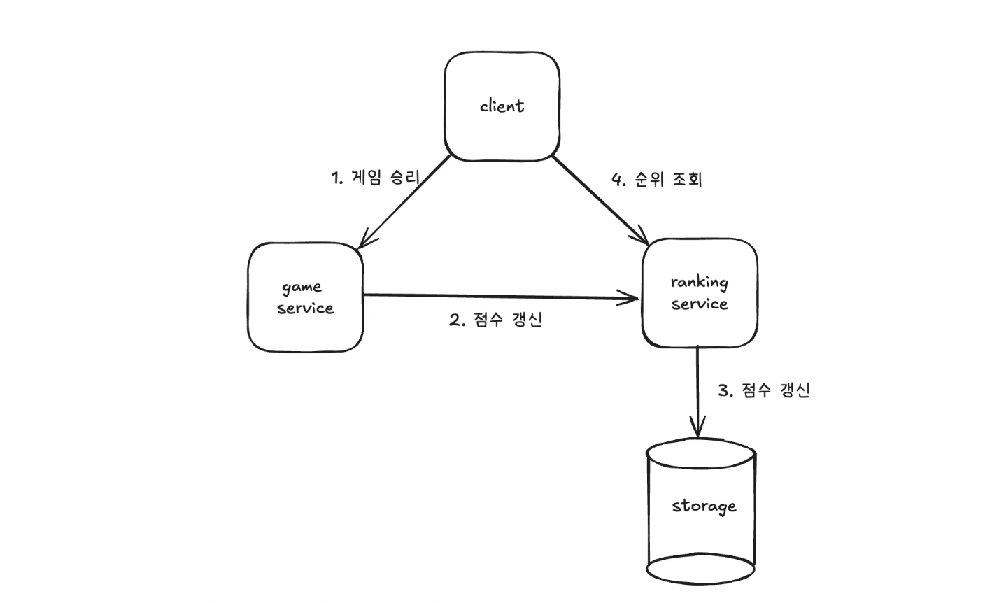
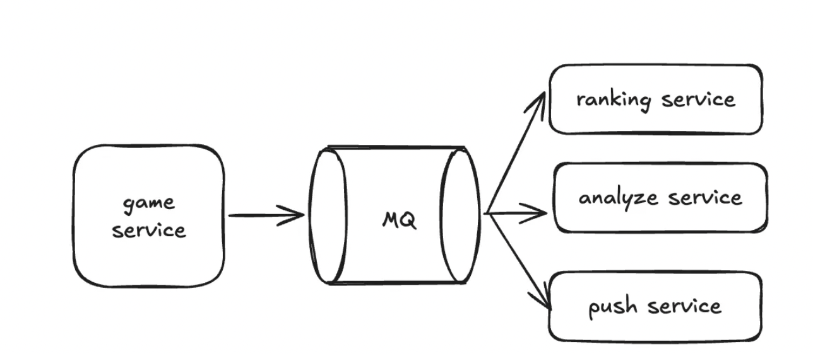
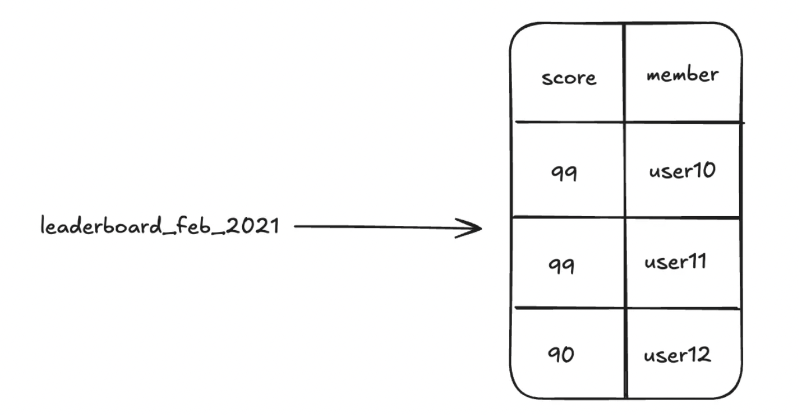
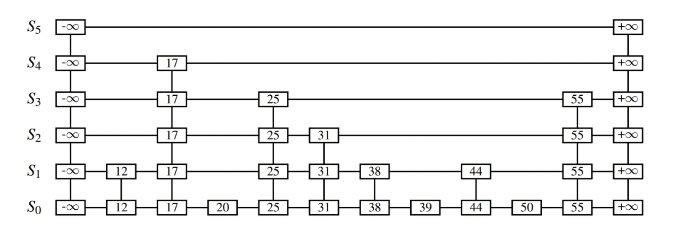
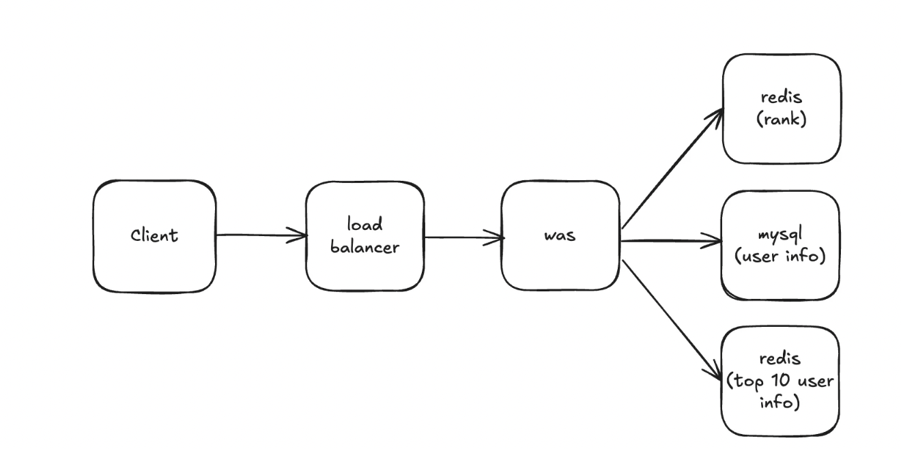
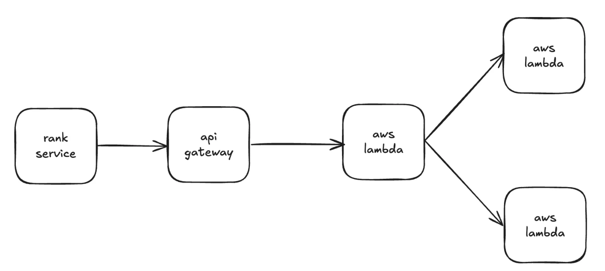
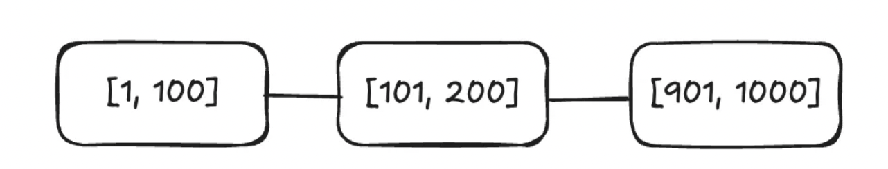
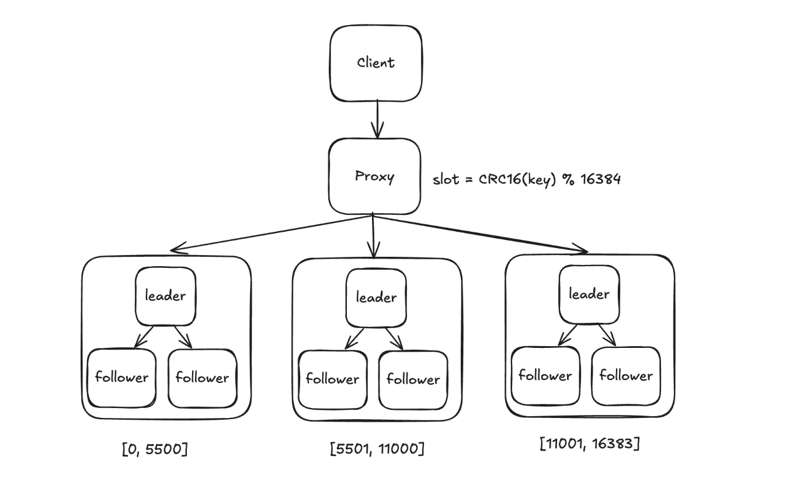

# 기본 요구사항

### 기능 요구사항

- 순위표 상위 10명 표시
- 임의의 사용자 순위 표기
- 어떤 사용자의 4순위 위/아래 사용자 표시

### 비기능 요구사항

- 점수 업데이트는 실시간
- 확장성, 가용성, 안정성 보장

# 개략적 설계

### API 설계

- POST /v1/scores
  - 게임에 승리하면 순위 갱신
- GET /v1/scores
  - 순위표 상위 10명 플레이어 조회
- GET /v1/scores/{:user_id}
  - 특정 사용자의 순위 조회

### 개략적 설계안

- 고려사항

  - 클라이언트와 순위표 서비스 사이의 직접적인 통신 여부

    - 사용자가 Proxy를 설치하고 점수를 마음대로 바꾸는 중간자 공격이 가능 → 채택X

  - 게임 서비스와 순위표 서비스 사이의 메시지 큐 여부

    - 게임 점수가 여러 곳에서 이용 가능해야 하면 메시지 큐를 사용하는게 좋음

      

## 데이터 모델

순위 데이터 저장을 위해 어떤 저장소를 사용할지?

### 관계형 데이터베이스

- leaderboard 테이블 구조

  - user_id  (varchar)
  - score     (int)
  - game_id, modified_at, etc..

- 점수(순위) 갱신

  - INSERT INTO leaderboard (user_id, score) VALUES (’mary1934’, 1);
  - UPDATE leaderboard SET score=score + 1 WHERE user_id=’mary1934’;

- 사용자 순위 검색

  - SELECT (@rownum := @rownum + 1) AS rank, user_id, score FROM leaderboard ORDER BY score DESC

    - 위 방식은 같은 점수를 받은 사용자가 있을 수 있어서 단순 조회 목록 내의 위치가 순위가 아님
    - 그리고 대규모 데이터인 경우 갱신을 실시간으로 처리하기에 적합하지 않음
    - 또한 변경이 계속 발생하기에 캐싱도 어려움

    → 일괄처리를 생각해볼 수 있지만 **실시간 요구사항**이 존재

  - 결론

    - 순위를 알아내기 위해 전체 테이블을 읽어야 하기에 적합하지 않음

### 레디스

Sorted Set을 활용하여 요구사항을 만족시킬 수 있음

- **Sorted Set 특징**

  

  - 같은 점수가 집합 내에 여러개 존재할 수 있음

  - 해시 테이블 + 스킵 리스트로 구현됨

    - 해시 테이블 : 사용자 점수 저장

    - 스킵 리스트 : 특정 점수를 딴 사용자들의 목록을 저장

      

      - 정렬된 연결 리스트에 다단계 색인을 둠
      - 새 원소 추가, 삭제할 때 O(logn)에 처리 가능, 원래 O(n)

- **동작 원리**

  - 사용자가 점수 획득
    - ZINCRBY <키> <증분> <사용자>
  - 사용자 순위표 상위 10명 조회
    - ZREVRANGE leaderboard_feb_2021 0 9 WITHSCORES
  - 사용자 본인 점수 조회
    - ZREVRANK leaderboard_feb_2021 ‘mary1934’
  - 순위 +-4 명 조회
    - 사용자 점수 조회를 통해 얻은 점수로 아래 연산 수행
    - ZREVRANGE leaderboard_feb_2021 357 365

- **저장소 요구사항**

  - 레디스 장애 발생을 대비해서 데이터를 영속적으로 보관할 필요가 있음
  - RDB, AOF 활용할 수 있는데 인스턴스 재시작이 오래 걸림 → Replica를 둠

# 상세 설계

## 클라우드 사용 여부

- **자체 서비스 활용**

  

  - 사용자 및 점수 정보를 저장 redis(rank)
  - 사용자 이름, 프로필 저장 mysql(user info)
  - 매번 순위 정보와 프로필 정보를 가져와서 합치는게 부담될 경우 캐싱 redis(top 10 user info)

- **클라우드 서비스 이용**

  

  - 기존 인프라가 AWS에 있어서 클라우드로 순위 구축이 자연스러운 경우
  - API gateway + AWS lambda 활용
    - API gateway로 RESTful API의 HTTP 엔드포인트 정의 및 아무 백엔드 서버에 연결
    - 책에서는 lambda function에 연결 예시
    - lambda를 활용하면 인프라 규모에 맞게 자동으로 스케일링 가능

## **레디스 규모 확장**

- 규모가 커지면 샤딩이 필요

  - 고정 파티션 (채택)

    

    - 순위표에 등장하는 점수 범위에 따라 파티션을 나눔

    - 순위가 골고루 퍼져있어야 잘 작동함

    - **변경** → 사용자 점수를 sorted set에 넣거나 변경할 때 기존 데이터를 찾기 위해 (user_id, score) 쌍으로 데이터를 캐싱해두면 DB 보다 빠름

    - **상위 10명** → [901, 1000]에서 찾을 수 있음

    - 특정 사용자의 순위

       → 해당 사용자가 속한 샤드뿐 아니라 해당 샤드보다 높은 점수를 저장하는 샤드 전체를 확인해야 함

      - info keyspace로 O(1)에 샤드내 사용자 수 확인

  - 해시 파티션 (채택 X)

    

    - 레디스 클러스터를 활용하는 방식

    - 점수가 특정 구간에 몰릴 경우 유용함

    - **변경** → 사용자의 샤드 찾고 (CRC16 % 16384) 해당 샤드에서 변경

    - 상위 10명

       → 모든 샤드에서 10명 찾아서 애플리케이션에서 분산-수집

      - 상위 k개를 찾을 때 k가 크면 각 샤드에 부담됨
      - 특정 사용자의 순위를 결정할 간단한 방법이 없음 (애플리케이션에서 다 처리해야 할듯)

- 레디스 노드 크기 조정

  - 쓰기가 많을 때 스냅숏 용으로 필요한 메모리 2배 할당

