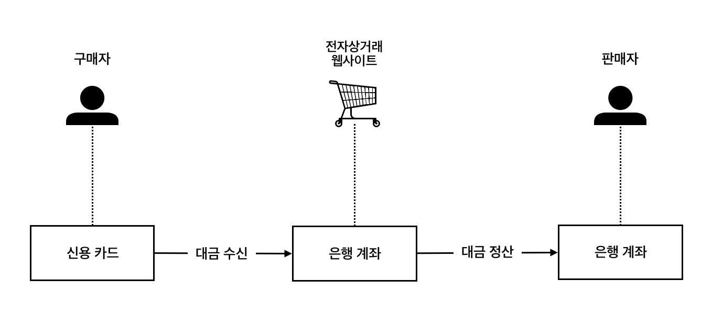
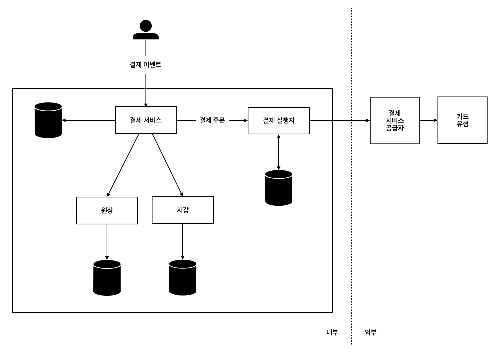

## 1. 요구사항

### 1-1. 기능 요구사항

- **대금 수신 흐름**: 결제 시스템이 판매자를 대신하여 고객으로부터 대금을 수령함
- **대금 정산 흐름**: 결제 시스템이 전 세계의 판매자에게 제품 판매 대금을 송금함

### 1-2. 비기능 요구사항

- **신뢰성 및 내결함성**: 결제 실패는 신중하게 처리해야 함
- **내부 서비스와 외부 서비스 간의 조정 프로세스**: 시스템 간의 결제 정보가 일치하는지 비동기적으로 확인함

## 2. 개략적 설계안

### 2-1. 대금 수신 흐름

1. **결제 서비스**
    
    사용자로부터 결제 이벤트를 수락하고 결제 프로세스를 조율한다. 위험 확인을 통과한 결제만 처리한다. 일반적으로 위험 확인은 제3자 제공업체를 이용한다.
    
2. **결제 실행자**
    
    결제 서비스 공급자를 통해 결제 주문 하나를 실행한다. 하나의 결제 이벤트에는 여러 결제 주문이 포함될 수 있다.
    
3. **결제 서비스 공급자 (PSP)**
    
    A 계정에서 B 계정으로 돈을 옮기는 역할을 한다. 이 경우에는 구매자의 신용 카드 계좌에서 돈을 인출한다.
    
4. **카드 유형**
    
    신용 카드 업무를 처리하는 조직이다.
    
5. **원장 서비스**
    
    결제 트랜잭션에 대한 금융 기록이다. 전자상거래 웹사이트의 총 수익을 계산하거나 향후 수익을 예측하는 등, 결제 후 분석에서 매우 중요한 역할을 한다.
    
6. **지갑 서비스**
    
    판매자의 계정 잔액을 기록한다.
    

### 2-2. 결제 흐름

1. 사용자가 주문하기 버튼을 클릭하면 결제 이벤트가 생성되어 결제 서비스로 전송된다.
2. 결제 서비스는 결제 이벤트를 데이터베이스에 저장한다.
3. 결제 서비스는 결제 이벤트의 결제 주문마다 결제 실행자를 호출한다.
4. 결제 실행자는 결제 주문을 데이터베이스에 저장한다.
5. 결제 실행자가 외부 PSP를 호출하여 신용 카드 결제를 처리한다.
6. 결제 실행자가 결제를 성공적으로 처리하고 나면 결제 서비스는 지갑을 갱신한다.
7. 지갑 서비스는 갱신된 잔고 정보를 데이터베이스에 저장한다.
8. 지갑 서비스가 판매자 재고를 성공적으로 갱신하고 나면 결제 서비스는 원장을 호출한다.
9. 원장 서비스는 새 원장 정보를 데이터베이스에 추가한다.

### 2-3. 대금 정산 흐름

대금 정산 흐름의 구성 요소는 대금 수신 흐름과 유사하다. 한 가지 차이는 PSP를 사용할 때 돈을 주고 받는 대상이다. 대금 정산 흐름에서는 전자상거래 웹사이트 은행 계좌에서 판매자 은행 계좌로 돈을 이체한다.

### 2-4. 복식부기 원장 시스템

복식부기란 모든 결제 거래를 두 개의 별도 원장 계좌에 같은 금액으로 기록하는 것이다. 한 계좌에서는 차감만 이루어지고 다른 계좌에서는 입금만 이루어진다. 이때 모든 거래 항목의 합계는 0이어야 한다. 이 시스템을 활용하면 자금의 흐름을 추적할 수 있고 결제 주기 전반에 걸쳐 일관성을 보장할 수 있다.

## 3. API 설계

### 3-1. 결제 이벤트 실행

1. **엔드포인트**
    
    POST `/v1/payments`
    
2. **요청**
    
    
    | 필드 | 설명 | 자료형 |
    | --- | --- | --- |
    | buyer_info | 구매자 정보 | json |
    | checkout_id | 해당 결제 이벤트를 식별하는 전역적으로 고유한 ID | string |
    | credit_card_info | 암호화된 신용 카드 정보 또는 결제 토큰 | json |
    | payment_orders | 결제 주문 목록 | list |
    
    그중 payment_order의 구조는 다음과 같다. 이때 대금은 숫자가 아닌 문자열로 저장하는 것이 좋다. 숫자 정밀도에 따라 의도치 않은 반올림 오류가 발생할 수 있고 수가 매우 크거나 작을 수 있기 때문이다.
    
    | 필드 | 설명 | 자료형 |
    | --- | --- | --- |
    | seller_account | 대금을 수령할 판매자 | string |
    | amount | 해당 주문으로 전송되어야 할 대금 | string |
    | currency | 주문에 사용된 통화 단위 | string (ISO 4217) |
    | payment_order_id | 해당 주문을 식별하는 전역적으로 고유한 ID | string |

### 3-2. 단일 결제 주문의 실행 상태 반환

1. **엔드포인트**
    
    GET `/v1/payments/{:id}`
    
2. **요청**
    
    실행 상태를 알고자 하는 결제 주문의 `payment_order_id`
    

## 4. 데이터 모델

### 4-1. 데이터베이스 유형

결제 시스템을 위한 데이터베이스를 고를 때는 성능보다도 안정성이 가장 중요하다. 또한 모니터링 도구나 데이터베이스 관리자 채용 시장의 규모도 고려해야 한다. 일반적으로 NoSQL/NewSQL보다는 ACID 트랜잭션을 지원하는 전통적인 관계형 데이터베이스를 선호한다.

### 4-2. 스키마

1. **결제 이벤트 테이블**
    
    
    | 이름 | 자료형 |
    | --- | --- |
    | checkout_id | string PK |
    | buyer_info | string |
    | seller_info | string |
    | credit_card_info | 카드 제공업체에 따라 다름 |
    | is_payment_done | boolean |
2. **결제 주문 테이블**
    
    
    | 이름 | 자료형 |
    | --- | --- |
    | payment_order_id | string PK |
    | buyer_account | string |
    | ammount | string |
    | currency | string |
    | checkout_id | string FK |
    | payment_order_status | string |
    | ledger_updated | boolean |
    | wallet_updated | boolean |
    - `checkout_id`는 외래키다. 따라서 하나의 결제 이벤트에 여러 개의 결제 주문이 포함될 수 있다.
    - 판매자에게 대금을 정산하는 과정은 추후에 이루어지므로 사용자의 결제를 처리할 때는 구매자의 카드 정보만 필요하다.
    - `payment_order_status`는 `NOT_STARTED`, `EXECUTING`, `SUCCESS`, `FAILED` 등을 상태 값으로 갖는다.

## 5. 상세 설계

### 5-1. PSP 연동

PSP 연동 방식은 크게 회사가 민감한 결제 정보를 저장할 것인지에 대한 여부를 기준으로 나눌 수 있다.

- **회사가 결제 정보를 저장하는 경우**: 회사에서 개발한 웹페이지에서 결제 정보를 수집한다. 그리고 해당 결제 정보를 바탕으로 PSP가 제공하는 API를 사용해 결제를 진행한다.
- **회사가 결제 정보를 저장하지 않는 경우**: PSP가 제공하는 외부 결제 페이지를 사용할 수 있다. PSP는 해당 페이지에서 카드 결제 세부 정보를 수집하여 안전하게 저장한다. 대부분의 기업이 이 방식을 선택한다.

### 5-2. 조정

결제 관련 사업에서는 일반적으로 시스템 성능을 높이기 위해 비동기 통신을 자주 사용한다. 이러한 상황에서 정확성을 보장하려면 관련 서비스 간의 상태를 주기적으로 비교해 일치하는지 확인해야 한다.

매일 밤 PSP나 은행은 고객에서 정산 파일을 보낸다. 이 정산 파일에는 은행 계좌의 잔액과 하루 동안 해당 계좌에서 발생한 모든 거래 내역이 기재되어 있다. 조정 시스템은 정산 파일의 세부 정보를 읽어 원장 시스템과 비교한다. 그 과정에서 불일치 문제를 발견하면 문제의 종류에 따라 다음과 같은 방식으로 해결한다.

- **문제의 원인과 해결 방법을 알고 그 절차를 자동화할 수 있는 경우**: 자동화 프로그램을 작성한다.
- **문제의 원인과 해결 방법은 알지만 자동화할 수 없는 경우**: 작업 대기열에 넣고 재무팀에서 수동으로 수정한다.
- **문제의 원인을 알 수 없는 경우**: 특별 작업 대기열에 넣고 재무팀에서 조사하도록 한다.

### 5-3. 결제 지연 처리

대부분의 결제 요청은 몇 초 만에 처리되지만, 위험성이 높다고 판단되거나 카드사에서 추가 보호 장치를 요구하는 등 일부 경우에는 몇 시간 또는 며칠까지 소요될 수 있다. 이러한 경우 일반적으로 다음과 같이 처리한다.

1. PSP는 결제가 대기 상태임을 알리는 상태 정보를 클라이언트에게 반환하고, 클라이언트는 이를 사용자에게 표시한다.
2. PSP는 대기 중인 결제의 진행 상황을 추적하고, 상태가 바뀌면 PSP에 등록된 웹훅을 통해 결제 서비스에게 알린다.
3. 결제 서비스는 내부 시스템에 기록된 정보를 업데이트하고 고객에게 배송을 완료한다.

### 5-4. 내부 서비스 간 통신

1. **동기식 통신**
    
    동기식 통신은 설계하기는 쉽지만 결합도가 높고 중간에 성능 문제나 장애가 발생하면 전체 시스템에 영향을 끼친다는 단점이 있다. 또한 갑작스러운 트래픽 증가에 대응하기 어려워 확장성도 떨어진다.
    
2. **비동기식 통신**
    
    비즈니스 로직이 복잡하고 타사 서비스 의존성이 높은 대규모 결제 시스템에는 동기식 통신보다 비동기식 통신이 더 적합하다.
    
    각 요청을 하나의 수신자 또는 서비스가 처리하는 단일 수신자의 경우 일반적으로 공유 메시지 큐를 사용한다. 처리된 메시지는 큐에서 바로 제거된다. 반면 각 요청을 여러 수신자 또는 서비스가 처리하는 다중 수신자의 경우 카프카를 사용할 수 있다. 소비자가 메시지를 수신해도 카프카에서 바로 사라지지 않는다.
    

### 5-5. 결제 실패 처리

1. **결제 상태 추적**
    
    실패가 발생할 때마다 결제 거래의 현재 상태를 파악하고 재시도 또는 환불 여부를 결정한다.
    
2. **재시도 큐 및 실패 메시지 큐**
    - **재시도 큐**: 일시적 오류 같은 재시도 가능 오류는 재시도 큐로 보낸다. 만약 재시도가 불가능할 경우에는 오류 내역을 데이터베이스에 저장한다.
    - **실패 메시지 큐**: 반복적으로 처리에 실패한 메시지는 실패 메시지 큐로 보낸다. 이 큐에서는 문제가 있는 메시지를 디버깅하고 이유를 파악한다.

### 5-6. 정확히 한 번 전달

이중 청구가 발생하지 않으려면 결제 주문이 정확히 한 번만 실행되도록 결제 시스템을 설계해야 한다. 이를 위해서 재시도를 통해 최소 한 번 실행을 보증하고 멱등성 검사를 통해 최대 한 번 실행을 보증한다.

1. **재시도**
    
    네트워크 오류나 시간 초과로 인해 결제 요청이 실패할 경우 재시도 메커니즘을 통해 결제가 최소한 한 번은 실행되도록 보장할 수 있다. 이때 얼마나 간격을 두고 재시도할지 정하는 것이 중요하다. 즉시 재시도하거나, 일정 시간만큼 기다렸다가 재시도하거나, 혹은 기다리는 시간을 점진적으로 늘려 나갈 수 있다.
    
2. **멱등성 검사**
    
    멱등성은 클라이언트가 같은 API를 여러 번 호출해도 항상 동일한 결과가 나오는 것을 의미한다. 이를 위해 클라이언트와 서버 간의 통신을 할 때 멱등 키를 사용한다. 멱등 키는 일반적으로 클라이언트가 생성하고 일정 시간이 지나면 만료되는 고유한 값으로 UUID가 많이 사용된다. 이 멱등 키를 데이터베이스 테이블의 기본 키로 사용해 멱등성을 보장할 수 있다.
    

### 5-7. 일관성

분산 환경에서는 서비스 간 통신 실패로 데이터 불일치가 발생할 수 있다. 내부 서비스와 외부 서비스 간의 데이터 일관성 유지를 위해서는 일반적으로 멱등성과 조정 시스템을 사용한다.

만약 데이터를 다중화하는 경우 복제 지연으로 인해 기본 데이터베이스와 사본 데이터가 불일치할 수 있다. 이는 다음과 같은 방법으로 해결한다.

1. 주 데이터베이스에서만 읽기와 쓰기 연산을 처리한다. 규모 확장성이 떨어지고, 사본 데이터베이스가 트래픽을 처리하지 않기 때문에 자원이 낭비된다는 단점이 있다.
2. 모든 사본이 항상 동기화되도록 한다. 팩서스, 래프트 같은 합의 알고리즘을 사용하거나 YugabyteDB, CockroachDB 같은 합의 기반 분산 데이터베이스를 사용한다.

### 5-8. 보안

| 문제 | 해결책 |
| --- | --- |
| 요청/응답 도청 | HTTPS 사용 |
| 데이터 변조 | 암호화 및 무결성 강화 모니터링 |
| 중간자 공격 | 인증서 고정과 함께 SSL 사용 |
| 데이터 손실 | 여러 지역에 걸쳐 데이터베이스 복제 및 스냅샷 생성 |
| 분산 서비스 거부 공격 | 처리율 제한 및 방화벽 |
| 카드 도난 | 실제 카드 번호를 사용하는 대신 토큰을 저장하고 결제에 사용 |
| 사기 | 주소 확인, 카드 확인번호, 사용자 행동분석 등 |