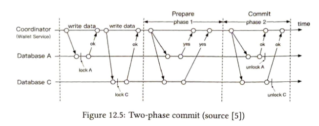
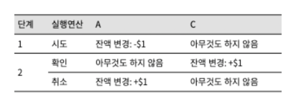
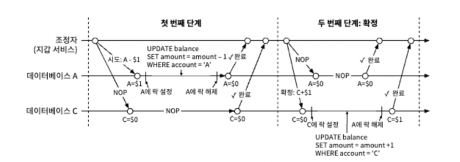
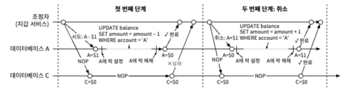
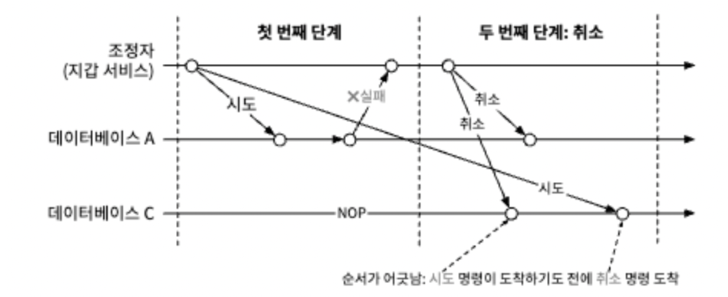
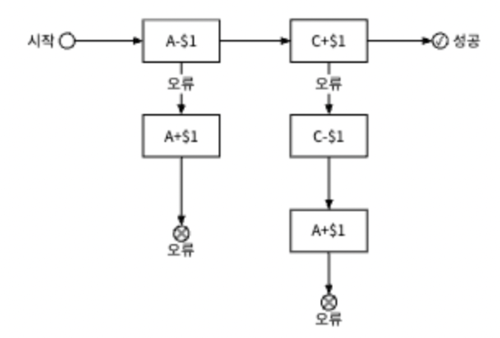
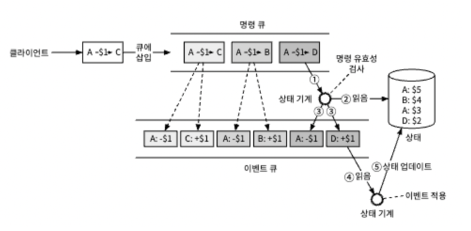
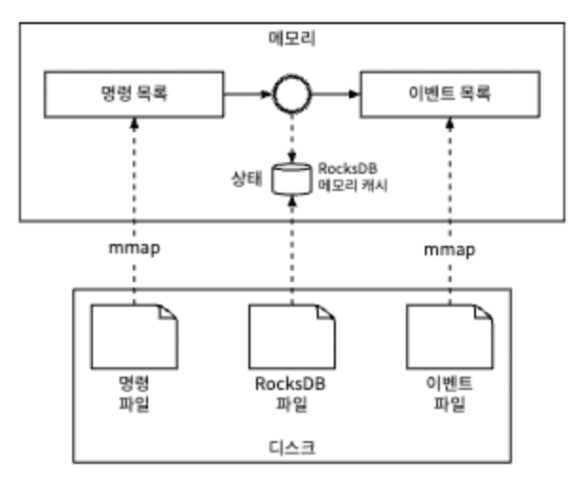
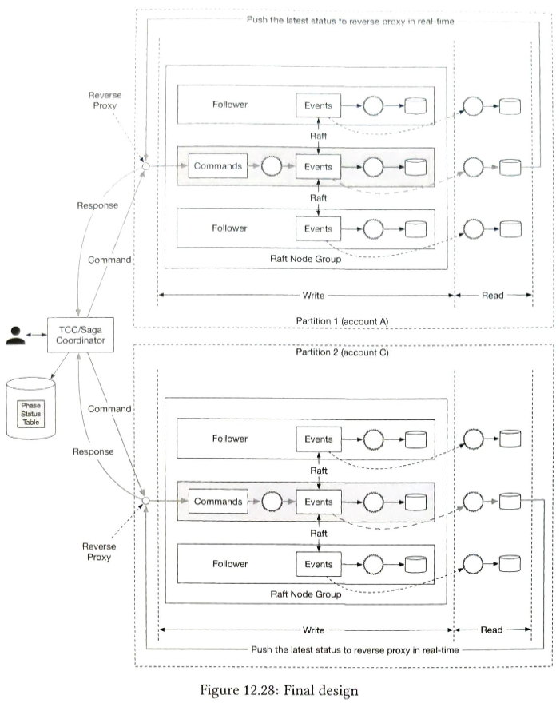

## 전자 지갑

결제 플랫폼에서는 전자 지갑 서비스를 제공해 상품을 그 지갑의 돈으로 결제하는 옵션을 선택할 수 있다.
전자 지갑을 통해 고객에게 여러 서비스들을 제공해줄 수 있기 때문이다. 이러한 서비스에서 있어서 중요한 점은 아래와 같다.

- 전자 지갑 간 금액 이체
- 높은 트랜잭션(대략 10,000,000TPS)
- 정확성과 가용성이 높아야 한다.(99.99 퍼센트)
- 일관성이 깨지더라도 재현할 수 있어야 함.

위에 있어서 트랜잭션 목표를 달성하기 위해서는 반드시 분산처리가 필요하다. 
왜냐하면 일반적인 데이터베이스로 1개 노드가 낼 수 있는 최대 초당 트랜잭션 수는 수천 개이기 때문이다.

단순한 데이터 베이스만으로는 이러한 요구사항을 만족하기는 쉽지 않다. 책에서는 3가지 방법을 소개한다.

1. 간단한 메모리 기반 솔루션
2. 데이터베이스 기반 분산 트랜잭션 솔루션
3. 재현성을 갖춘 이벤트 소싱 솔루션

### 인메모리 샤딩, <사용자, 잔액> 형태의 맵 또는 키-값 저장소에 저장

인메모리 저장소로 사용하기 좋은 선택지는 레디스이다. 관계형 데이터베이스와 마찬가지로 레디스 노드 한 대로는 100만 TPS를 낼 수 없다.
따라서 클러스터를 구성하고 사용자 계정을 모든 노드에 균등하게 분산하여 주어야 한다.
책에서는 단순하게 n개 파티션에 대해 골고른 분산을 위해 키의 해시 값을 계산하고 파티션 수로 나누라고 하는데 안정해시나 별도의 키를 발급해주는 노드 등을
만드는 방법도 있을 것 같다.

이제 이체 명령을 처리해주는 구성 요소가 필요한데 이 서비스의 역할은 아래와 같다.

1. 이체 명령의 수신
2. 이체 명령의 유효성 검증
3. 명령이 유효한 것으로 확인되면 이체에 관계된 두 계정의 잔액 갱신, 두 계정이 서로 다른 레디스 노드에 있을 수 있다.

해당 서비스는 무상태 서비스로 수평적 규모 확장이 커진다. 그런데 정확성을 보장할 수 있을까? 잔액이 A에서 B로 1달러가 이동한다고 해보자.
그러면, A 계좌는 노드1에 있고 B 계좌는 노드2에 있는데, 둘 다 한번에 성공한다는 것을 보장할 수 있을까? 어떻게하면 원자적으로 트랜잭션처럼 처리될 수 있음을
확장된 상태에서 보장할 수 있을까?

### 데이터베이스 샤딩

우선 트랜잭션 기능을 지원하기 위해 레디스 대신 데이터베이스로 교체하는 방법이 있다. 데이터베이스에서는 원자적 연산을 트랜잭션으로 보장해주기 때문이다.
그런데, 데이터베이스에서도 서로 다른 데이터베이스에서 작업이 동시에 처리되는 걸 보장할 수 없다. 

만약 1번 데이터베이스에 있는 A 계좌의 잔액을 갱신한 이후 2번 데이터베이스의 B 계좌를 갱신하기 전에 두 데이터베이스 사이의 처리를 담당해주는 서비스가 종료된다면?
2번 데이터베이스에 속한 B 계좌의 잔액은 바뀌지 않는다.

그러면 이를 해결할 수 있는 방법에는 무엇이 있을까? 아래와 같은 3가지의 방법이 있다.

- 2단계 커밋(PC)
- TC/C
- SAGA

#### 2단계 커밋 방법

2단계 커밋은 데이터베이스 자체에 의존하는 방법으로 아래의 과정을 통해 이뤄진다.

1. 조정자(지갑 서비스)는 모든 데이터베이스에 트랜잭션 준비를 요청한다.
2. 모든 데이터베이스의 응답에 따라 처리한다.
   - 만약 모든 데이터베이스가 성공한 경우 모든 데이터베이스에 해당 트랜잭션 커밋을 요청한다.
   - 하나라도 아니요라고 응답한다면 조정자는 모든 데이터베이스에 트랜잭션 중단을 요청한다. -> 잡은 모든 노드의 트랜잭션이 롤백된다.

이러한 방식의 문제는 두 가지가 있다.
- 잡힌 노드의 모든 데이터베이스가 응답할 때까지 모든 노드의 트랜잭션을 잡고 있게 된다.
- 조정자가 단일 장애지점(SPOF)가 될 수 있다.

#### 분산 트랜잭션(TC/C)

TC/C는 시도-확정/취소 두 단계로 구성된 보상 트랜잭션을 의미한다.

1. 조정자는 모든 데이터베이스에 트랜잭션에 필요한 자원 예약을 요청한다.(트랜잭션과 다르게 잡지 않음.)
2. 조정자는 모든 데이터베이스로부터 회신을 받는다.
   - 모두 예라고 응답하면 모든 데이터베이스에 작업 확인을 요청한다.
   - 어느 하나라도 '아니요'라고 하면 조정자는 모든 데이터베이스에 작업 취소를 한다.

A에서 C계좌도 돈이 이동할 때를 정리하면 아래와 같다.

1단계에서 A계좌의 잔액 변경과 C계좌의 아무것도 안하는 연산(NOP 연산)이 성공하면 
2단계에서 C계좌의 잔액 변경과 A계좌의 NOP연산을 시도한다.

만약, A계좌는 성공하고 C계좌에 문제가 있어 실패한다면 A계좌에 대한 보상트랜잭션으로 다시 잔고 입금이 이뤄진다.

여기에서 앞의 2PC와 다른 점이 일어난다. TC/C는 별도의 트랜잭션이 단계마다 계속해서 일어나는 것이며, 이미 커밋된 트랜잭션에 대한 실행결과를 별도의 트랜잭션을 만들어서 다시 되돌리는 역할을 한다.

이 방법도 앞의 문제였던 조정자(지갑 시스템)의 장애로 인한 명령 손실을 복구할 수 있을까?

이는 개별 단계별 상태 정보를 트랜잭션이란 테이블 형태로 데이터베이스 내부에 별도로 만들어 저장해주면 된다.

1단계 상태 : not sent yet, has been sent, response received
2단계 상태 : confirm, cancel
순서가 어긋낫음 플래그 : True, False

이 때 고려해보아야 할 건 1단계에서 출금이 먼저 이뤄져야 할까 입금이 먼저 이뤄져야 할까? 이런 질문을 하는 이유는 분산 트랜잭션에선 항상 데이터 불일치가 발생하기 때문이다.
- 여기에 대한 답은 출금이 먼저 일어나는 것이다. 왜냐하면, 입금이 먼저 일어나는 경우 다른 누군가가 해당 계좌에서 출금해서 더이상 돈이 없는 경우 보상 트랜잭션으로 유효한 출금을 할 수 없기 때문이다.

그 다음은 데이터베이스에서 초기 NOP 연산에 대한 요청 시도 요청이 네트워크 문제로 늦어지는 경우이다. 이 경우, NOP연산이 도착하기도 전에 다른 데이터베이스에서 실패가 먼저 일어나고
취소 명령을 먼저 받을 수 있다. 이렇게 취소할 명령이 없음에도 취소 요청이 오는 경우 순서가 어긋낫음 플래그를 설정하여 나중에 시도가 들어왔을 때 플래그를 보고 취소해주면 된다.

#### 분산 트랜잭션 : 사가

사가는 분산 트랜잭션으로 개념은 아래와 같다.

1. 모든 연산은 순서대로 정렬된다. 각 연산은 자기 데이터베이스에 독립적인 트랜잭션으로 실행된다.
2. 연산은 처음부터 마지막까지 순서대로 실행된다. 한 연산이 완료되면 다음 연산이 개시된다.
3. 연산이 실패하면 실패한 연산부터 처음 연산까지 역순으로 보상 트랜잭션으로 롤백한다. 따라서, 실패시 n개의 연산이 2n 개의 연산이 된다.

자세한 내용은 생략한다.

#### TC/C와 사가

TC/C와 사가는 애플리케이션 단에서의 분산 트랜잭션이다. 이 때 사가는 작업이 선형적으로 일어나는 특징이 있다.
선택의 기준은 지연 시간에 대한 요구사항이 있는지와 관련이 있으며 지연 시간에 민감하다면 TC/C를 고르는 편이 더 낫다.

### 이벤트 소싱

분산 트랜잭션이 제대로 동작하지 않는 경우, 애플리케이션 수준에서 잘못된 작업을 입력하는 경우 이 원인을 역추적하는 시스템을 만들 필요가 있다.
전자 지갑 서비스에서는 감사 과정에서 다음과 같은 질문을 받을 수 있다.

1. 특정 시점의 계정 잔액을 알 수 있나요?
2. 과거 및 현재 계정 잔액이 정확한지 어떻게 알 수 있나요?
3. 코드 변경 후에도 시스템 로직이 올바른지는 어떻게 검증하나?

이를 해결할 수 있는 방법이 이벤트 소싱이며 여기엔 중요한 4가지 용어가 있다.

1. 명령 : 외부에서 전달된 의도가 명확한 요청(고객 A에서 C로 $1을 이체하라), 단 순서가 중요하므로 FIFO 큐에 저장(카프카 활용)
2. 이벤트 : 명령 중 유효성 검사가 완료되고 이행되는 결과, 실행이 끝난 과거에 실제로 있는 것(같은 명령에 동일한 이벤트가 만들어지진 않는다.)
3. 상태 : 이벤트가 적용될 때 변경되는 내용, 지갑시스템에선 클라이언트의 계정 잔액을 의미한다.
4. 상태 기계 : 명령의 유효성을 검사하고 이벤트 생성 후 상태를 갱신(I/O나 난수 같은 무작위 데이터를 허용하지 않는다.)

이런 시스템에서 상태 기계가 단계적으로 동작하는 과정은 위의 그림과 같으며 각 과정은 아래처럼 요약할 수 있다.(그냥 애플리케이션이라 하면 안되나..?)

1. 명령 대기열에서 명령을 읽는다.
2. 데이터베이스에서 잔액 상태를 읽는다.
3. 명령의 유효성을 검사한다. 유요하면 계정별로 이벤트를 생성한다.
4. 다음 이벤트를 읽는다.
5. 데이터베이스의 잔액을 갱신하여 이벤트 적용을 마친다.

#### 재현성

지갑 서비스에서 갱신한 계정 잔액은 데이터베이스에 저장한다. 하지만 계정 잔액이 변경된 이유는 알기가 어렵다. 또한 한번 업데이트가 이뤄지고 나서 과거 잔액이 얼마였는지는 알 수가 없다.
데이터베이스를 통해서는 특정 시점의 잔액이 얼마인지만 알 수 있다. 하지만 이벤트 리스트를 받아 처음부터 끝까지 재생하면 과거 잔액은 언제든 동일하게 재구성할 수 있다.
실제로 은행 시스템에서는 절대로 계좌 이체 내역 등에 관한 내용은 망하지 않는 이상 절대로 지우지 않는다.

재현성을 통해 아래의 답변을 쉽게 답할 수 있다. 

1. 특정 시점의 계정 잔액을 알 수 있나요? - 이벤트 재생
2. 과거 및 현재 계정 잔액이 정확한지 어떻게 알 수 있나요? - 이벤트 재생
3. 코드 변경 후에도 시스템 로직이 올바른지는 어떻게 검증하나? - 새로운 코드에서 이벤트 재생

위의 시스템에서 이벤트를 재구성하는 과정을 기존 운영환경에서 쓰면 운영환경에 큰 부하가 간다. 따라서 별도의 사본을 두고 외부에서 재생하는 방법이 있는데,
이런 설계를 CQRS라고 하는데, 자세하게 설명이 나와있지 않어 생략한다.

### 고성능 이벤트 소싱

명령과 같은 이벤트를 카프카 같은 원격 저장소가 아닌 로컬 디스크에 저장하는 방안을 생각할 수 있다. 이는 네트워크로 인한 전송 시간을 피할 수 잇다.
또한, 이벤트가 쌓이는 과정은 순차적인 쓰기로 매우 빠르다. 따라서, HDD로 무작위 메모리 접근보다도 빠르게 처리될 가능성이 있다. 

최근 명령과 이벤트를 메모리에 캐싱하는 방법도 있는데, mmap 시스템 콜을 통해서 로컬 디스크에 쓰는 것과 동시에 최근 데이터를 메모리에 자동으로 캐시할 수도 있다.

mmap은 로컬 디스크에 쓰는 동시에 최근 데이터는 메모리에 자동으로 캐시한다. mmap은 디스크 파일을 메모리 배열에 대응시킨다.
추가만 가능한 파일에 이루어지는 연산은 가능한 모든 데이터가 대부분 메모리에 있으므로 실행 속도가 높아진다.

또한 잔액 정보를 관계형 데이터베이스가 아닌, 로컬 디스크에도 저장을 할 수 있다. 로컬 관계형 데이터베이스 SQLite를 사용하거나, 로컬 파일 기반 키-값 저장소 RocksDB도 사용할 수 있다.
RocksDB는 LSM 기반 쓰기 최적화가 되므로 최근 데이터를 캐시해 읽기 성능을 높여서 적용한다.

그러면 명령과 이벤트는 mmap에 저장되고, 계좌의 상태는 RocksDB 메모리 캐시에 존재하는 형태로 하여 속도와 안정성을 높여줄 수도 있다.

#### 스냅샷

모든 것이 파일 기반일 때 재현 프로세스를 높이는 방법은 주기적으로 상태 기계를 멈춘고 해당 시점을 파일에 저장하여 시간을 절약한다.
이 파일을 스냅숏이라고 부른다. 보통 주기적으로 데이터가 들어오지 않는 점검시간 10분 정도를 만들어놓고, 데이터를 한번에 받아오고 스냅샷을 띄운 다음 필요한 곳에 재배치하고
다시 실시간으로 데이터를 받아온다. 대부분의 금융서비스에서 지갑 서비스를 구현함에 있어 구현을 하면 00:00에 스냅숏을 찍는다.

왜냐하면 재무팀이 당일 발생한 모든 거래를 확인할 수 있기 때문이다. 스냅숏을 사용하면 해당 데이터가 포함된 스냅숏하나를 로드하고 이후에 처리된 이벤트를
재생함으로써 더 빠르게 특정 지점을 복구할 수 있다.

스냅숏은 거대한 이진(bin 파일)로 HDFS(Hadoop Distributed File System)과 같은 객체 저장소에 저장한다. 모든 것이 파일 기반일 때 
시스템은 컴퓨터 하드웨어 I/O처리량을 한계까지 활용할 수 있다.

하지만 이런 시스템은 로컬 디스크에 데이터를 저장하기에 무상태성을 띄지 않고 해당 시스템이 다운되는 순간 단일 장애지점이 된다. 
이런 시스템의 안정성은 어떻게 개선을 할 수 있을까?

#### 신뢰할 수 있는 고성능 이벤트 소싱

시스템의 안정성을 통해 신뢰성을 보장함에 있어 데이터는 내구성이 보장된다면 계산 결과는 쉽게 복구할 수 있다.
하지만 데이터 자체의 신뢰성을 앞의 설계에서는 보장하지 못한다. 상태와 스냅숏은 이벤트 목록을 통해서 보장이 가능하다. 
그렇기에 이벤트 목록의 신뢰도만 살펴주면 된다. 

그렇다면, 명령의 신뢰성만으로는 보장이 가능할까? 명령은 같은 명령이 가더라도 동일한 이벤트가 발생하지 않는다. 명령의 신뢰성이 아닌 이벤트의 신뢰성을 가져야 한다.

높은 안정성과 신뢰도를 제공하기 위해서는 다음을 보장해야 한다.

1. 데이터 손실이 없음.
2. 로그 파일 내 데이터의 상대적 순서는 모든 노드에 동일

이런 목표를 달성하는 데에는 합의 기반 복제 방안이 가장 적합하다. 래프트 알고리즘이 가장 적절하다. 래프트 알고리즘은 절반 이상이 동의하면 그 모두에 보관된
추가 전용 리스트는 같은 데이터를 가진다. 따라서 래프트 알고리즘을 기반으로 이벤트를 복제하여 다른 노드로 복제하며 처리가 가능하다.

3개의 이벤트 소싱 노드가 있을 때 리더는 외부 사용자로부터 들어오는 명령을 받아 이벤트로 변환하고 로컬 이벤트 목록에 추가한다. 이 때, 새로운 이벤트를 모든 팔로워에 복제한다.
이 과정에서 팔로워의 과반 이상이 업데이트를 하면 이벤트 목록은 업데이트를 한다. 이런 방식으로 래프트 알고리즘은 리더와 팔로워가 동일한 이벤트 목록을 갖도록 하고 동일한 이벤트 목록에서 동일한 상태가 만들어지도록 해준다.

그럼 리더가 장애가 났을 떈 이 시스템에선 어떻게 될까? 리더가 장애가 난 경우 클라이언트는 타임아웃 혹은 오류 표시를 보낼 것이고, 클라이언트는 재전송하면 된다.
팔로워가 장애가 났을 땐 팔로워에 요청된 요청이 완료될 때까지 기한 없이 재시도 한다. 

#### 풀 vs 푸시 

풀 모델에서는 외부 사용자가 읽기 전용 상태 기계에서 주기적으로 실행 상태를 읽어온다. 해당 상태는 실시간이 아닐 수 있다.
문제는 읽어올 수 있는 주기를 줄이면 지갑 서비스에 과부하가 걸릴 수 있는데 이런 문제는 래프트 노드 그룹 앞에 리버스 프록시를 하나 두어
처리하면 어느정도 개선이 된다.

하지만 읽기 전용 상태 기계에서 특별한 로직을 통해 이벤트가 수신되자마자 실행 상태를 역방향 프락시에 푸시는 방식으로 두면 실시간 응답이 일어나는 것처럼 사용자 경험을 만들어줄 수 있다.

#### 분산 트랜잭션

이제 앞의 내용부터 최종적인 부분까지 쭉 종합하여 정리를 해보자. TPS를 높이기 위해서는 반드시 샤딩까지 처리를 해야 한다.
책에선 사가를 기준으로 이야기를 하였다.

1. 사용자 A가 1달러를 사용자 C에게 보낸다. 그러면 사용자 A가 사가 조정자에게 A 출금과 C 입금 명령을 보낸다.
2. 사가 조정자는 단계별 상태 테이블에 트랜잭션의 상태를 추적할 수 있는 레코드를 만들어낸다.
3. 사가 조정자는 출금 명령을 우선 처리한다.(입금은 복구문제가 있음.) 사용자 A가 속한 파티션 1은 A의 출금 명령을 보낸다.
4. 파티션 1은 출금 명령의 유효성을 판별한 후 이벤트로 발행하고, 합의 알고리즘에 의해 이벤트는 팔로워로 동기화가 된다.
5. 이벤트를 실행하고 CQRS를 통해 데이터를 읽기 경로로 이동하여 해당 정보를 통해서 쓰기가 일어나지 않는 곳에서 지갑 및 실행 상태를 재구성한다.
6. 파티션 1에서는 사가 조정자에게 작업 후 지갑의 상태와 성공 상태를 보낸다. 그러면 사가 조정자는 상태를 수신해 작업이 완료되었음을 레코드로 저장한다.
7. 첫번째 작업이 완료했으므로 조정자는 사용자 C의 지갑이 속한 파티션 2로 명령을 보낸다.
8. 이후 작업은 1과 동일하게 일어난다. 
9. 두번째 작업까지 완료되면 분산 트랜잭션이 완료되고 실패한다면 순차적으로 보상 트랜잭션으로 각각의 상태를 복구해준다.

