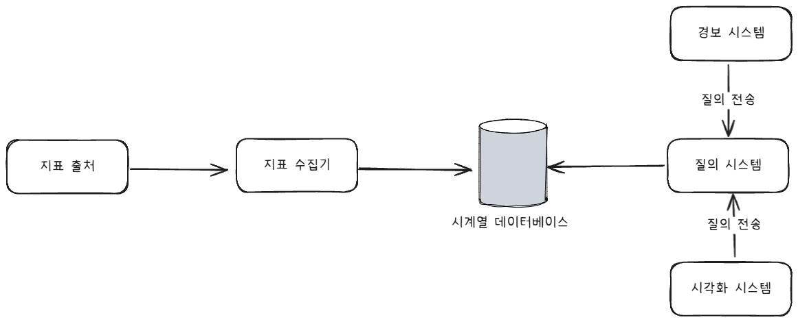
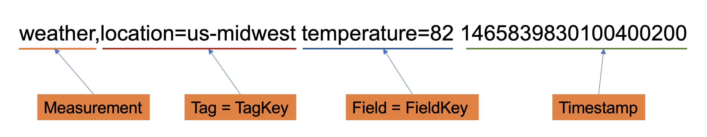
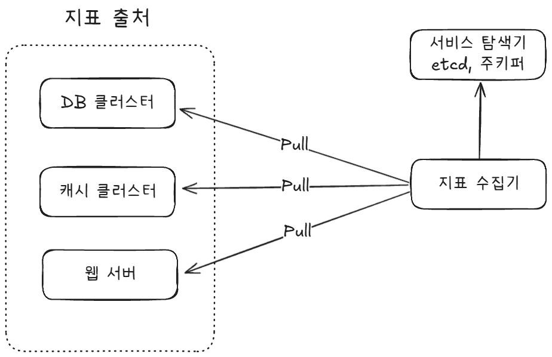
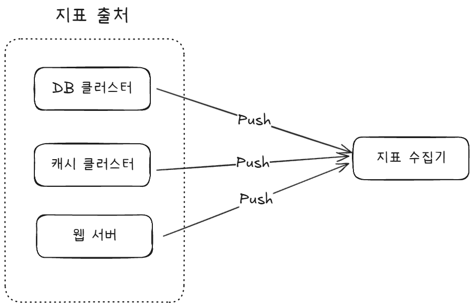
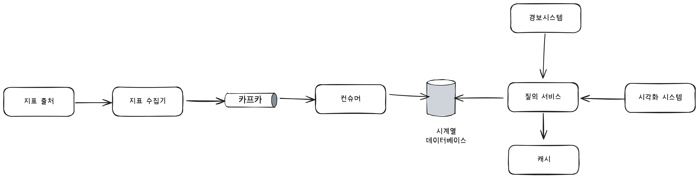
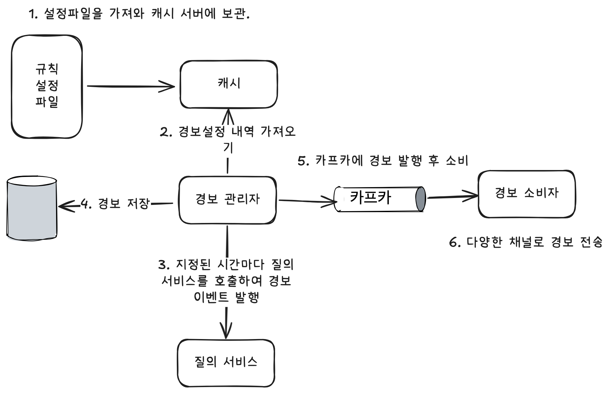

# 지표 모니터링 및 경보 시스템

지표 모니터링 시스템은 회사마다 요구사항이 다를 수도 있다. 따라서 어떤 요구사항을 필요로 하는가에 대해 면접관에게 알아볼 필요가 있다.
본문에서는 시스템 운영 지표를 수집한다고 한다. 그 내용은 다음과 같다.
- CPU 부하
- 메모리 사용률
- 디스크 사용량
- request per sec
- 웹 서버 프로세스 개수
또한 다음과 같은 비기능적 요구사항이 있다.
- 낮은 응답 지연, 안정성, 유연성, 확장성

***

# 구성
지표 모니터링 시스템은 기본적으로 다음과 같은 컴포넌트를 가진다.
- 데이터 수집: 여러 출처로부터 지표 데이터를 수집
- 데이터 전송: 수집된 정보를 지표 모니터링 시스템으로 전송
- 데이터 저장소: 전송받은 데이터 저장
- 경보: 데이터를 분석하고 이상 징후를 감지 미치 경보
- 시각화: 데이터를 차트나 그래프로 반환


## 데이터
시계열 데이터를 바탕으로 하며, 행 프로토콜 형식을 준수한다.

지표 모니터링 시스템에서는 많은 곳에서 지표가 발생하기 때문에 쓰기 연산의 비율이 압도적으로 높다.
그에 반면 지표 분석을 통한 경보 서비스등에서는 읽기 연산이 치솟았다가 사라지는 스파이크 형식을 보인다.

위와 같은 특징을 고려하면 일반적인 범용적 데이터베이스(MySQL, Redis)로는 처리할 수 없다. 다음의 기능들을 지원해야 한다.
- 시계열 처리
- 많은 양의 쓰기 연산 감당
- 레이블을 기준으로 집계, 분석 기능
  - 레이블 == 태그
*주로 프로메테우스, Influx DB등을 사용한다고 한다.

***

# 상세 설계

## 지표 수집: Pull vs Push

### Pull 모델

풀 모델에서는 지표 수집기가 어느 서비스에서 지표를 가져올 지 알아야 한다. 서버가 동적으로 바뀌는 상황에서는 서비스 탐색 기술을 통해 각
서비스는 자신의 가용성 관련 정보를 서비스 탐색기에 기록하고, 이에 대한 변경 사항을 서비스 탐색기가 지표 수집기에 내려준다. 다음은 지표 수집기가
서비스 탐색기로부터 들고 오는 메타데이터다.
- 지표 수집 주기
- IP 주소
- 타임아웃
- 재시도 인자
지표 수집기는 다양한 출처에서 많은 지표를 가져오게 된다. 이걸 다 감당하기에는 부족할 수 있어 scale-out을 고려해볼 수 있다.
이때 주의할 점은 안 그래도 많은 지표에서 중복으로 데이터를 가져오게 되면 너무 많은 데이터가 발생할 수 있다. 이를 해결하기 위해 안정 해시 링
방식으로 증설한 서버를 관리할 수 있다.(이에 관한 내용은 스킵하겠습니다.)

### Push 모델

푸시 모델에서는 지표를 출처측에서 지표 수집기에 보내주는 방식이다. 이런 경우 모니터링 대상 서버에 수집 에이전트라는 소프트웨어를 통해 주기적으로
지표를 수집한 다음 보내준다.(+전처리) 하지만 이렇게 보내는 주체가 지표 출처측이면 지표 수집기가 받은 데이터를 다 처리하지 못했을 경우 오류를 반환할
수 있다. 이를 방지하기 위해 지표 수집기를 auto-scale-out을 통해 클러스터를 구성하고 로드밸런서를 두어 부하를 분산할 수 있다.

## 지표 전송 파이프라인의 규모 확장
만약 지표 데이터를 받는 시계열 데이터베이스가 장애가 나면 데이터 손실이 발생할 것이다. 이런 사태를 방지하기 위해 카프카같은
스트림 처리 서비스를 중간에 배치한다. 다음과 같은 장점이 있다.
- 안정적, 뛰어난 규모 확장성
- 결합도 낮추기
- 카프카를 통해 1차적 데이터 보관
카프카를 사용하면 파티션을 통해 다양한 구성을 할 수 있다.
- 대역폭
- 지표 종류에 따라
- 레이블에 따라
- 우선순위

## 데이터 집계 지점
여기에는 여러가지 방안이 있다. 클라이언트에서 할 것인가? 수집기에서 할 것인가?<br>
전자는 클라이언트측에서 설치된 애플리케이션에 의존해서 해야 하기 때문에 복잡한 집계 로직은 처리가 불가능하다.
후자는 위의 문제점은 해결하지만, 이제 늦게 도착하는 데이터는 어떻게 처리할지 모른다는 단점이 존재한다.(책에서는 이제 원본 데이터를 보관하지
않는다는 단점이 있는데 클라이언트에서 가공해서 보내나 여기서 하나 뭔 차이인지 모르겠음.)<br>
또한, 질의 시에 집계하는 방안도 존재한다. 원본을 그대로보관한 다음 쿼리로 해결하면 된다.(전체 데이터를 기준으로 쿼리를 치기 때문에 데이터베이스측에
부담을 넘기는 행위)

## 질의 서비스
시각화 시스템 또는 경보 시스템의 요청을 받아 데이터베이스에서 이를 처리하는 서비스이다.(계층을 한 개 더 두는 것)
- 근데 대부분 시중에 있는 시각화나 경보 시스템에는 시계열 데이터베이스와 연동하는 자체 플러그인이 있다고 한다.


## 저장소 계층
모니터링 시스템에 사용되는 시계열 데이터베이스는 중요하다. 따라서 자신의 시스템에 맞는 특성을 가진 시계열 데이터베이스를 선정하는 것이 매우 중요하다.

### 저장 용량 최적화
계속 언급했듯이 지표 데이터는 엄청나다. 이를 최적화하기 위해 다음과 같은 방법들을 쓸 수 있다.
- 데이터 인코딩 및 압축
  - 데이터베이스 자체적으로 해당 기능을 가지고 있는 데이터베이스도 있다.
  - 이중 델타 인코딩: 데이터의 변화량의 변화량을 저장하는 기법. 일정 주기로 수집하는 시계열 데이터인 경우 압축률이 매우 높아진다.
```text
10, 20, 30, 40, 50 다음과 같은 데이터들을 저장한다고 해보자.
델타 인코딩을 하면
10, 10, 10, 10
위와 같이 변화량을 저장하게 된다. 여기서 한번 더 인코딩을 하면
0, 0, 0
이렇게 5개 데이터가 3개로 줄어들어 저장되는 것을 볼 수 있다. 이게 이중 델타 인코딩이다.
```
- 다운샘플링: 데이터의 해상도를 낮춰 저장소 요구량을 줄이는 방법이다. 예시로는 최근 데이터는 1분단위까지 저장하고 옛날 데이터는 1시간
단위만 저장하는 방식이다.
- 냉동저장소: 잘 활용되지 않는 데이터를 저장하는 곳이다.

## 경보 시스템

- 좋은 경보 시스템은 이미 시중에 많이 있다고 한다. 필요하면 구현하지 말고 도입하라고 한다.

## 시각화 시스템
지표 데이터들을 대시보드를 통해 다양한 시간 범위로 표시하고, 한번에 보여주는 역할을 한다.
- Grafana