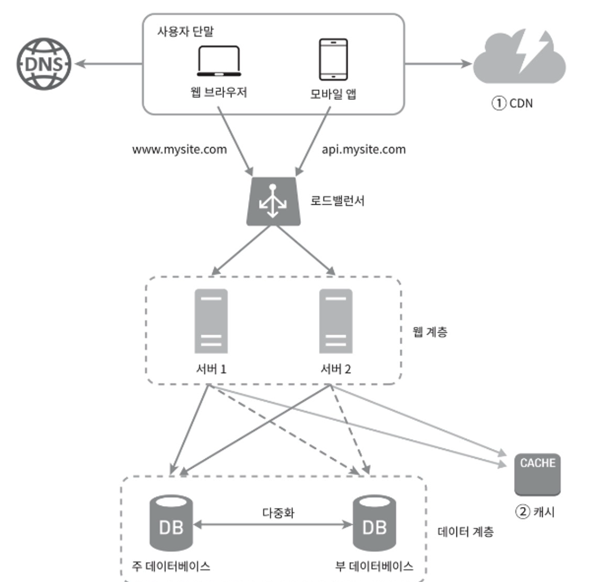

# 1장: 사용자수에 따른 규모 확장성
- 1장은 사용자 수가 증가할 때, 시스템 규모를 어떻게 확장해야 하는지 다양한 기법들에 대해 순차적으로 설명하고 있다.
- 먼저, 이 장의 핵심인 시스템 규모 확장 기법들을 나열한 후, 단일 서버에서 점진적으로 확장해나가는 순서대로 설명하겠다.

---

## 시스템 규모 확장을 위한 전체 기법 정리
1. 웹 계층은 무상태 계층으로 한다.
2. 모든 계층에 다중화를 도입할 수 있다.
3. 가능한 많은 데이터를 캐싱한다.
4. 여러 데이터 센터를 지원한다.
5. 정적 콘텐츠는 CDN을 통해 서비스한다.
6. 데이터 계층은 샤딩을 통해 그 규모를 확장한다.
7. 각 계층은 독립적인 서비스로 분할할 수 있다.
8. 시스템을 지속적으로 모니터링하고, 자동화 도구들을 활용하자.

---

## 단일 서버에서 점진적으로 확장하기
- 모든 컴포넌트가(웹 앱, 데이터베이스, 캐시 등) 전부 서버 한 대에서 실행된다고 가정
- 서버에서 사용자 요청 처리 흐름
    1. 사용자는 도메인 이름을 이용하여 웹사이트에 접속 (DNS에 질의하여 IP 주소로 변환 필요)
    2. DNS 조회 결과로 반환된 IP 주소 (웹 서버의 주소) 찾기
    3. 해당 IP 주소로 HTTP 요청 전달
    4. 요청을 받은 웹 서버는 HTML 페이지나 JSON 형태의 응답 반환

## 데이터베이스 분리하기
- 사용자가 늘면 단일 서버로 충분하지 않다.
- 웹 서버와 데이터베이스 서버를 분리하면 각각을 독립적으로 확장해 나갈 수 있다.
- 어떤 데이터베이스를 사용할 것인지 고르는 것도 중요하다.
    - 전통적인 관계형 데이터베이스 (RDBMS)
    - 비관계형 데이터베이스 (NoSQL)
        - 대표적으로 4가지 분류로 나눌 수 있고, 일반적으로 Join 연산을 지원하지 않거나 성능이 나쁘다.
            1. 키-값 저장소 (KV store)
            2. 그래프 저장소 (Graph store)
            3. 칼럼 저장소 (Column store)
            4. 문서 저장소 (Document sotre)
- 보통 RDBMS 를 많이 사용하나, 아래와 같은 경우에 NoSQL 사용을 고려하면 좋다.
    - 매우 낮은 응답 latency 요구될 때
    - 다루는 데이터가 비정형이고, 관계형 데이터가 아닐 때
    - 데이터를 직렬화하거나 역직렬화 할 수 있기만 하면 되는 경우
    - 아주 많은 양의 데이터를 저장할 필요가 있는 경우 (쓰기 용량 최적화가 필요하거나 속도 등 쓰기 성능 측면에서 예민한 경우)

---

## 수직적 규모 확장(Scale-up) vs 수평적 규모 확장(Scale-out)
- Scale-up
    - 서버에 고사양 자원 추가 (더 성능 좋은 CPU, RAM 용량 추가 등)
    - 서버에 유입되는 트래픽 양이 적을 때 시도하기 좋음 → 단순한 솔루션이라서
    - 단점
        - 아무리 사양을 업그레이드해도 CPU나 RAM 성능을 늘리는데 한계가 있다.
        - 장애에 대한 자동 복구(failover) 방안이나 다중화(redundancy) 방안이 없다.
        - 서버 장애 발생 시 서비스가 완전히 중단되는 치명적인 문제가 있다.
- Scale-out
    - 서버 인스턴스를 늘리면서 처리량을 늘려 성능 개선
    - Scale-up의 단점과 한계로 인해, 대규모 애플리케이션을 지원하는데에 Scale-out이 더 적절하다.

---

## 웹 계층에서 확장 - 로드밸런서
- 단일 서버 설계에서 사용자는 웹 서버에 바로 연결되는데, 바로 연결되는 것보다 로드밸런서를 거치는 것이 더 좋다.
- 로드밸런서는 load balancing set에 속한 웹 서버들에게 트래픽 부하를 고르게 분산한다.
- 사용자가 로드밸런서의 공개 IP 주소로 접속하고, 적절한 웹 서버로 연결시킨다.
- 서버 간 통신은 사설 IP 주소를 사용하여 외부 접속을 못하게 하면 보안을 강화할 수 있다.

---

## 데이터 계층에서 확장 - 데이터베이스 다중화
- master-slave 구조 사용 (원본은 master, 사본은 slave)
- 쓰기 연산은 master에서만 지원, slave는 사본을 관리하며 읽기 연산만 지원
- 많은 서비스들은 읽기와 쓰기의 비율을 따져볼 때 읽기 비율이 더 높은 경우가 많아 slave의 수가 더 많다.
- 장점
    - 성능 향상: 읽기 연산이 slave 들에 적절히 분산되어서 병렬로 처리할 수 있는 query 수가 늘어난다.
    - 안정성: DB 서버 중 일부가 파괴되어도 데이터가 보존된다. (데이터를 지역적으로 떨어진 여러 장소에 다중화해놨을 경우)
    - 가용성: 데이터를 여러 지역에 복제하면, 하나의 DB 서버에 장애가 발생하더라도 다른 서버를 사용하여 계속 서비스할 수 있다.
- 다양한 장애 상황을 대비하여 "다중 마스터", "원형 다중화" 등의 방식을 도입하기도 한다.

---

## 응답 속도 개선 - 캐싱
### 캐시 계층
- Memcached, Redis 등
- 별도의 캐시 계층을 두어 응답 속도를 개선하고 DB 부하를 줄인다.
- 캐시 계층의 규모를 독립적으로하여 확장시키는 것도 가능하다.
- 다양한 캐시 전략이 있는데, 캐시할 데이터 종류, 크기, 액세스 패턴에 맞는 전략을 선택하면 된다.

### 캐시 사용 시 유의할 점
- 어떤 상황에 캐싱이 유리한 지 꼼꼼하게 고려하기 (ex. 데이터 갱신은 자주 일어나지 않지만 참조는 빈번할 경우)
- 어떤 데이터를 캐시에 두어야 하는지 (ex. 데이터의 특징을 살핀 고려 - 휘발성/영속성)
- 캐시에 보관된 데이터 만료 정책 적절하게 설정하기
- 캐시 일관성 유지할 방법
- 캐시 계층 장애 상황 시 대처 (해당 서버의 SPOF가 되지 않도록 여러 지역에 걸쳐 캐시 서버 분산 필요)
- 캐시 메모리 크기 설정
- 데이터 방출(eviction) 정책 설정: 캐시가 꽉 찼을 때 기존 데이터를 방출하는 경우
    - LRU, LFU, FIFO 등 여러 정책 중에 알맞은 것 적용

    
### CDN (콘텐츠 전송 네트워크)
- 정적 콘텐츠를 전송하는데 쓰이는, 지리적으로 분산된 서버의 네트워크
- 이미지, 비디오, CSS, JavaScript 파일 등을 캐시할 수 있다.
- 어떤 사용자가 웹 사이트를 방문했을 때, 그 사용자에게 가장 가까운 CDN 서버가 정적 콘텐츠를 전달한다.

### CDN 사용 시 유의할 점
- 비용: 보통 third-party 제공자가 운영하기 때문에 CDN을 통하는 데이터 전송 양에 따라 요금이 부과된다.
- 적절한 만료 기간 설정: 시의성이 중요한 콘텐츠의 만료 시점을 잘 정하여 캐싱 효과를 높여야 한다.
- CDN 장애에 대한 대처: CDN 자체가 죽었을 경우 본래 서비스가 어떻게 동작할 지
- 콘텐츠 무효화 방법을 통해 CDN에서 제거할 수 있다. (CDN 제공 API 이용하기 or 콘텐츠에 version을 지정하여 version 옮기기)

---

위에서 언급한 확장 구조를 모두 적용하면, 다음과 같은 설계가 된다.

---

## 무상태 웹 계층 (Stateless)
- 웹 계층을 수평적으로 확장하기 위해서는 상태 정보(사용자 세션 데이터 등)를 웹 계층에서 제거해야 한다.

### 상태 정보에 의존적인 아키텍처
- 상태 정보를 보관하는 서버는 클라이언트 정보, 즉 상태를 유지하여 요청들 사이에 공유되도록 한다.
- 예를 들어, 사용자의 세션 정보 등을 서버 A가 가지고 있다면, 해당 사용자 인증이 필요한 API는 서버 A로 전송되어야 한다.
- 이런 경우를 지원하고자 로드 밸런서에서 고정 세션(sticky-session) 기능을 제공하지만, 이는 로드밸런서에 부담이 되고, 서버 scale-out이 까다로워지는 등 단점이 많다.

### 무상태 아키텍처
- 무상태일 경우, 사용자의 HTTP 요청을 어떤 웹 서버로 전달하는지 상관이 없어진다.
- 상태 정보가 필요할 경우, 공유 저장소 등을 두어 상태 정보를 웹 서버로부터 물리적으로 분리할 수 있다.

최종적으로, 세션 데이터를 웹 계층에서 분리하고 다른 공유 저장소에 관리할 때 다양한 저장소를 쓸 수 있다.
- RDBMS
- 캐시 시스템(Memcached/Redis)
- NoSQL

---

## 데이터 센터
- 글로벌한 서비스 제공 및 가용성을 높이기 위해 여러 지역에 데이터 센터를 지원할 수 있다.
- 지리적 라우팅(geo-routing)을 통해 사용자에게 물리적으로 가장 가까운 데이터 센터로 보낼 수 있다.
- GeoDNS는 사용자의 위치에 따라 도메인 이름을 어떤 특정 IP 주소로 변환할 지 결정해주는 DNS 서비스이다.

### 다중 데이터센터 아키텍처 구성을 위해 해결해야할 문제
- 트래픽 우회
    - 알맞은 데이터 센터로 트래픽을 보내는 효과적인 방법을 찾아야 한다. (ex. GeoDNS처럼 물리적 위치 기준으로 트래픽 보내기)
- 데이터 동기화
    - 여러 데이터 센터에 걸쳐 데이터를 다중화하여, 트래픽이 우회되었을 때도 찾는 정보가 DB에 있도록 구성
- 테스트와 배포
    - 서비스를 여러 물리적인 위치에서 테스트 해보고, 모든 데이터 센터에 동일한 서비스를 수행할 수 있는지 체크

---

## 메시지 큐
- 더 큰 규모의 시스템 확장을 위해, 시스템의 컴포넌트를 분리 할 수 있다.
- 시스템의 컴포넌트가 각기 독립적으로 확장될 수 있게 된다면 대용량 처리가 가능해지고,
- 이 문제를 해결하기 위해 많은 분산 시스템이 MQ를 핵심 전략으로 채용하고 있다.

### 메시지 큐의 특징
- 서비스 or 서버 간 결합을 느슨하게 만들어 규모 확장 시에도 안정적인 애플리케이션을 구성할 수 있다.
- 생산자와 소비자 둘 중에 한 쪽이 문제가 생기더라도, 각각 동작하여 발행/소비를 할 수 있다.
- 시간이 오래 걸리는 중간 프로세스를 MQ를 통해 비동기적으로 처리할 수 있다.
- 생산자와 소비자 규모도 독립적으로 확장할 수 있다. (auto-scaling)

---

## 로그, 메트릭, 자동화
- 서비스 규모가 커질 때 필수적으로 투자해야 하는 부분이다.

- 로그
    - 에러 로그 모니터링하기 (시스템 오류, 문제를 신속하게 파악)
    - 에러 로그를 서버 단위로 모니터링 하기 보단, 로그를 단일 서비스로 모아주는 도구를 활용하자

- 메트릭
    - 메트릭을 잘 수집하면 비즈니스에 유용한 정보를 얻을 수 있다.
    - 유용한 메트릭 종류
        1. 호스트 단위 메트릭: CPU, 메모리, Disk I/O 에 대한 메트릭
        2. 종합(aggregated) 메트릭: 데이터베이스 계층의 성능, 캐시 계층의 성능 등
        3. 핵심 비즈니스 메트릭: DAU(Daily Active User), 수익(Revenue), 재방문(Retention) 수치

- 자동화
    - 시스템이 크고 복잡해질 때, 생산성을 높이기 위한 자동화 도구를 도입할 수 있다.
    - CI 도구를 활용하여 코드 검증 절차를 자동화하고, 코드 문제를 쉽게 감지할 수 있다.
    - 이 외에도 빌드, 테스트, 배포 등의 절차를 자동화할 수 있다.

---

## [데이터베이스 규모 확장](/chapter-01/1-2-database-scaling.md)

