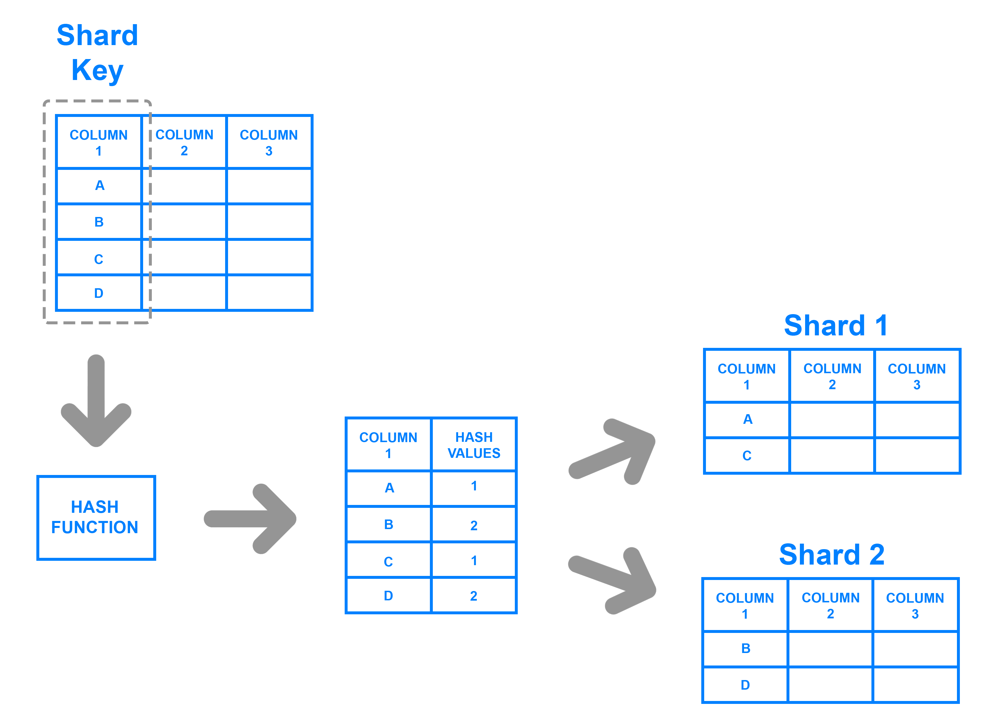

# 데이터베이스 규모 확장
- 저장 데이터가 많아질수록, 데이터베이스에 대한 부하가 증가한다.
- 데이터베이스 규모 확장에는 두 가지 접근법이 있는데, 수직적 규모 확장과 수평적 규모 확장이다.

## 수직적 확장 (scale-up)
- 기존 서버에 더 많은 or 더 고성능의 자원을 사용하는 것이다.
- 에를 들면, Amazon RDS에 24TB RAM 을 갖춘 서버도 product로 제공하고 있다.
- 또한, StackOverFlow 사이트는 2013년 한 해 방문한 천만 명의 사용자 모두의 정보를 단 한대의 마스터 데이터베이스로 처리했다.

### 수직적 확장의 한계
- 데이터베이스 서버 하드웨어적인 한계가 있다. (CPU, RAM 크기를 무한 증설할 수 없음)
- SPOF 문제로 인한 위험성
- 고성능 서버를 사용할 수록 비용 부담이 막대해진다.

## 수평적 확장 (scale-out)
- 샤딩(sharding) 이라고도 하고, 더 많은 서버를 추가하여 성능을 향상시킬 수 있도록 한다.
- 샤딩은 대규모 데이터베이스를 샤드(shard)라고 부르는 작은 단위로 분할하는 기술을 말한다.
- 모든 샤드는 같은 스키마를 사용하지만, 샤드에 보관되는 데이터 사이에는 중복이 없다.

### 샤딩 전략 구현
- 샤딩 전략 구현에 가장 중요한 것은 샤딩 키를 정하는 것이다.
- 샤딩 키는 파티션 키라고도 부르고, 데이터가 어떻게 분산될 지 정하는 하나 이상의 칼럼으로 구성된다.
- 샤딩 키를 정할 때, 데이터가 고르게 분할 될 수 있게 만들어야 한다.

샤딩을 도입할 때 생기는 문제들도 있다.

1. 데이터의 재샤딩(resharding)
- 다시 샤딩을 해야하는 경우
    1. 데이터가 너무 많아져서 현재 샤드로 감당하기 어려울 때
    2. 데이터 분포가 고르지 못하여 특정 샤드에 할당된 공간 소모가 다른 샤드에 비해 빠르게 진행될 때 (샤드 소진)
- 샤드 키를 계산하는 함수를 변경하고 데이터를 재배치해야한다. (5장 안정 해시 설계 참고)

2. 유명인사(celebrity) 문제
- hotspot key 문제라고도 한다.
- 특정 샤드에 질의가 집중되어 서버에 과부하가 걸리는 문제
- 예를 들어, SNS 서비스에서 유명인이 몰려있는 샤드에 read 요청이 몰려 과부하가 걸릴 수 있다.
- 이렇게 샤드에 큰 영향을 미치는 내부 요소가 있다면, 이를 고려해서 더 잘게 쪼개야할 수도 있다.

3. Join과 비정규화
- 하나의 데이터베이스를 여러 샤드로 쪼개면, 여러 샤드에 걸친 데이터를 조인하기 힘들어진다. 
- 이를 해결하는 방법으로 데이터베이스를 비정규화하여 하나의 테이블에서 쿼리를 수행하도록 만들 수 있다.

