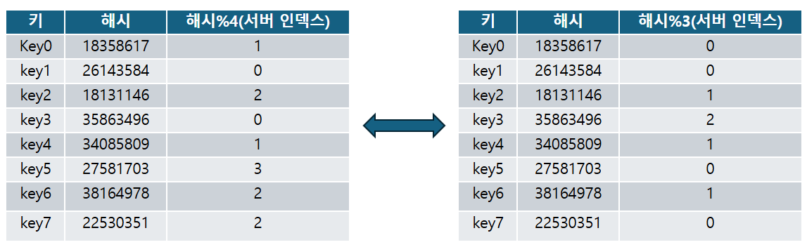
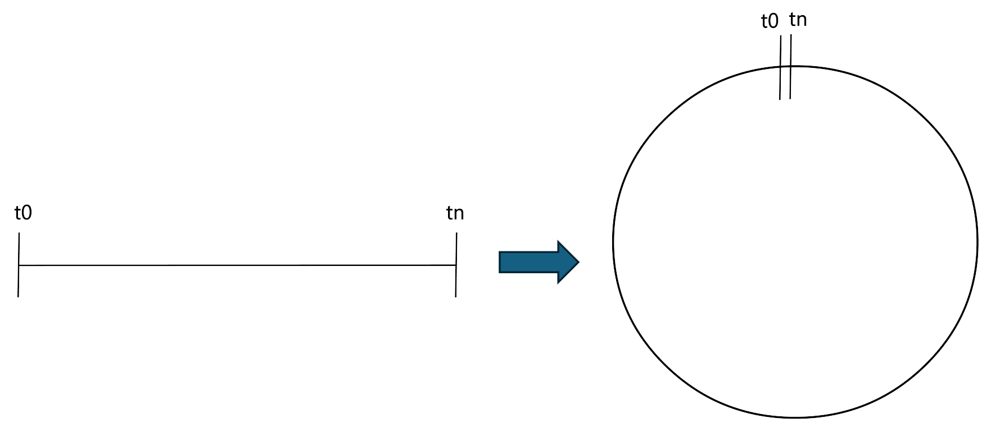
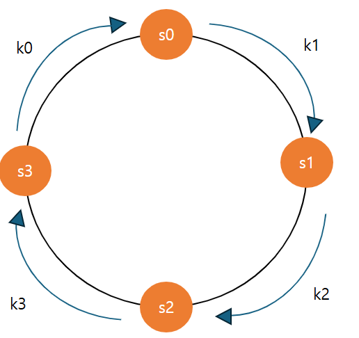
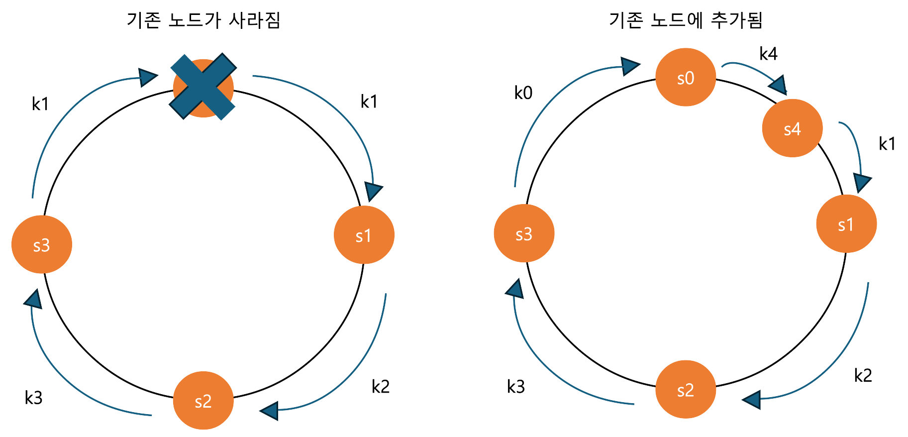
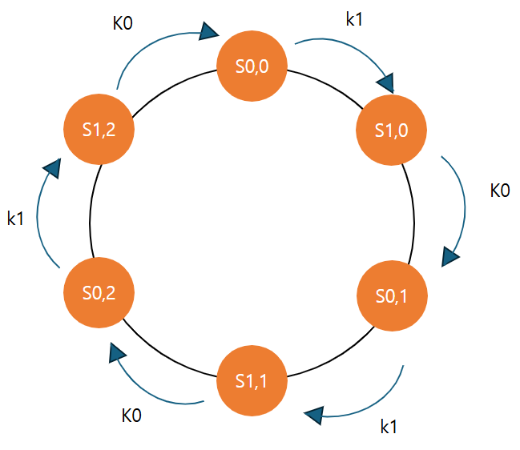

### 안정 해시 설계

> #### 모듈러 방식의 캐시 설계의 문제점

안정 해시 설계는 데이터의 분산 환경과 관련이 있다. 만약에 서버가 4대가 돌아가져 있고, 
각각의 서버에 맞게 키를 분배한다고 생각을 해보자.

그러면, 가장 쉽게 생각할 수 있는 방법은 모듈러 연산을 사용한 방법이 될 것이다. 서버 1을 0, 서버 2를 1....
이런 식으로 대응을 시키는 방식으로 구현이 굉장히 간단하다. 일반적으로 서버가 돌아갈 때 위의 방식은 정상적으로 돌아간다.

그런데 만약에 두 가지 경우를 생각해보자.

1. 서버의 사용자가 줄어들었지만 서비스를 없애지 못하는 상황(서버를 줄여 비용을 줄여야 한다.)
2. 서버의 사용자가 예상했던 것보다 빠르게 증가해서 서버를 늘려야 하는 상황
3. 서버가 갑자기 장애로 인해서 내려가는 경우

위의 상황 중 1가지만 되더라도 분배된 해시가 굉장히 크게 바뀌게 된다. 우선 3번 케이스도 결국 1번처럼 서버가 내려가는 상황이니
그렇게 생각을 하고 서버가 줄어들고 서버가 늘어날 때 각각의 해시에 대응하는 값이 어떻게 바뀌는지 서버가 3대인 경우와 서버가 4대인 경우를 예시로 작성을 하였다.

위의 그림을 보면 서버가 3대일 때, 서버가 4대일 때의 결과가 일치하는 경우가 과반을 넘는 것을 볼 수 있다.
단순한 모듈러 연산은 서버가 장애가 났을 때 큰 캐시 미스로 인해 서버 부하가 급격하게 증가하고 
latency, throughput이 순간적으로 감소하게 될 것이다.

이러한 문제를 방지하기 위해서 안정해시 방식이 나오게 되었다.

> #### 안정 해시 기본

안정 해시의 목표는 테이블의 크기가 조정될 때 평균적으로 k/n개의 키만 재배치(k는 키의 개수, n은 슬롯(서버의 수))가 되게 하는 해시 기술을 의미한다.
위의 경우처럼 대부분의 키가 재배치되는 것이 아닌 전체 키 중 서버 개수로 나눈 만큼만 변하게 해서
서버에서 분산된만큼 전체 시스템에 가해지는 부하를 감소시키는 것이 목표다.

서버가 이전과 동일하게 4대가 있다고 해보자. 만약에 해시 값이 0-2^32-1까지 입력이 가능한 범위라고 하고 시작값을 t0, 마지막 값을 tn이라고 해보자.
그러면 선형으로 표현을 하면 좌측처럼 구형으로 표현하면 우측처럼 표현이 가능하다.

해당 표현에서 서버를 4대를 놔둔다고 하면 다음처럼 해시 값의 분포를 표현할 수 있다. s0-3는 서버를 의미하고 k0-3은 키를 의미한다.
각각의 k0-3에 해당하는 키 값은 s0-3에 대응되게 된다.

위의 구조의 장점은 특정한 서버가 사라지거나 생겼을 때 영향을 받는 정도가 이전보다 작아지게 된다.
한번 서버를 삭제시켜보고 서버를 늘려보자.

그러면 위의 그림처럼 변화가 되는데, 이전과 다르게 노드가 사라지는 경우 s1으로만 기존 s0에 가던 부하와 캐시미스가 발생하게 된다.
또한, 기존 노드가 추가되는 경우에는 s0부터 s4까지 속한 k4만큼의 키만 s1으로부터 s0로 이동하면 된다.

그러면 위의 방식은 이전보다는 키의 이동이 작아졌지만 완벽한 방법이라고 할 수 있을까? 아래의 경우에는 문제가 생길 수 있다.

1. 키의 분배가 고르지 않은 경우
2. 서버별 불균형 문제(초기 세팅 이후 변경되는 경우)

> #### 가상노드를 통한 문제 해결

위의 문제를 해결하기 위해서 가상 노드를 활용하는 방법이 제안되었다. 
서버의 개수를 2개로 줄이고 각각의 서버에 대한 가상 노드가 3개씩 있다고 하면 아래처럼 분배가 될 것이다.

위의 방식이 서버가 2대이고 가상 노드가 3개씩 밖에 없어서 별 효과가 없어보이지만 서버와 가상 노드가 많아지면 많아질수록
서버가 늘어나고 줄어들 때 주변 서버에 주는 영향이 크게 줄어들거나 부하 변화를 여러 서버에 분산시킬 수 있는 효과를 가지게 된다.

하지만, 위의 방식에선 각각의 key가 어떤 서버의 어떤 가상노드에 적용되는 지에 대한 메타데이터를 저장해야 하므로 
너무 크지도 작지도 않은 적당한 가상 노드로 나누는 게 좋다.