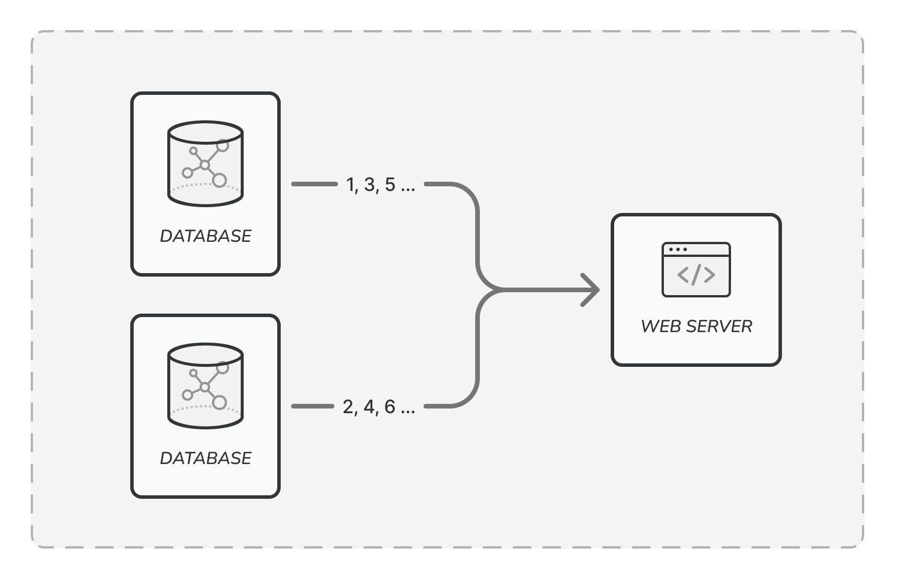
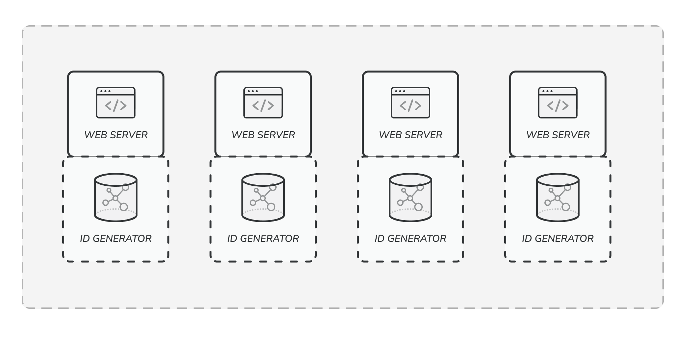
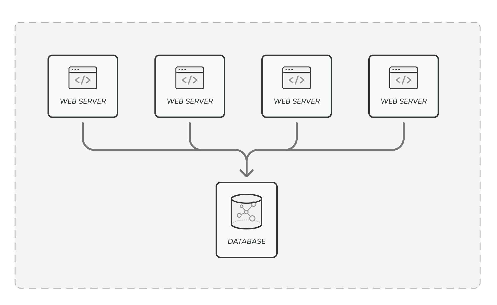

## 7장. 분산 시스템을 위한 유일 ID 설계

### 1. 다중 마스터 복제

데이터베이스의 auto_increment 기능을 활용하는 방법이다. 다음 ID 값을 계산할 때 1이 아닌 k만큼 증가시킨다. 이때 k는 현재 사용 중인 데이터베이스 서버의 수다. 즉, n번째 데이터베이스 서버는 초기값을 n, 증가값을 k로 설정하여 ID의 충돌을 피한다. 또한 데이터베이스를 추가하면 초당 생산 가능한 ID 수도 늘릴 수 있다.

하지만 각 데이터베이스 서버가 독립적으로 ID를 증가시키기 때문에 시간순으로 ID가 커지는 것을 보장할 수 없다. 또한 여러 데이터센터에 걸쳐 규모를 늘리거나 서버를 추가 및 삭제할 때 동기화를 위한 복잡한 처리가 필요하다.

### 2. UUID

UUID는 컴퓨터 시스템에 저장되는 정보를 유일하게 식별하기 위한 128비트짜리 수이다. UUID가 중복될 확률은 매우 낮기 때문에 서버 간의 동기화가 필요 없고 각 서버가 각자의 ID 생성기를 가질 수 있다. 따라서 규모 확장성이 뛰어나다.

하지만 ID의 길이가 길고 ID를 통해 시간순으로 정렬할 수 없다는 단점이 있다. 또한 ID에 숫자뿐만 아니라 문자도 포함될 수 있음을 고려해야 한다.

### 3. 티켓 서버

auto_increment 기능을 가진 데이터베이스 서버를 티켓 서버로서 하나만 사용하는 중앙 집중형 방식이다. 서버가 하나뿐이기 때문에 동기화에 대한 고민 없이 유일성이 보장되며 숫자로만 이루어진 ID를 쉽게 만들 수 있다.

하지만 티켓 서버가 단일 장애 지점이 될 수 있다. 즉, 티켓 서버에 문제가 생기면 전체 시스템이 영향을 받게 된다. 또한 병목이 발생할 수 있어 대규모보다는 중소 규모 애플리케이션에 적합하다.

### 4. 트위터 스노플레이크 접근법

트위터에서 사용하는 ID 생성 기법으로 생성해야 하는 ID의 구조를 여러 부분으로 분할하는 방법이다. 다음은 64비트 ID를 나누는 하나의 예시이며 각 부분의 길이는 상황에 따라 조절할 수 있다. 예를 들어 동시성이 낮고 수명이 긴 애플리케이션이라면 일련번호 길이를 줄이고 타임스탬프의 길이를 늘이는 것이 좋을 것이다.

1. **사인 비트**
    
    대부분 0으로 고정되며 현재는 사용하지 않지만 나중을 위해 할당해 두는 비트이다. 음수와 양수를 구별하는 등에 사용할 수 있다.
    
2. **타임스탬프**
    
    기원 시각 이후로 몇 밀리초가 경과했는지를 나타낸다. ID에서 타임스탬프 값을 추출하면 시간순으로 정렬이 가능하다. 41비트로 표현할 수 있는 타임스탬프의 최대값은 69년이기 때문에 69년이 지나면 기원 시각을 바꾸거나 마이그레이션을 해야 한다.
    
3. **데이터센터 ID**
    
    데이터센터를 식별하기 위한 값이다. 5비트를 사용하면 32개의 값을 나타낼 수 있다. 따라서 최대 32개의 데이터센터를 사용할 수 있다.
    
4. **서버 ID**
    
    서버를 식별하기 위한 값이다. 5비트를 사용하면 32개의 값을 나타낼 수 있다. 따라서 데이터센터당 최대 32개의 서버를 사용할 수 있다.
    
5. **일련번호**
    
    각 서버에서 ID를 생성할 때마다 일련번호를 1만큼 증가시킨다. 1밀리초가 경과할 때마다 일련번호는 0으로 초기화된다. 12비트를 사용하면 4096개의 값을 나타낼 수 있다. 따라서 한 서버에서 밀리초당 4096개의 ID를 생성할 수 있다. 이는 하나의 서버가 1초당 약 400만 개의 ID를 생성할 수 있는 수준으로, 대부분의 서비스에서 충분히 높은 처리량이다.
    

### 5. 추가 고려 사항

1. **시계 동기화**
    
    만약 ID 생성기들의 시스템 시간이 서로 불일치한다면 NTP(Network Time Protocol) 등을 통한 시계 동기화가 필요하다.
    
2. **고가용성**
    
    ID 생성기는 필수 불가결한 컴포넌트이므로 아주 높은 가용성을 제공해야 한다.