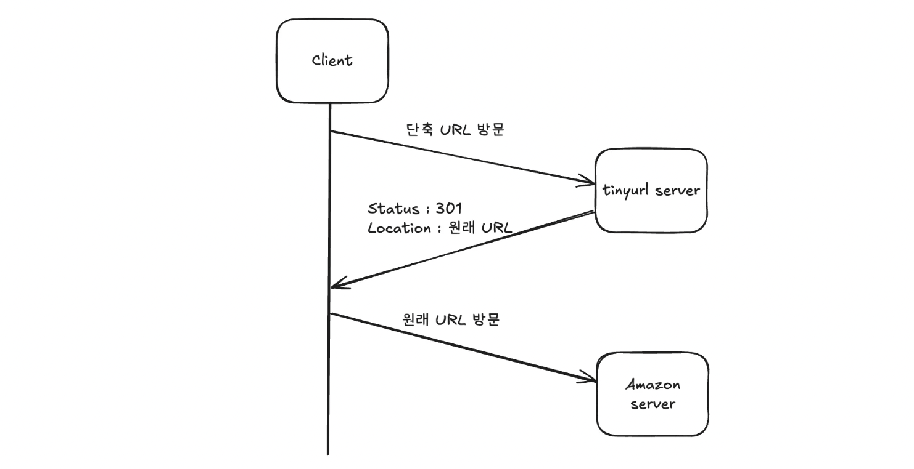
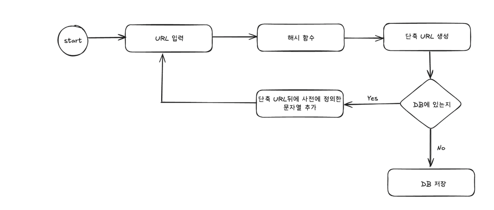

# URL Shortener

## 설계 범위 확정

- URL 단축기 동작은?
- 트래픽 규모는?
- 단축된 URL 길이는 어느정도?
- 단축 URL에 포함될 문자에 대한 제한은?
- 단축 URL을 시스템에서 삭제할 수 있는지?

→ 면접에서는 위와 같은 질문들로 개략적인 요구사항을 수집하면 됨.

## 개략적 설계안

- **API 엔드포인트**

  - URL 단축용 엔드포인트 -) POST /api/v1/data/shorten
  - URL 리디렉션용 엔드포인트 -) GET /api/v1/shortUrl

- **URL 리디렉션**

  

  - 리디렉션 응답 상태로는 대표적으로 301, 302가 있음.
    - 301 Permanently Moved : 해당 URL에 대한 HTTP 요청의 처리 책임이 영구적으로 Location 헤더에 반환된 URL로 이전되었음을 의미. 때문에 추후 브라우저는 캐싱된 원래 URL로 요청을 보낸다.
    - 302 Found : 일시적으로 Location 헤더가 지정하는 URL에 의해 처리되어야 한다는 의미. 때문에 클라이언트 요청은 단축 URL 서버에 먼저 가게 된다.
  - 301을 사용하면 서버 부하를 줄일 수 있지만 트래픽 분석이 중요할 때는 302 Found를 사용하는 것이 좋다.
  - 리디렉션할 URL을 매핑하는 것은 HashTable을 사용하는 것이 일반적이다.

- **URL 단축**

  - 원래 URL을 단축 URL로 변환할 때 해시 함수에 넣게 되는데 다음과 같은 요구사항을 만족시켜야 한다.
    1. 입력이 다르면 출력이 달라야 함.
    2. 해시값을 원래 URL로 복원할 수 있어야 함.

## 상세 설계안

- 데이터 모델

  - 모든 매핑 정보를 메모리에 들고 있기는 어렵기에 디스크에 저장해야 하고 관계형 데이터베이스를 사용해서 저장한다.

- 해시 함수

  - 해시값 - [0-9, a-z, A-Z] 문자로 구성하고 총 62개 문자 사용 가능

  - 요구사항을 만족시킬 수 있는 해시값 문자 길이를 정해야 한다.

    - 책의 예시로 3650억개의 URL 변환 정보를 저장하기 위해 7자리의 해시값이 필요 62^n ≥ 365억

  - 구현

    - 해시 충돌 후 해소

      - CRC32, MD5, SHA-1 사용 → 7자리가 넘음

      - 앞의 7자리를 짤라서 사용하면 충돌 확률이 높아진다. 충돌 발생시 해소될 때까지 사전에 정한 문자열을 해시값에 붙인다.

        

      - 단축 URL 생성시마다 DB 조회는 오버헤드가 크기 때문에 블룸 필터 사용

        - 있는건 확실하게 알 수 없지만 없는건 확실하게 알 수 있음.

    - base-62 변환

      - 해시값에 사용할 수 있는 문자 개수가 62개이기 때문에 사용
      - 11157(10) → 2TX(62)

    - 특징 비교

    | 해시 후 충돌 해소                   | base-62 변환                         |
    | ----------------------------------- | ------------------------------------ |
    | 단축 URL 길이 고정                  | 단축 URL 길이 가변, ID 커지면 길어짐 |
    | 유일성 보장 ID 생성기 필요 없음     | ID 생성기 필요                       |
    | 충돌 가능                           | 충돌 불가                            |
    | 다음 생성되는 URL을 미리 알 수 없음 | 다음 URL을 미리 알 수 있음.          |

    - 책에서는 base-62 변환을 사용했고 이를 위해 유일 ID 생성기가 필요.

- URL 리디렉션 상세

  - 쓰기보다 읽기가 많은 시스템이기에 캐시를 도입하여 캐시를 먼저 읽는 방식으로 설계