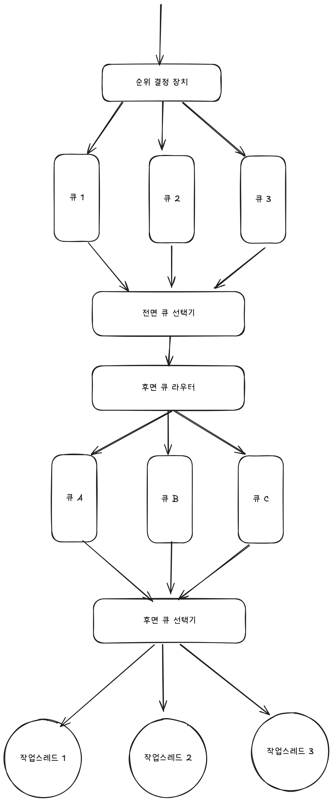

# Web Crawler

## 웹 크롤러란?

- 웹에 새로 올라오거나 갱신된 콘텐츠를 찾는 기술
- 링크를 타고 나가는 방식

## 사용처
- 검색 엔진 인덱싱: 웹 페이지를 모아 검색 엔진을 위한 로컬 인덱스 구성(구글)
- 웹 아카이빙: 말 그대로 웹을 모아서 저장하는 것
- 웹 마이닝: 정보수집 목적
- 웹 모니터링: 저작물같은 거 모니터

## 고려사항
- 규모 확장성
- 파일 형태
- 예절
- 안정성

## 기본 알고리즘

1. URL 집합이 입력으로 주어지면, 해당 URL들이 가리키는 모든 웹 페이지를 다운로드한다.
2. 다운받은 웹 페이지에서 URL들을 추출한다.
3. 추출된 URL들을 다운로드할 때 URL 목록에 추가하고 위의 과정을 반복한다.

## 작업흐름

1. 시작URL들을 미수집 URL 저장소에 저장한다.
- 시작URL이란 도메인의 루트라고 이해하면 편하다.
- 미수집 URL 저장소: 앞으로 수집할 URL 목록 => 큐
2. HTML 다운로더는 미수집 URL 저장소에서 URL 목록을 가져오고 도메인 이름 변환기를 통해 URL의 IP주소로 접속해 웹 페이지를 다운받는다.
3. 파싱과 검증을 통해 나온 데이터를 중복여부를 검사한다.
4. URL 추출기에서는 새로운 URL을 받아 링크를 골라낸다.
5. URL 필터에서 문제가 될만한 URL들을 거른다.(접근 금지, 가면 오류 걸리는 곳등)
6. URL 저장소에서 visited 여부 확인

----

## 상세 설계

### DFS vs BFS

- BFS: 루트를 중심으로 BFS
  - 근데 이런 식으로 병렬로 처리하면 상대 서버에 부하를 주는 행위
  - 우선순위를 두지 못함

=> 미수집 URL 저장소로 이를 해결할 수 있다.

### 예의 지키기
- 동일 웹 사이트에 대해서는 한 번에 한 페이지만 요청
- 큐 라우터를 통해 같은 호스트에 속한 URL은 언제나 같은 큐로 가게 해서 지정된 작업 스레드에 전달

### 우선순위
- 미수집 저장소에서 큐에 가기전 순위결정장치를 두어 순위를 정함.
- 큐 별로 차등을 두어 큐 선택기가 더 높은 큐에서 자주 꺼내도록 설정.

### 신선도 
- 웹 페이지는 수시로 바뀜 => 재수집 필요
  - 변경 이력 활용
  - 중요 페이지 자주 수집

### Robots.txt
- 웹 사이트가 정해주는 크롤러가 지켜야할 규칙

---

## 최적화 요소

- 분산 크롤링: 병렬로 크롤링 수행
- 도메인 이름 변환 결과 캐시: 가장 큰 병목 중 하나로, DNS 요청을 보내고 결과를 받아야 하는 특성 때문.
도메인과 IP 주소를 캐싱해놓고 주기적으로 업데이트 하기.
- 지역성
- 짧은 타임아웃: 무한정 기다리지 않고 넘어가기
- 안정해시: 다운로더 서버 부하 분산
- 크롤링 상태 및 수집 데이터 저장: 장애가 난 지점 기록
- 데이터 검증
- 예외 처리

---

## 문제 있는 컨텐츠 감지 및 회피
- 중복 컨텐츠: 해시나 체크섬으로 탐지
- 거미 덫: 크롤러를 무한 루프에 빠뜨리도록 설계한 웹 페이지 => 수작업으로 처리.
- 데이터 노이즈: 가치없는 데이터 제외
