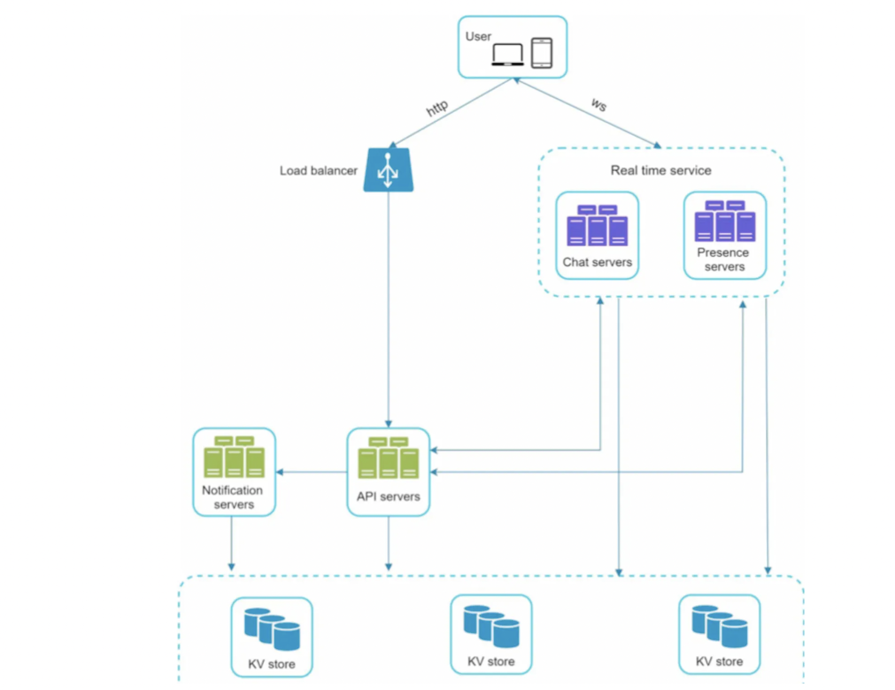
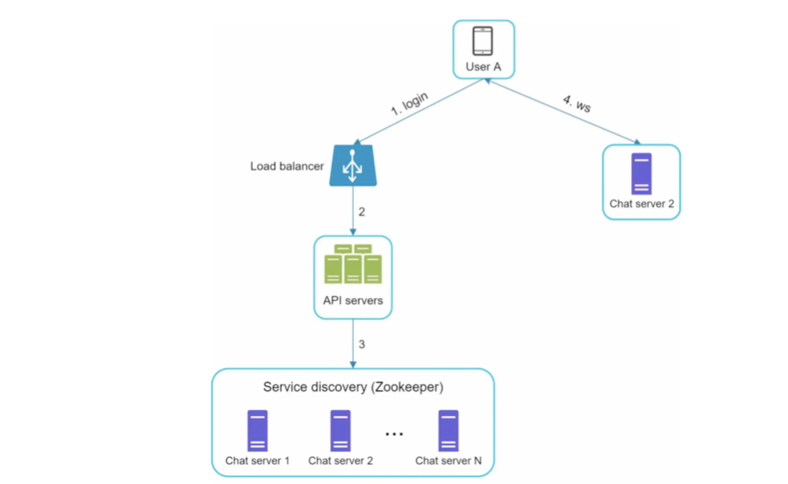
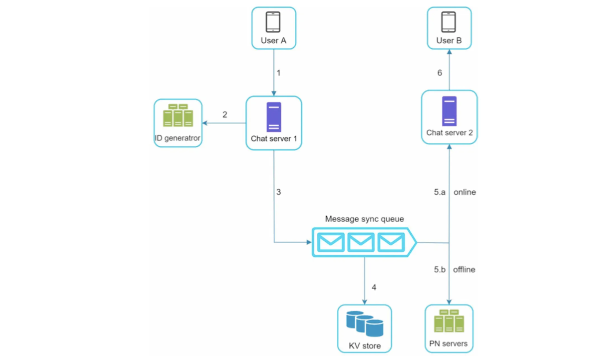
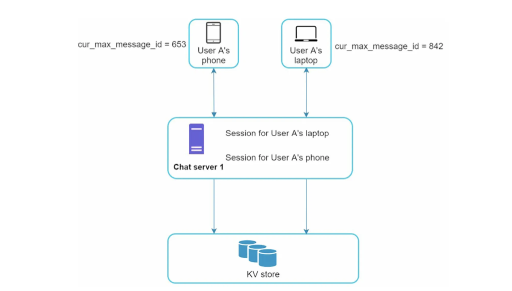
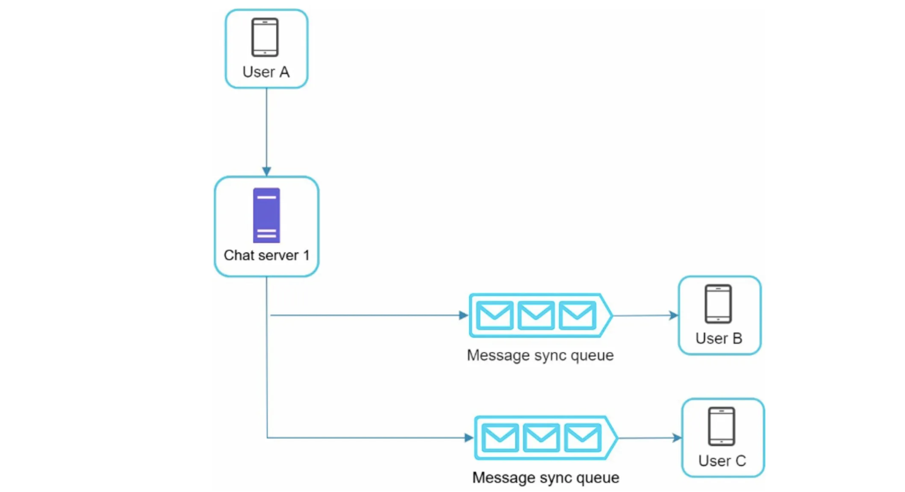
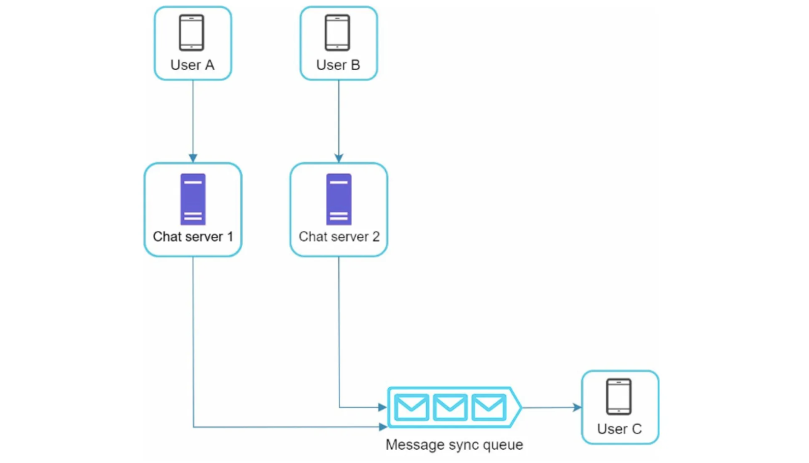
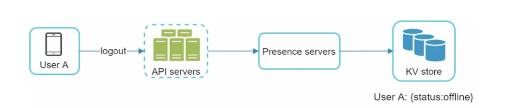
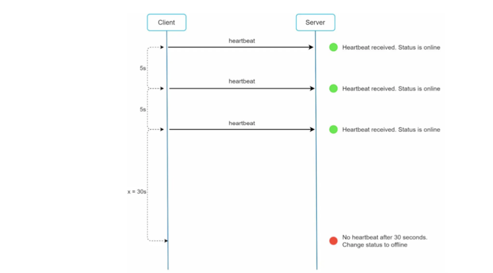
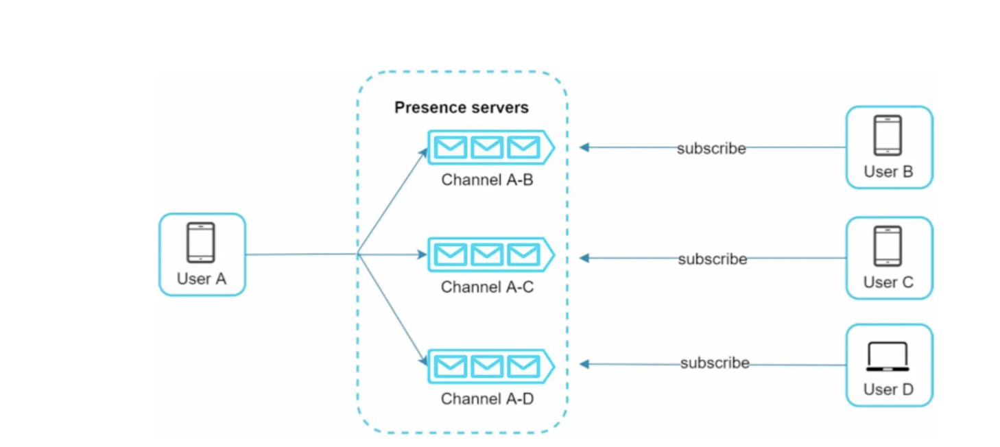

# Chat System

## 설계 범위 확정

- 1:1 채팅, 그룹 채팅 여부는?
- 모바일, 웹 지원 여부는?
- 트래픽 규모는?
- 채팅 메시지에서 지원하는 기능은? (첨부파일, TEXT, etc)
- 메시지 길이 제한은?
- 종단 간 암호화 여부는?

→ 위와 같은 질문들로 설계해야 하는 채팅 시스템의 요구사항을 먼저 파악하기

### 제공해야 하는 기능

- 클라이언트로부터 채팅 메시지 수신
- 메시지 수신자 결정 및 전달
- 수신자의 접속 여부를 판단

### 통신 프로토콜

- HTTP
  - keep-alive 헤더를 활용하여 연결을 끊지 않고 유지 가능하고 handshake 횟수도 줄일 수 있음
  - 서버에서 임의 시점에 클라이언트에게 메시지를 보내기 어려움
- (롱)폴링
  - 주기적으로 서버에 새 메시지가 있는지 확인하는 방법
  - 많이 폴링할수록 비용 증가 (불필요한 서버 자원 낭비)
  - 롱 폴링의 경우 반환받을 메시지가 생기거나 타임아웃 시점까지 연결 유지 (차이점)
  - 메시지 송신 클라이언트와 수신 클라이언트가 동일한 채팅 서버에 접속하지 못하는 경우 별도의 처리가 필요 (DB나 Global Session Storage가 필요)
- 웹소켓
  - 한번 연결된 웹소켓은 항구적, 양방향 → 서버 측에서 연결을 효율적으로 처리해야 함
  - 80, 443 포트에서 동작하기 때문에 방화벽 위에서 잘 작동

## 개략적인 설계안

- 무상태 서비스

  - 채팅 기능을 제외한 다른 REST API (로그인, 회원가입, 프로파일 표시 등)을 처리하는 무상태 서버

- 상태 유지 서비스

  - 채팅 기능을 제공하는 서버

- 제3자 서비스 연동

  - 채팅 푸시  알림을 제공하는 서버
  - 10장의 알림 시스템 설계 참고

- 규모 확장성

  - 트래픽 규모가 작을때는 하나의 모든 기능을 하나의 서버로 처리 가능
  - 하지만 SPOF가 될 수 있고 확장성에 한계를 가짐

  

- 저장소

  - 채팅 데이터의 유형을 판단해야 함 → 읽기/쓰기 패턴 분석

    - 사용자 프로필, 설정, 친구 목록 등의 데이터는 안정성이 중요 → RDBMS
    - 채팅 이력 데이터의 특성
      - 양이 엄청 많음 (페이스북, 왓츠앱 매일 600억 메시지)
      - 주로 접근되는건 최근 채팅 내역
      - 검색이 가능해야 하고 특정 사용자가 언급한 채팅 내역으로 점프 가능해야 함 → 랜덤 접근이 가능
      - 1:1 채팅의 경우 읽기/쓰기 비율 1:1

    → 수평적 규모 확장이 유리한 Key-Value 저장소 채택

    - 데이터 접근 속도가 빠름
    - RDBMS는 인덱스가 커질수록 랜덤 엑세스 처리 비용 증가 (버퍼풀 크기는 한정적)

### 데이터 모델

- 1:1 채팅 메시지 테이블
  - PK는 meesage_id로 설정하여 순서 보장
  - created_at은 동시에 메시지가 생성될 수 있기에 순서 보장X

| meesage_id   | bigint    |
| ------------ | --------- |
| message_from | bigint    |
| message_to   | bigint    |
| content      | text      |
| created_at   | timestamp |

- 그룹 채팅 메시지 테이블
  - (channel_id, message_id)를 복합키로 설정
  - channel은 채팅 그룹을 의미, channel_id를 파티션 키로 설정 (동일한 채팅방 메시지는 같은 물리 저장소에서 질의)

| channel_id | bigint    |
| ---------- | --------- |
| message_id | bigint    |
| message_to | bigint    |
| content    | text      |
| created_at | timestamp |

- message_id의 특성 (그룹 채팅)

  - 고유해야 함
  - ID로 정렬 가능하고 시간 순서와 일치해야 함

  → 이를 보장하기 위해서 3가지 방법을 제시

  - RDBMS에서는 auto_increment 사용 (NoSQL 제공 안함)
  - snowflake 사용
  - 지역적 순서 번호 생성기 (로컬 장비에서 유일한 ID)
    - 1:1 채팅, 그룹 채팅의 경우 세션 안에서 유일하게 ID가 유지되면 됨

## 상세 설계

- **서비스 탐색**

  - 고려 사항

    - 클라이언트의 위치 (지역)
    - 서버의 용량

  - 주키퍼가 많이 사용됨

    - 모든 채팅 서버를 주키퍼에 등록해두고 서버 용량, 위치를 고려하여 적절한 채팅 서버로 라우팅

      

    - API Servers에서 로그인 처리후 주키퍼에서 적절한 ChatServer를 찾아주고 여기에 WS 연결

- **메시지 흐름**

  - 1:1 채팅

    

    - UserA가 Chat server1로 채팅 요청
    - ID 생성기에서 채팅 ID 생성
    - 메시지 큐로 채팅 메시지 전송
    - KV 저장소에 채팅 내역 저장
    - UserB의 온오프라인 여부에 따라 채팅 전송하거나 알림 전송

- **여러 단말 사이의 메시지 동기화**

  

  - 각 기기마다 cur_max_message_id를 유지하는데 이는 각 기기에서 관측한 마지막 메시지 ID
  - 최신 메시지는 2가지 조건으로 판단
    - 수신자 ID가 현재 로그인한 사용자 ID와 같음
    - Key-value 저장소에 보관된 메시지의 ID가 cur_max_message_id보다 큼

- **소규모 그룹 채팅 메시지 흐름**

  

  - 채팅방에 (A, B, C)가 있을 때 A가 채팅 요청을 하면 B, C의 메시지 동기화 큐에 들어가게 됨
  - 그룹의 크기가 적을때 유용 (WeChat은 500명 제한)
    - 그룹의 크기가 적으면 수신자별로 복사해서 큐에 넣는 비용이 크지 않음
    - 유저수가 많다면 Fan out 이슈

  

  - 각 사용자의 수신함은 여러 사용자로부터 오는 메시지를 수신할 수 있어야 함

- **접속상태 표시**

  - 사용자 로그인

    - 로그인하면 웹소켓 연결을 맺는데 이 때 접속상태 서버에서 사용자의 상태와 last_active_at 타임스탬프 값을 Key-value 저장소에 저장

  - 로그아웃

    

    - 로그아웃되면 접속상태 서버에서 Key-value 스토어의 사용자의 상태값을 offline으로 갱신

  - 접속 장애

    1. 연결이 끊어지면 오프라인 상태로 바꾸고 연결되면 온라인으로 바꿈

       - 일시적으로 연결이 끊어진 경우도 존재 (터널 지날때) → UX 저하

    2. 주기적인 heartbeat 검사를 통해 x초 내에 이벤트를 받으면 온라인

       

- **상태 정보의 전송**

  - 사용자의 접속 상태가 바뀌었을때 pub/sub을 사용해서 친구들에게 알림

    - 친구 관계마다 채널을 둔다. ex) A-B, A-C, A-D

    - 그룹의 크기가 적을때 사용가능, 크다면 변경을 알리는 비용이 커짐 (성능 이슈)

      