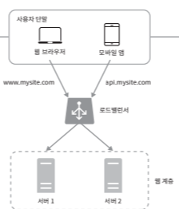

> ## 구글 드라이브 설계

### 요구사항 파악하기 

클라우드 저장소 서비스는 파일 저장 및 동기화 서비스로 문서, 사진, 비디오 기타 파일을 클라우드에 보관할 수 있도록 하는 서버이다.

이 클라우드 저장소에 지원하는 기능은 다음과 같다.
- 파일 업로드/다운로드 기능
- 파일 동기화 기능
- 파일 압축 기능
- 알림 기능

이 클라우드 저장소에서 요구하는 비기능적 요구사항은 다음과 같다.
- 안정성 : 데이터 손실은 발생해선 안된다.
- 빠른 동기화 속도 : 파일 동기화가 오래 걸려선 안된다.
- 네트워크 대역폭 : 네트워크 대역폭
- 규모 확장성 : 아주 많은 트래픽을 처리 가능
- 높은 가용성 : 일부 서버에 장애가 발생하거나, 느려지거나 끊겨도 계속 사용 가능해야 한다.

---

### 설계안 제시

기본적인 간단한 시스템부터 어려운 시스템을 만드는 게 좋다. 

> #### 요구되는 요소들
- 파일을 올리고 다운로드하는 웹 서버
- 사용자 데이터, 로그인 정보 등의 메타데이터를 보관하는 데이터베이스
- 파일을 저장할 저장소 시스템

우선은 웹 서버 내의 특정 폴더의 경로에 저장하는 시스템 형태.

> #### 요구되는 기능에 맞는 API 설계

1. 파일 업로드 API
- 단순 업로드
- 이어 올리기(resumable upload) : 파일 사이즈가 네트워크 문제로 업로드 중단될 시 사용

이이 올리기 절차
- 이어 올리기 URL을 통한 요청 전송
- 데이터를 업로드하고 업로드 상태 모니터링
- 업로드 장애 시 장애 발생시점부터 업로드 재시작

2. 파일 다운로드 API
- 파일의 경로만 들고 요청

3. 파일 갱신 히스토리 API
- 갱신 히스토리와 히스토리 길이의 최대치를 선택

> #### 위 시스템의 문제

- 웹 서버에 파일을 업로드하면 파일 시스템이 가득찬다. 그런 문제는 데이터를 샤드에 저장하면 된다. 이런 시스템을 구축하는 건 오래 걸린다.
따라서, Amazon S3를 사용한다. AmazonS3는 규모 확장을 자동적으로 지원하고 여러 데이터 센터에 다중화도 지원한다.

- 웹 서버에 대한 가용성을 높이고, 트래픽 분산을 위해서는 로드 밸런서가 필요하고 장애 시 우회하는 기능까지 제공한다.

- 메타데이터 데이터베이스는 파일 저장 서버와 별도로 분리해야 장애 서버로서 회피할 수 있다.

- 파일 저장소는 가용성을 보장하기 위해 두 개 이상의 지역에 데이터를 다중화 시킨다.

### ※ 동기화 충돌
구글 드라이브 같은 시스템은 같은 파일이나 폴더를 동시에 업데이트할 수 있다. 이런 경우엔 먼저 처리된 요청은 변경 성공으로
나중에 처리된 건 충돌이 발생한 걸로 표시한다. 이 버전을 어떻게 관리할 지는 개발자가 선택해야 한다.

> #### 추가되어야 할 요소

블록 저장소 서버(block server) : 팡리 블록을 클라우드 저장소에 업로드하는 서버로 파일을 여러 개의 블록으로 나눠 저장하고 블록을 구분한다.
이 해시 값을 통해 각 파일의 변경되는 부분만 별도로 저장하게 해준다. 드롭 박스가 예시이다.

알림 서비스 : 이벤트가 발생했음을 클라이언트에게 알리는데 사용하는 용도로 롱 폴링으로 구현하는 걸 권장한다.
파일의 추가, 편집, 삭제, 최신 여부를 확인하게 해준다.

오프라인 사용자 백업 큐 : 오프라인 사용자가 온라인이 될 떄 최신 정보를 즉시 받을 수 있게 해준다.

### 블록 저장소 서버
큰 파일들의 업데이트마다 전체 파일을 서버로 보내면 네트워크 대역폭을 많이 잡아먹는다. 은근히 네트워크 대역폭이
우리는 감지 못하지만 순간적으로 초당 TPS가 만단위로 넘어가면 뻗어버림. 이런 문제는 압축과 델타 동기화로 해결할 수 있다.

- 델타 동기화 : 파일이 수정되면 전체 파일대신 수정이 일어난 블록만 동기화
- 압축 : 블록 단위 압축으로 파일 형식에 따라 알고리즘을 결정한다.

### 높은 일관성 요구사항
같은 파일은 단말과 사용자에 상관없이 일관돼야 한다. 이를 위해 메타데이터 캐시와 데이터베이스 계층에도 최종 일관성을 적용시켜야 한다.

- 캐시 사본과 데이터베이스 원본은 일치해야 한다.
- 원본 변경 시 캐시에 있는 사본을 무효화

NoSQL 데이터베이스는 ACID를 지원하지 않으므로 동기화로직을 추가해야한다.

### 저장소 공간 절약
- 중복된 파일 블록을 제거한다. 이는 블록의 해시 값을 활용하면 된다.
- 지능적 백업 전략을 사용한다. 충돌난 파일의 버전 개수에 제한을 둔다. 오래된 버전을 꾸준히 버린다. 불필요한 임시 사본은 제거하고 중요한 버전만 보관한다.